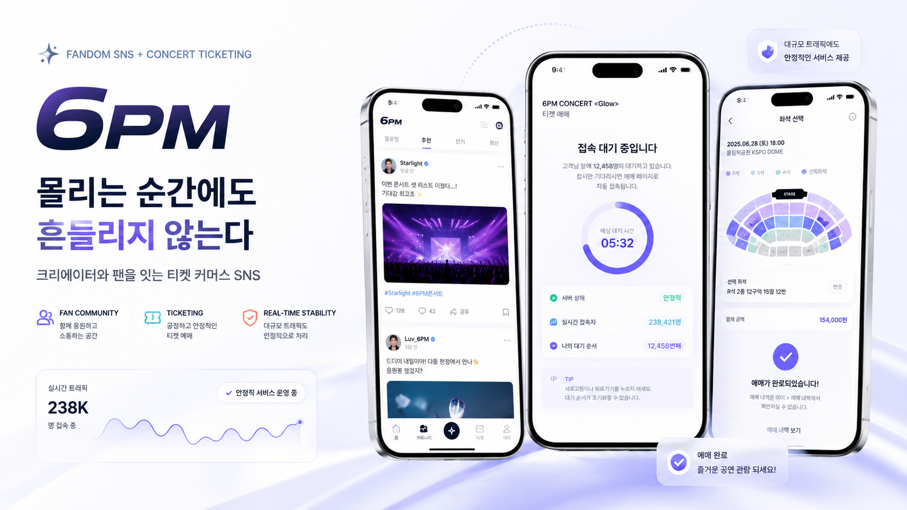
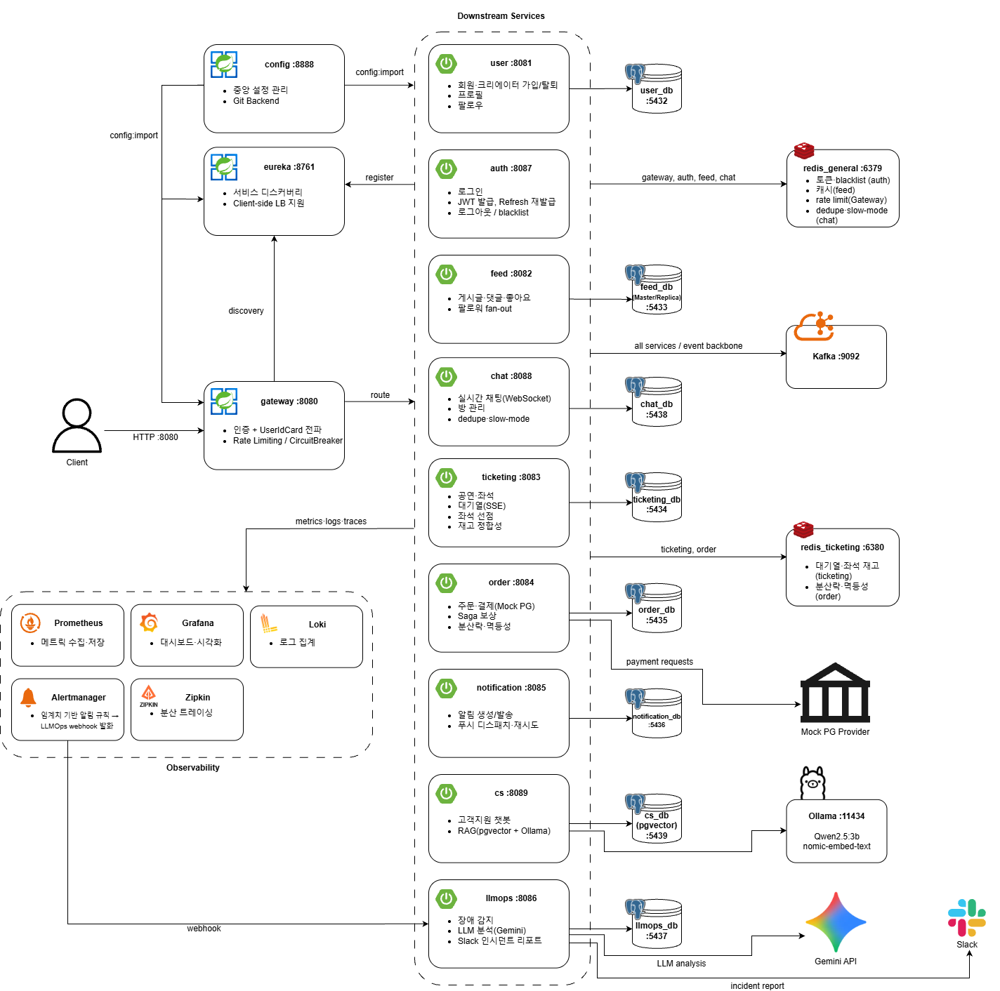
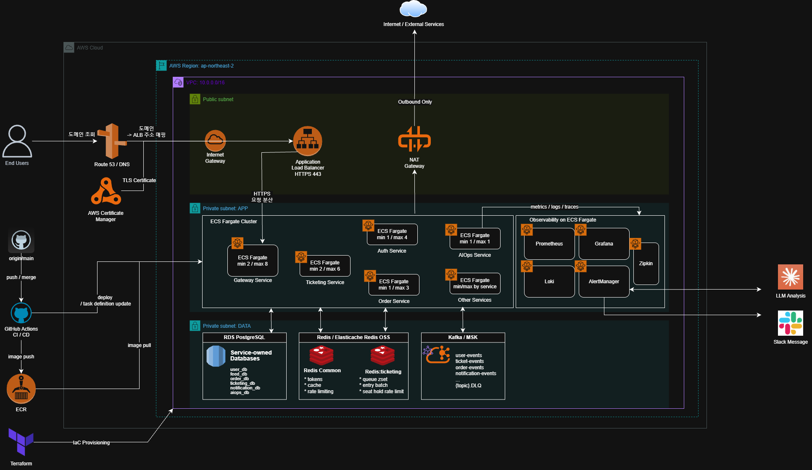

# 6pm



팬덤 SNS와 선착순 티켓팅을 결합한 MSA 기반 플랫폼입니다. 대기열 → 좌석 선점 → 주문 → 결제 → 예매 확정으로 이어지는 흐름을 Kafka Choreography SAGA로 구성하고, 좌석·결제 정합성(더블부킹·중복결제 방지, 실패 시 보상)을 보장합니다.

## 핵심 기능

- **팬덤 SNS**: 회원/크리에이터, 프로필, 팔로우, 피드(게시글·댓글·좋아요), 실시간 채팅
- **선착순 티켓팅**: 대기열(SSE 순번 안내), 좌석 선점(Redis 원자적 처리), 구매 한도
- **주문·결제**: 주문 생성, 결제(Mock PG + 웹훅), SAGA 보상, 환불 복구 배치
- **인증·인가**: JWT + Gateway 단일 검증, HMAC 서명 기반 내부 신원 전파(UserIdCard), RBAC
- **이벤트 기반 연동**: 서비스 간 Kafka 비동기 통신, Transactional Outbox로 발행 신뢰성 보장
- **AIOps**: 장애 알림 수신 → LLM 분석 → Slack 통지
- **관측성**: Prometheus·Grafana·Loki·Zipkin 기반 메트릭·로그·분산 추적

## 기술 스택

| 구분 | 기술                                                      |
|------|---------------------------------------------------------|
| Language | Java 21                                                 |
| Framework | Spring Boot 3.5, Spring Cloud (Eureka, Gateway, Config) |
| DB | PostgreSQL 17 (서비스별 개별 인스턴스)                            |
| Cache / 상태관리 | Redis 7 (일반 / 티켓팅 분리)                                   |
| Messaging | Apache Kafka 3.7                                        |
| 실시간 | SSE (대기열), WebSocket (채팅)                               |
| 서비스 간 통신 | FeignClient (동기), Kafka (비동기)                           |
| 관측성 | Prometheus, Alertmanager, Grafana, Loki, Zipkin         |
| AI | Google Gemini (AIOps), Ollama(CS), pgvector 기반 RAG (CS) |
| Infra | Docker Compose (로컬), Terraform + AWS ECS (운영)           |

## 아키텍처

### 시스템 구성도



### 인프라 설계도



전체 시스템 구조와 도메인·API·테이블·ERD 상세는 [시스템 설계 개요](docs/SA.md)를 참고하세요.

## 서비스 구성

| 서비스 | 역할 | 포트(로컬) |
|--------|------|-----------|
| gateway-service | API Gateway (라우팅·인증·rate limit·장애격리) | 8080 |
| eureka-server | 서비스 디스커버리 | 8761 |
| config-server | 중앙 설정 관리 | 8888 |
| user-service | 회원·크리에이터·프로필·팔로우 | 8081 |
| auth-service | 인증·토큰 발급/폐기 (Redis 전용) | 8087 |
| feed-service | 피드 (게시글·댓글·좋아요) | 8082 |
| ticketing-service | 공연·좌석·대기열·좌석 선점 | 8083 |
| order-service | 주문·결제·SAGA | 8084 |
| notification-service | 알림 | 8085 |
| aiops-service | 장애 탐지·LLM 분석 | 8086 |
| chat-service | 실시간 채팅 | 8088 |
| cs-service | 고객지원 (RAG) | 8089 |

## 로컬 실행

서버는 IDE에서 실행하고, Docker는 인프라(DB·Redis·Kafka 등)만 띄우는 방식을 권장합니다.

```bash
# 인프라 전체 (DB·Redis·Kafka·Zipkin)
docker compose --profile infra up -d

# 본인 도메인만 (예: user/auth/gateway)
docker compose --profile db-user --profile redis-general up -d

# 인프라 + 관측성
docker compose --profile infra --profile o11y up -d

# 전체(서비스 포함) 빌드 기동
docker compose --profile all up -d --build
```

상세 절차(.env 설정, profile 구성, 서비스별 기동)는 [로컬 실행 가이드](docs/infra/dev-start-guide.md)를 참고하세요.

## 문서

- [시스템 설계 개요 (SA)](docs/SA.md) — 도메인·API·테이블·ERD·인프라 전반
- [로컬 실행 가이드](docs/infra/dev-start-guide.md) — 개발 환경 기동

<!-- TODO: ERD 이미지 삽입 -->
<!-- TODO: 이벤트 흐름도 이미지 삽입 -->

서비스별 상세 설계 문서는 각 `docs/{service}/` 폴더를 참고하세요.

## 팀 

| 이름  | 담당 서비스 / 영역              | GitHub                               |
|-----|--------------------------|--------------------------------------|
| 이재범 | user · auth · gateway    | [@iPad7](https://github.com/iPad7)   |
| 김승현 | order                    | [@swissmissed2](https://github.com/swissmissed2) |
| 김신영 | notification · chat · cs | [@tlsdud135](https://github.com/tlsdud135)   |
| 맹현지 | feed                     | [@gray-ji](https://github.com/gray-ji)      |
| 조아영 | ticketing                | [@look516](https://github.com/look516)      |
| 하준영 | llmops · infra           | [@HaJunyoung](https://github.com/HaJunyoung)  |
