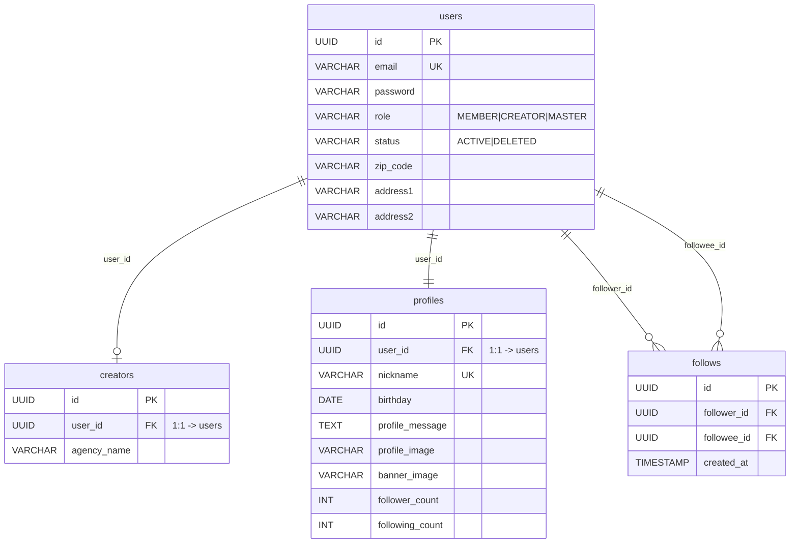
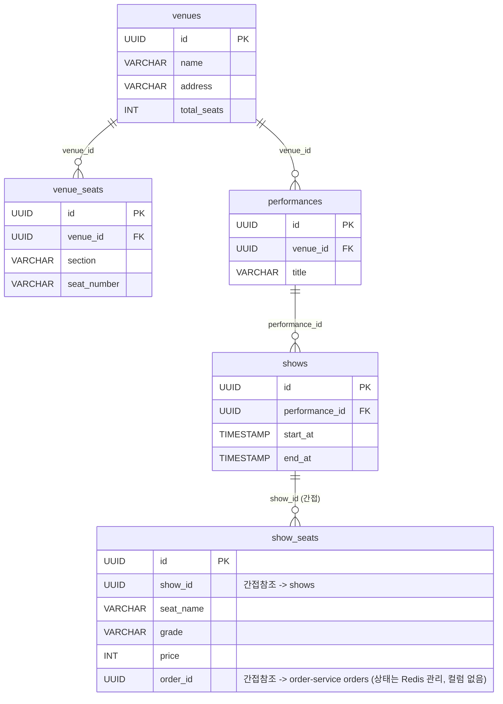
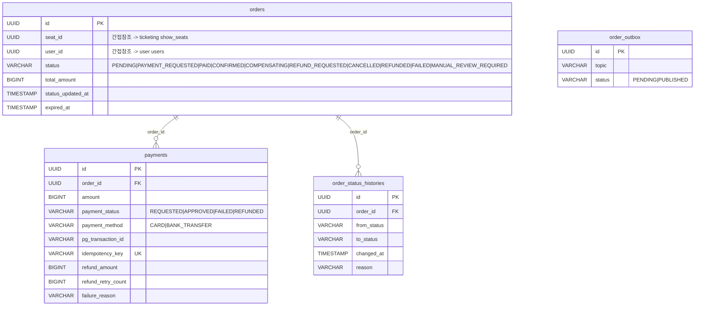
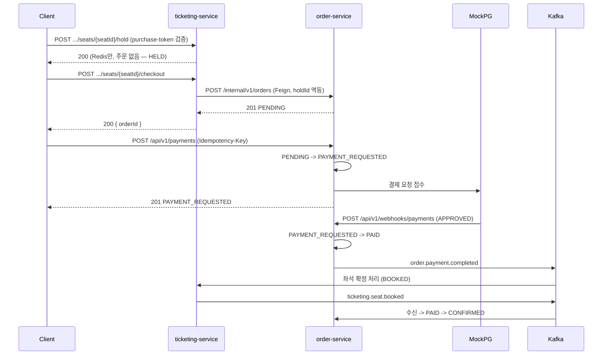
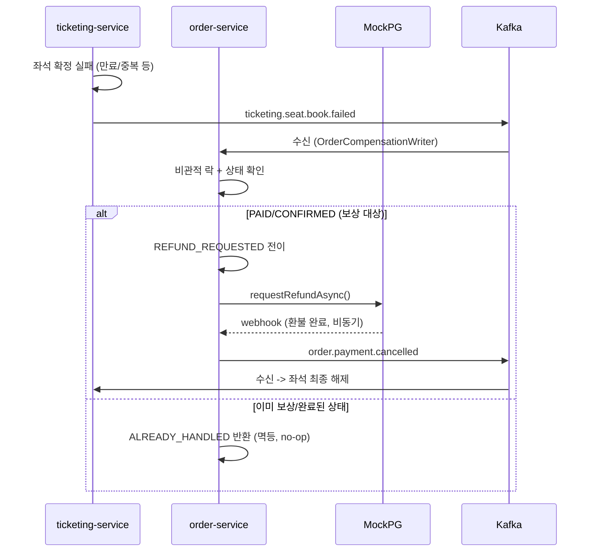

# 6pm 팬덤 티켓팅 서비스 SA 문서

<aside>

**범위**: 전체 10개 서비스(auth, user, ticketing, order, feed, chat, cs, notification, aiops, gateway) 중
예매 핵심 흐름인 **auth-service · user-service · ticketing-service · order-service** (+ gateway/common 통신 규약)만 다룬다.
feed/chat/cs/notification/aiops는 후속 문서에서 다룬다.

**작성 방식**: 구현된 항목은 코드(`*/src/main/java`) 및 기존 서비스 문서(`docs/order-service/`, `docs/ticketing-service/`, `docs/user-auth-gateway/auth-user-architecture.md`)에서 역추출했다. 미구현/미확정 항목은 각 절에 **[TODO]**로 표시했다.

</aside>

## 목차

1. [프로젝트 개요](#1-프로젝트-개요)
2. [도메인 정의](#2-도메인-정의)
3. [API 명세서](#3-api-명세서)
4. [테이블 명세서](#4-테이블-명세서)
5. [ERD 명세서](#5-erd-명세서)
6. [인프라 설계서](#6-인프라-설계서)
7. [패키지 구조](#7-패키지-구조)
8. [기능 체크리스트](#8-기능-체크리스트)
9. [에러코드 명세](#9-에러코드-명세)

---

## 1. 프로젝트 개요

- **주제**: 팬덤 SNS 겸 선착순 티켓팅 플랫폼 (6pm-sparta)
- **목표**: 대기열 → 좌석 선점 → 주문 생성 → 결제 → 예매 확정으로 이어지는 흐름을 MSA + Kafka Choreography SAGA로 구성하고, 좌석 정합성(더블부킹 방지)과 결제 정합성(중복 결제 방지, 실패 시 보상)을 보장한다.
- **한 줄 요약**: PostgreSQL + Redis + Kafka 기반. 대기열/좌석 상태는 Redis에서, 주문/결제 상태는 PostgreSQL에서 관리하며, 두 서비스는 Kafka 이벤트로만 통신한다(직접 동기 호출은 좌석 Hold 성공 후 주문 생성 1건뿐).
- **핵심 설계 포인트**
  - `ShowSeats`에 상태 컬럼을 두지 않는다 — 좌석 상태(AVAILABLE/HOLDING/BOOKED)는 전부 Redis가 단일 진실 공급원(SoT)이다. DB `show_seats.order_id`는 보조 참조.
  - `Orders`는 예약(hold)과 확정(confirm)을 하나의 애그리게이트로 다룬다 — 별도 `SeatHolds` 테이블 없음 **[TODO: 미확정, ticketing-service/README.md §9]**.
  - 주문 생성(SAGA 정상 흐름)은 **Choreography**, 주문 취소(보상 흐름)는 **Orchestration**(order-service가 오케스트레이터)으로 패턴을 분리했다. 참고: [order-service/adr/002](order-service/adr/002-saga-choreography.md)

---

## 2. 도메인 정의

### 2.1 MSA 도메인

| 도메인 | 설명 | 관련 테이블 | 포트 | DB |
| --- | --- | --- | --- | --- |
| Eureka Server | 서비스 디스커버리 | - | - | - |
| Config Server | 각 서비스 설정 파일 관리 | - | 8888 | - |
| Gateway | 라우팅, Access Token 검증, 내부 인증 컨텍스트(`X-Id-Card`) 생성 | - | 8080 | - |
| Auth (인증) | 로그인, 토큰 재발급/폐기, 로그아웃 | *(DB 없음, Redis만 사용)* | 8087 | Redis(6379) |
| User (사용자) | 회원/크리에이터 가입, 프로필, 팔로우, 탈퇴 | `users`, `creators`, `profiles`, `follows` | 8081 | PostgreSQL |
| Ticketing (티켓팅) | 공연/좌석 마스터, 대기열, 좌석 선점 | `venues`, `venue_seats`, `performances`, `shows`, `show_seats` | 8083 | PostgreSQL + Redis(6380) |
| Order (주문/결제) | 주문, 결제, SAGA 보상, Outbox | `orders`, `payments`, `order_status_histories`, `order_outbox` | 8084 | PostgreSQL + Redis(6380 공용) |

> 서비스 간 결합도를 낮추기 위해 다른 도메인 소유 테이블은 FK 대신 ID 간접 참조를 사용한다 (예: `orders.seat_id`는 ticketing 소유 `show_seats.id`를 값으로만 저장).

### 2.2 권한 체계

| 역할 | 코드 | 설명 |
| --- | --- | --- |
| 일반 회원 | `MEMBER` | 예매, 팔로우 등 일반 기능 |
| 크리에이터 | `CREATOR` | 회원 기능 + 팔로우 대상(팔로우 당하는 쪽) |
| 마스터 | `MASTER` | 운영자 |

`UserIdCard`(Gateway가 발급, HMAC 서명)가 `userId`/`role`만 담아 내려온다. 판별은 `isMember()`/`isCreator()`/`isMaster()`/`isMe(userId)` 메서드로 한다. 자세한 흐름은 [auth-user-architecture.md](./user-auth-gateway/auth-user-architecture.md) §4~5 참고.

### 2.3 권한별 접근 범위

이 플랫폼은 로지스틱스 예시처럼 "역할별 CRUD 매트릭스"보다는 **"로그인 여부 + 본인 소유 여부"** 기반 권한 체크가 대부분이다. 표로 정리하면:

**회원/크리에이터/프로필**

|  | 가입 | 본인 정보 수정 | 본인 탈퇴 | 프로필 조회 | 프로필 수정 |
| --- | --- | --- | --- | --- | --- |
| 비로그인 | O (회원가입 API 자체) | X | X | O (공개) | X |
| `MEMBER` | - | O (본인) | O (본인) | O | O (본인) |
| `CREATOR` | - | O (본인) | O (본인) | O | O (본인) |
| `MASTER` | - | **[TODO]** 전체 관리 API 미구현 | - | O | **[TODO]** |

**팔로우**

| 규칙 | 강제 방식 |
| --- | --- |
| 팔로우는 `MEMBER` 또는 `CREATOR`만 (팔로우 당하는 대상은 `CREATOR`만) | `FollowErrorCode.FOLLOWER_MUST_BE_MEMBER_OR_CREATOR` / `FOLLOWEE_MUST_BE_CREATOR` |
| 자기 자신 팔로우 불가 | `SELF_FOLLOW_NOT_ALLOWED` |
| 중복 팔로우 불가 | DB unique 제약(`follower_id`,`followee_id`) + `DUPLICATE_FOLLOW` |

**좌석 선점 (ticketing)**

| 규칙 | 강제 방식 |
| --- | --- |
| 대기열 통과 후 발급된 `purchase-token` 없으면 Hold 불가 | `PURCHASE_TOKEN_NOT_FOUND` (403) |
| 본인이 선점한 좌석만 해제 가능 | `SEAT_HOLD_FORBIDDEN` (403) |
| 좌석 목록 조회는 비회원도 가능(토큰 불필요) | 컨트롤러에 `@CurrentIdCard` 없음 |

**주문/결제 (order)**

| 규칙 | 강제 방식 |
| --- | --- |
| 주문 조회/취소는 본인 주문만 | `ORDER_ACCESS_DENIED` (403) |
| 결제 조회는 본인 주문의 결제만 | `PAYMENT_ACCESS_DENIED` (403) |
| 주문 생성(`/internal/v1/orders`)은 클라이언트가 직접 호출 불가 | Gateway 라우트 predicate에서 `/internal/v1/**` 미노출 (서비스 간 Feign 전용) |
| PG 웹훅 수신은 Access Token이 아닌 `X-PG-Signature` HMAC으로 검증 | `PaymentErrorCode.INVALID_SIGNATURE` |
| 운영자용 `/admin/v1/orders/manual-review` | **[TODO] 미구현**: 컨트롤러/게이트웨이 어느 쪽에도 `MASTER` 역할 검증이 없다. 현재는 로그인 여부와 무관하게 경로만 알면 호출 가능한 상태 — 별도 이슈로 관리 필요 |

---

## 3. API 명세서

### 3.1 공통 응답 형식

```json
{
  "status": 200,
  "message": "SUCCESS",
  "data": { },
  "timestamp": "2026-07-02T10:00:00"
}
```

- 데이터 없는 성공: `message: "SUCCESS"`, `data` 필드 자체가 생략됨(`@JsonInclude(NON_NULL)`)
- 생성 성공: `status: 201`, `message: "CREATED"`
- 에러도 같은 `ApiResponse` 포맷을 쓰되 `data`가 없고 `message`에 에러 메시지가 들어간다 (`GlobalExceptionHandler`). 로지스틱스 예시의 `success`/`errors[]` 필드는 **[TODO] 아직 없음** — 현재는 상태코드 + message 한 줄로만 에러를 표현한다.

### 3.2 인증 (auth-service)

| Method | URL | 인증 | 설명 |
| --- | --- | --- | --- |
| POST | `/api/v1/auth/login` | 불필요 | 로그인, Access/Refresh Token 발급 |
| POST | `/api/v1/auth/reissue` | 불필요(Refresh Token 필요) | Access Token 재발급 (RTR) |
| POST | `/api/v1/auth/logout` | 필요 | 로그아웃, Access Token blacklist 등록 |

Redis 키: `refresh:{userId}:{tokenId}`, `blacklist:access:{jti}`, `blacklist:user:{userId}` (자세한 내용은 [auth-user-architecture.md](./user-auth-gateway/auth-user-architecture.md) §6.2)

### 3.3 회원/크리에이터/프로필/팔로우 (user-service)

| Method | URL | 인증 | 설명 |
| --- | --- | --- | --- |
| POST | `/api/v1/members` | 불필요 | 일반 회원가입 (User + Profile 생성) |
| POST | `/api/v1/creators` | 불필요 | 크리에이터 가입 (User + Creator + Profile, 단일 트랜잭션) |
| PATCH | `/api/v1/members/me` | 필요 | 본인 회원 정보 수정 |
| PATCH | `/api/v1/creators/me` | 필요 | 본인 크리에이터 정보 수정 |
| DELETE | `/api/v1/members/me` | 필요 | 회원 탈퇴 (soft delete + `user.deleted` 이벤트 발행) |
| GET | `/api/v1/members/{memberId}/profile` | 불필요 | 일반 회원 프로필 조회 |
| GET | `/api/v1/creators/{creatorId}/profile` | 불필요 | 크리에이터 프로필 조회 |
| PATCH | `/api/v1/members/me/profile` | 필요 | 본인 프로필 수정 |
| PATCH | `/api/v1/creators/me/profile` | 필요 | 본인 프로필 수정 |
| POST | `/api/v1/follows/{creatorId}` | 필요 | 팔로우 |
| DELETE | `/api/v1/follows/{creatorId}` | 필요 | 언팔로우 (hard delete) |
| GET | `/api/v1/follows/{creatorId}/followers` | 정책에 따름 | 팔로워 목록 |
| GET | `/api/v1/members/{memberId}/followings` | 정책에 따름 | 팔로잉 목록 |

### 3.4 대기열/좌석 (ticketing-service)

| Method | URL | 인증 | 설명 |
| --- | --- | --- | --- |
| POST | `/api/v1/tickets/shows/{showId}/queue` | 필요 | 대기열 등록 (`ZADD NX`, 중복 방지) |
| GET | `/api/v1/tickets/shows/{showId}/queue/status` | 필요 | 현재 순번(rank) 조회 |
| GET | `/api/v1/tickets/shows/{showId}/queue/stream` | 필요 | SSE 연결, 순번(`RANK`)/입장 가능(`READY`) 이벤트 수신 |
| GET | `/api/v1/tickets/shows/{showId}/seats` | 불필요 | 회차별 좌석 목록 + 상태(`AVAILABLE`/`HOLDING`/`BOOKED`) |
| POST | `/api/v1/tickets/shows/{showId}/seats/{seatId}/hold` | 필요 | 좌석 선점만(주문 없음, HELD 상태) (`purchase-token` 검증 선행). 응답 바디 없음 |
| POST | `/api/v1/tickets/shows/{showId}/seats/{seatId}/checkout` | 필요 | 체크아웃 — 주문 생성(2026-07-03 신설, §11 참고). HELD 상태에서만 가능, CONFIRMED 재요청은 멱등 응답 |
| DELETE | `/api/v1/tickets/shows/{showId}/seats/{seatId}/hold` | 필요 | 좌석 선점 해제 (본인 것만, order-service 주문도 함께 취소) |
| GET | `/api/v1/tickets/shows/{showId}/purchase-limit` | 필요 | 구매 한도/구매 수/잔여 조회 — **[TODO] 문서/설계 미확정**, 코드 주석에 엔드포인트 설계 재검토 표시 있음 |

**Venue/Performance/Show 관리 API — [TODO] 미구현.** 현재 코드베이스에 해당 엔티티의 컨트롤러가 없다(엔티티만 존재, `db-init` 시드 데이터로만 채워짐으로 추정). 운영자가 공연/좌석 마스터를 CRUD하는 API 설계가 필요하다.

**주요 응답 예시**

```json
// POST .../seats/{seatId}/hold → 200 (응답 바디 없음)
{ "status": 200, "message": "SUCCESS" }

// POST .../seats/{seatId}/checkout → 200
{ "status": 200, "message": "SUCCESS", "data": { "orderId": "..." } }

// GET .../seats → 200
{ "status": 200, "message": "SUCCESS", "data": [
  { "seatId": "...", "seatName": "A-12", "grade": "VIP", "price": 150000, "status": "AVAILABLE" }
] }

// GET .../queue/status → 200
{ "status": 200, "message": "SUCCESS", "data": { "rank": 42, "isReady": false } }
```

### 3.5 주문/결제 (order-service)

| Method | URL | 인증 | 설명 |
| --- | --- | --- | --- |
| POST | `/internal/v1/orders` | *(서비스 간 전용, Gateway 미노출)* | ticketing → order 주문 생성 (Feign). holdId 멱등 |
| GET | `/api/v1/orders/{id}` | 필요(본인만) | 주문 단건 조회 |
| GET | `/api/v1/orders` | 필요 | 본인 주문 목록 (page/size, 기본 0/20) |
| DELETE | `/api/v1/orders/{id}` | 필요(본인만) | 주문 취소 (상태별 분기: PENDING 즉시취소 / PAID·CONFIRMED 환불) |
| POST | `/api/v1/payments` | 필요, `Idempotency-Key` 헤더 필수 | 결제 요청 |
| GET | `/api/v1/payments/{paymentId}` | 필요(본인 주문만) | 결제 시도 단건 조회 |
| GET | `/api/v1/orders/{orderId}/payments` | 필요(본인 주문만) | 주문별 결제 시도 전체 목록 (최신순, 페이징 없음) |
| POST | `/api/v1/webhooks/payments` | `X-PG-Signature` HMAC | PG 웹훅 수신 (승인/실패/환불/환불실패) |
| GET | `/admin/v1/orders/manual-review` | **[TODO] 미구현** | 환불 복구 배치 소진 건 조회 |

**요청/응답 바디**

```json
// POST /internal/v1/orders (Ticketing → Order, Feign)
{ "holdId": "uuid", "seatId": "uuid", "userId": "uuid", "totalAmount": 150000 }
→ 201 { "orderId": "...", "seatId": "...", "userId": "...", "status": "PENDING", "totalAmount": 150000, "createdAt": "..." }

// POST /api/v1/payments  (Header: Idempotency-Key)
{ "orderId": "uuid", "paymentMethod": "CARD" }
→ 201 { "paymentId": "...", "orderId": "...", "amount": 150000, "paymentStatus": "REQUESTED", "paymentMethod": "CARD", "pgTransactionId": "...", "createdAt": "..." }

// DELETE /api/v1/orders/{id}
→ 200 { "orderId": "...", "status": "REFUND_REQUESTED", "paymentId": "...", "updatedAt": "..." }
// PENDING 취소는 paymentId: null

// POST /api/v1/webhooks/payments  (Header: X-PG-Signature)
{ "pgTransactionId": "...", "orderId": "uuid", "status": "APPROVED", "amount": 150000, "failureReason": null }
```

---

## 4. 테이블 명세서

> 공통 Audit 필드(`BaseEntity`): `id`(UUIDv7), `created_at`, `created_by`, `updated_at`, `updated_by`, `deleted_at`, `deleted_by`. 아래 표에서는 생략. `follows`는 예외적으로 `BaseEntity`를 상속하지 않고 `id`+`created_at`만 갖는다(hard delete 정책이라 soft delete 필드 불필요).

### 4.1 사용자 (`users`)

| 컬럼 | 타입 | NULL | KEY | 설명 |
| --- | --- | --- | --- | --- |
| email | VARCHAR | NOT NULL | UK | 로그인 ID |
| password | VARCHAR | NOT NULL | | 암호화된 비밀번호 |
| role | VARCHAR(30) | NOT NULL | | `MEMBER`\|`CREATOR`\|`MASTER` |
| status | VARCHAR(30) | NOT NULL | | `ACTIVE`\|`DELETED` |
| zip_code | VARCHAR(10) | NULL | | |
| address1 | VARCHAR | NULL | | |
| address2 | VARCHAR | NULL | | |

### 4.2 크리에이터 (`creators`)

| 컬럼 | 타입 | NULL | KEY | 설명 |
| --- | --- | --- | --- | --- |
| user_id | UUID | NOT NULL | FK(1:1) | `users.id` |
| agency_name | VARCHAR | NULL | | 소속사명 |

### 4.3 프로필 (`profiles`)

| 컬럼 | 타입 | NULL | KEY | 설명 |
| --- | --- | --- | --- | --- |
| user_id | UUID | NOT NULL | FK(1:1), UK | `users.id` |
| nickname | VARCHAR(30) | NOT NULL | UK | |
| birthday | DATE | NULL | | |
| profile_message | TEXT | NULL | | |
| profile_image | VARCHAR(255) | NULL | | |
| banner_image | VARCHAR(255) | NULL | | |
| follower_count | INT | NOT NULL (기본 0) | | 비정규화 카운터 |
| following_count | INT | NOT NULL (기본 0) | | 비정규화 카운터 |

### 4.4 팔로우 (`follows`) — BaseEntity 미상속

| 컬럼 | 타입 | NULL | KEY | 설명 |
| --- | --- | --- | --- | --- |
| id | UUID | NOT NULL | PK | |
| follower_id | UUID | NOT NULL | FK, UK(복합) | 팔로우 하는 쪽 |
| followee_id | UUID | NOT NULL | FK, UK(복합) | 팔로우 당하는 쪽(크리에이터) |
| created_at | TIMESTAMP | NOT NULL | | |

- 제약: `(follower_id, followee_id)` UNIQUE
- hard delete 정책 (언팔로우 후 재팔로우 가능해야 하므로)

### 4.5 공연장 (`venues`)

| 컬럼 | 타입 | NULL | KEY | 설명 |
| --- | --- | --- | --- | --- |
| name | VARCHAR | NOT NULL | | 공연장명 |
| address | VARCHAR | NOT NULL | | |
| total_seats | INT | NOT NULL | | |

### 4.6 물리 좌석 마스터 (`venue_seats`)

| 컬럼 | 타입 | NULL | KEY | 설명 |
| --- | --- | --- | --- | --- |
| venue_id | UUID | NOT NULL | FK | `venues.id` |
| section | VARCHAR | NOT NULL | | 구역 |
| seat_number | VARCHAR | NOT NULL | | 좌석 번호 |

### 4.7 공연 (`performances`)

| 컬럼 | 타입 | NULL | KEY | 설명 |
| --- | --- | --- | --- | --- |
| venue_id | UUID | NOT NULL | FK | `venues.id` |
| title | VARCHAR | NOT NULL | | 공연명 |

### 4.8 회차 (`shows`)

| 컬럼 | 타입 | NULL | KEY | 설명 |
| --- | --- | --- | --- | --- |
| performance_id | UUID | NOT NULL | FK | `performances.id` |
| start_at | TIMESTAMP | NOT NULL | | `end_at > start_at` 애플리케이션 레벨 검증 |
| end_at | TIMESTAMP | NOT NULL | | |

### 4.9 회차별 좌석 (`show_seats`)

| 컬럼 | 타입 | NULL | KEY | 설명 |
| --- | --- | --- | --- | --- |
| show_id | UUID | NOT NULL | | 간접 참조 → `shows.id` |
| seat_name | VARCHAR(20) | NOT NULL | | 예: `A-12` |
| grade | VARCHAR(20) | NOT NULL | | 등급(가격 구간) |
| price | INT | NOT NULL | | |
| order_id | UUID | NULL | | 선점/확정한 주문 ID. **상태 컬럼 없음** — 좌석 상태는 Redis에서만 관리 |

- 좌석은 재사용 자원이라 취소 시 row soft delete가 아니라 `order_id`만 비운다(`releaseOrder()`).

### 4.10 주문 (`orders`)

| 컬럼 | 타입 | NULL | KEY | 설명 |
| --- | --- | --- | --- | --- |
| seat_id | UUID | NOT NULL | | 간접 참조 → `show_seats.id` |
| user_id | UUID | NOT NULL | idx | |
| status | VARCHAR(30) | NOT NULL | idx | 상태 머신 (4.10.1) |
| total_amount | BIGINT | NOT NULL | | |
| status_updated_at | TIMESTAMP | NOT NULL | | 마지막 상태 전이 시각 (취소 가능 시간 판단 기준) |
| expired_at | TIMESTAMP | NULL | | 타임아웃 자동 취소 기준 시각 |

- 부분 UNIQUE 인덱스: `CREATE UNIQUE INDEX uq_orders_seat_active ON orders(seat_id) WHERE status IN ('PENDING','PAYMENT_REQUESTED','PAID')` — 좌석당 "살아있는" 주문은 최대 1건.
- `CANCELLED` 주문은 soft delete 하지 않는다 (CS/환불 분쟁 근거 보존 목적).

**주문 상태 머신**

| 상태 | 설명 |
| --- | --- |
| `PENDING` | 주문 생성, 결제 요청 전 |
| `PAYMENT_REQUESTED` | PG 결제 API 호출 완료, 웹훅 대기 |
| `PAID` | 웹훅 승인 완료, 좌석 확정 전 |
| `CONFIRMED` | 좌석 확정까지 완료 |
| `COMPENSATING` | 좌석 예매 실패 → 보상 트랜잭션 진행 중 |
| `REFUND_REQUESTED` | PG 환불 요청 접수, 완료 대기 |
| `CANCELLED` | 취소 완료(결제 전) |
| `REFUNDED` | 환불 완료 |
| `FAILED` | 결제 실패 또는 보상 최종 실패 |
| `MANUAL_REVIEW_REQUIRED` | 복구 배치 자동 재시도 소진, 운영자 개입 필요 |

전이 다이어그램은 [order-service/architecture.md §3](order-service/architecture.md#3-주문-상태-머신) 참고.

### 4.11 결제 (`payments`) — 1:N (주문 하나에 시도 여러 건)

| 컬럼 | 타입 | NULL | KEY | 설명 |
| --- | --- | --- | --- | --- |
| order_id | UUID | NOT NULL | FK, idx | |
| amount | BIGINT | NOT NULL | | |
| payment_status | VARCHAR(30) | NOT NULL | | `REQUESTED`\|`APPROVED`\|`FAILED`\|`REFUNDED` |
| payment_method | VARCHAR(30) | NOT NULL | | `CARD`\|`BANK_TRANSFER` |
| pg_transaction_id | VARCHAR(100) | NULL | idx | 실패 시 null |
| idempotency_key | VARCHAR(100) | NOT NULL | UK | 클라이언트 생성 헤더값 |
| refund_amount | BIGINT | NOT NULL (기본 0) | | 전액 환불만 지원(MVP) |
| refund_retry_count | BIGINT | NOT NULL (기본 0) | | 복구 배치가 증가 |
| failure_reason | VARCHAR(255) | NULL | | |

### 4.12 주문 상태 이력 (`order_status_histories`) — append-only

| 컬럼 | 타입 | NULL | KEY | 설명 |
| --- | --- | --- | --- | --- |
| order_id | UUID | NOT NULL | FK, idx | |
| from_status | VARCHAR(30) | NULL | | 최초 생성 시 null |
| to_status | VARCHAR(30) | NOT NULL | | |
| changed_at | TIMESTAMP | NOT NULL | | |
| reason | VARCHAR(255) | NULL | | |

### 4.13 Outbox (`order_outbox`)

Transactional Outbox 패턴. 도메인 상태 변경과 같은 트랜잭션에서 INSERT하고, 스케줄러(`OutboxPublisher`)가 폴링해 Kafka로 발행한다. 컬럼 상세는 코드(`kafka/outbox/domain/OrderOutbox.java`) 및 [architecture.md §4](order-service/architecture.md#4-kafka-이벤트) 참고. **발행 완료 레코드도 DELETE하지 않고 `PUBLISHED`로 UPDATE**(DLQ 확장성/이력 가시성 목적).

---

## 5. ERD 명세서

**User Service**



**Ticketing Service**



**Order Service**



### 5.1 서비스 간 관계 요약 (간접 참조)

| 관계 | 방향 | 연동 방식 |
| --- | --- | --- |
| `orders.seat_id` → ticketing `show_seats.id` | order → ticketing | ID 값만 저장, FK 없음 |
| `orders.user_id` → user `users.id` | order → user | ID 값만 저장, FK 없음 |
| `show_seats.order_id` → order `orders.id` | ticketing → order | ID 값만 저장, FK 없음 |
| 주문 생성 | ticketing → order | Feign 동기 호출 (`POST /internal/v1/orders`), SAGA 흐름은 아님 |
| 좌석 확정/해제, 결제 상태 전파 | ticketing ↔ order | Kafka 이벤트 (5.2) |

### 5.2 Kafka 토픽

| 토픽 | Producer | Consumer | 용도 |
| --- | --- | --- | --- |
| `order.payment.completed` | order | ticketing | 결제 승인 → 좌석 BOOKED |
| `order.payment.failed` | order | ticketing | 결제 실패 → 좌석 해제 |
| `order.payment.cancelled` | order | ticketing | 결제 완료 후 취소/환불 → 좌석 해제 |
| `order.hold.released` | order | ticketing | 결제 전 취소/타임아웃 자동취소 → 좌석 해제 |
| `ticketing.seat.booked` | ticketing | order | 좌석 확정 → 주문 CONFIRMED |
| `ticketing.seat.book.failed` | ticketing | order | 좌석 예매 실패 → SAGA 보상 시작 |
| `notification.send` | order | notification | 알림 발송(범위 밖, 참고만) |
| `user.deleted` | user | auth | 탈퇴 사용자 토큰 무효화 |
| `user.creator-created`, `user.followed`, `user.unfollowed` | user | chat | 채팅방 자동 생성/입장/퇴장 (범위 밖, 참고만) |

`order.payment.cancelled`(결제 이력 있는 취소)와 `order.hold.released`(결제 전 취소)를 토픽 레벨에서 분리한 이유는 [order-service/architecture.md §4](order-service/architecture.md#4-kafka-이벤트) 참고.

### 5.3 SAGA 패턴

- **주문 생성 (정상 흐름)**: Choreography. 각 서비스가 이벤트를 구독해 다음 단계를 스스로 트리거한다.
- **주문 취소 (보상 흐름)**: Orchestration. order-service가 오케스트레이터 역할 — `ticketing.seat.book.failed` 수신 시 `COMPENSATING → REFUND_REQUESTED → REFUNDED` 순서를 order-service 내부에서 직접 통제한다.
- 선택 이유는 [order-service/adr/002-saga-choreography.md](order-service/adr/002-saga-choreography.md) 참고.



**보상 흐름 (Orchestration)** — 좌석 확정 실패 시 `OrderCompensationWriter`가 락 안에서 상태를 검증(PAID/CONFIRMED만 보상 대상)한 뒤 REFUND_REQUESTED로 전이한다. 이미 처리된 건은 ALREADY_HANDLED로 멱등 응답한다.



> 결제 전(PENDING) 취소·타임아웃 자동취소는 이 보상 흐름과 별개로 `order.hold.released` 토픽을 통해 처리된다 (§5.2).

---

## 6. 인프라 설계서

### 6.1 배포 아키텍처 (dev/local)

Docker Compose로 단일 호스트에서 실행한다. 서비스별로 **PostgreSQL 컨테이너를 개별 소유**(스키마 공유 아님, 서비스당 별도 DB 인스턴스)하고, Redis는 두 그룹(`REDIS_GENERAL_PORT` 6379: auth/gateway 등, `REDIS_TICKETING_PORT` 6380: ticketing/order 공용)으로 나뉜다.

### 6.2 기술 스택

| 구분 | 기술 |
| --- | --- |
| Language | Java 17 |
| Framework | Spring Boot 3.x, Spring Cloud (Eureka, Gateway) |
| DB | PostgreSQL 17 (서비스별 개별 컨테이너) |
| Cache/상태관리 | Redis 7 (RDB 영속성) |
| 메시지 큐 | Apache Kafka 3.7 |
| 실시간 통신 | SSE (대기열 순번 안내) |
| 서비스 간 통신 | FeignClient (동기), Kafka (비동기) |
| 분산 추적 | Zipkin |
| 모니터링 | Prometheus, Alertmanager, Grafana, Loki, Promtail |
| 컨테이너 | Docker / Docker Compose |

### 6.3 포트 맵

| 서비스 | 포트 |
| --- | --- |
| gateway-service | 8080 |
| user-service | 8081 |
| feed-service | 8082 *(범위 밖)* |
| ticketing-service | 8083 |
| order-service | 8084 |
| notification-service | 8085 *(범위 밖)* |
| aiops-service | 8086 *(범위 밖)* |
| auth-service | 8087 |
| chat-service | 8088 *(범위 밖)* |
| cs-service | 8089 *(범위 밖)* |
| config-server | 8888 |

### 6.4 동시성/정합성 방어 요약

| 계층 | 전략 |
| --- | --- |
| 좌석 Hold (ticketing) | Redis Lua 스크립트(`HOLD_SCRIPT`) 원자적 처리 + owner 키 `PENDING`/`CONFIRMED` 2단계로 hold↔release 레이스 차단 |
| 주문 생성 중복 (order) | 1차: holdId 기반 Redis 멱등성 / 2차(Redis 장애): `seat_id` + 진행중 상태 부분 UNIQUE 인덱스 |
| 결제 중복 요청 (order) | Redis 멱등성 키(동일 인스턴스) + Redis 분산락(다중 인스턴스) + `idempotency_key` DB UNIQUE(최종 방어) |
| 주문 상태 동시 변경 (order) | DB 비관적 락 |
| Kafka 발행 원자성 (order) | Transactional Outbox (`order_outbox`), at-least-once + 컨슈머 멱등 전제 |

상세 근거는 [order-service/adr/003](order-service/adr/003-concurrency-strategy.md), [007](order-service/adr/007-pessimistic-lock.md) 참고.

---

## 7. 패키지 구조

```
6pm/
├── build.gradle / settings.gradle        # 멀티모듈 루트
├── common/                                # BaseEntity, ApiResponse, ErrorCode, UserIdCard, @CurrentIdCard, HMAC 검증
├── eureka-server/
├── config-server/                         # :8888
├── gateway-service/                       # :8080 — Access Token 검증, X-Id-Card 발급
├── auth-service/                          # :8087 — DB 없음, Redis만
│   └── src/main/java/.../auth_service/auth/{presentation,application,domain,infrastructure}
├── user-service/                          # :8081
│   └── src/main/java/.../user_service/{member,profile,follow}/{presentation,application,domain,infrastructure}
├── ticketing-service/                     # :8083
│   └── src/main/java/.../ticketing_service/{venue,show,seat,queue,order}/{presentation,application,domain,infrastructure}
│       # venue(Venue/VenueSeat), show(Performance/Show), seat(ShowSeat + hold/confirm), queue, order(infra only)
├── order-service/                         # :8084
│   └── src/main/java/.../order_service/{order,payment,kafka/outbox}/{presentation,application,domain,infrastructure}
├── feed-service/ notification-service/ aiops-service/ chat-service/ cs-service/   # 범위 밖
├── docs/                                   # 서비스별 설계 문서 (본 문서 포함)
├── docker-compose.yml
├── terraform/  infra/  k6/  postman/
```

각 도메인 서비스는 `presentation`(controller/dto) → `application`(service) → `domain`(entity/repository interface/exception) → `infrastructure`(repository 구현/외부 클라이언트) 4계층 구조를 따른다 (ticketing #222 패키지 정리 커밋 참고).

---

## 8. 기능 체크리스트

### Auth / User

| 기능 | 상태 |
| --- | --- |
| 로그인 / Access·Refresh Token 발급 | ✅ |
| 토큰 재발급 (RTR) | ✅ |
| 로그아웃 / Access Token blacklist | ✅ |
| 회원 탈퇴 시 사용자 단위 토큰 무효화 (`user.deleted` 이벤트) | ✅ |
| 일반 회원가입 / 크리에이터 가입 | ✅ |
| 프로필 조회/수정 | ✅ |
| 팔로우/언팔로우 (중복 방지, 자기팔로우 금지) | ✅ |
| Outbox 패턴 (user-service 이벤트 발행) | ❌ 현재 서비스 로직 내 직접 발행, 실패 시 로그만 남김 |
| 이벤트 소비 멱등성 저장소 | ❌ |
| DLQ/재처리 정책 | ❌ |

### Ticketing

| 기능 | 상태 |
| --- | --- |
| 대기열 등록/순번 조회/SSE | ✅ |
| 좌석 목록 조회 (Redis 상태 조합) | ✅ |
| 좌석 Hold (구매 토큰 검증 포함) | ✅ |
| 좌석 Hold 해제 (본인 확인, TTL 자연만료, 결제실패/취소 연동) | ✅ |
| 구매 한도 체크 | ✅ (엔드포인트 설계는 [TODO]) |
| Venue/Performance/Show 관리 API | ❌ 미구현 (엔티티만 존재) |
| 스케줄러 분산 락 (`QueueScheduler`) | ✅ (2026-07-05 완료, Redisson RLock) |
| `holdId` 별도 테이블 분리 여부 | ✅ 결정됨 — 별도 테이블 없이 휘발성 UUID로 유지 ([ticketing-service/adr/010](ticketing-service/adr/010-hold-id-ephemeral-uuid.md)) |

### Order / Payment

| 기능 | 상태 |
| --- | --- |
| 주문 생성 (Ticketing Feign 내부 API) | ✅ |
| 주문 단건/목록 조회 | ✅ |
| 주문 취소 (결제 전/후/확정 후) | ✅ |
| 결제 요청/조회 | ✅ |
| PG 웹훅 수신 (승인/실패/환불/환불실패) | ✅ |
| 좌석 확정 이벤트 수신 → CONFIRMED | ✅ |
| SAGA 보상 트랜잭션 | ✅ |
| Kafka 이벤트 발행 (Transactional Outbox) | ✅ |
| 주문 타임아웃 자동 취소 스케줄러 | ✅ |
| 환불 미완료 복구 배치 | ✅ |
| PAYMENT_REQUESTED zombie 처리 | ✅ (`ZombiePaymentRecoveryWriter`) |
| 결제 재시도 로직 (P1) | ✅ (`PaymentRetryWriter`) |
| 운영자 manual-review API 권한 검증 | ❌ 엔드포인트는 있으나 role 가드 없음 |

### 공통

| 기능 | 상태 |
| --- | --- |
| 공통 응답 포맷(`ApiResponse`) | ✅ |
| Soft Delete (`deleted_at`/`deleted_by`) | ✅ (단, `follows`/`CANCELLED` 주문은 예외) |
| Gateway JWT 검증 + 내부 인증 헤더(X-Id-Card) 전파 | ✅ |
| 서비스 간 FeignClient 통신 | ✅ (ticketing→order 1건) |
| Zipkin 분산 추적 | ✅ (docker-compose 구성됨, 활용도는 별도 확인 필요) |
| Swagger API 문서화 | ✅ (`build.gradle`에서 9개 서비스에 springdoc 일괄 적용) |

---

## 9. 에러코드 명세

### 9.1 CommonErrorCode

| 코드 | HTTP | 설명 |
| --- | --- | --- |
| `INVALID_INPUT_VALUE` | 400 | 잘못된 입력값 |
| `MISSING_REQUIRED_HEADER` | 400 | 필수 헤더 누락 |
| `MISSING_REQUIRED_PARAMETER` | 400 | 필수 파라미터 누락 |
| `METHOD_NOT_ALLOWED` | 405 | 지원하지 않는 HTTP 메서드 |
| `INVALID_REQUEST_BODY` | 400 | 요청 본문 파싱 실패 |
| `INTERNAL_SERVER_ERROR` | 500 | 서버 내부 오류 |
| `UNAUTHORIZED` | 401 | 인증 필요 |
| `FORBIDDEN` | 403 | 권한 없음 |
| `NOT_FOUND` | 404 | 리소스 없음 |
| `INVALID_ID_CARD` | 401 | 유효하지 않은 내부 인증 컨텍스트(HMAC 검증 실패) |

### 9.2 AuthErrorCode

| 코드 | HTTP | 설명 |
| --- | --- | --- |
| `LOGIN_FAILED` | 401 | 이메일/비밀번호 불일치 (계정 존재 노출 방지용 통일 메시지) |
| `INACTIVE_MEMBER` | 403 | 비활성화된 계정 |
| `INVALID_ACCESS_TOKEN` | 401 | |
| `INVALID_REFRESH_TOKEN` | 401 | |
| `MEMBER_LOOKUP_FAILED` | 500 | User Service 조회 실패 |

### 9.3 MemberErrorCode / ProfileErrorCode / FollowErrorCode

| 도메인 | 코드 | HTTP | 설명 |
| --- | --- | --- | --- |
| Member | `DUPLICATE_EMAIL` | 409 | |
| Member | `MEMBER_NOT_FOUND` | 404 | |
| Member | `CREATOR_NOT_FOUND` | 404 | |
| Member | `FORBIDDEN_MEMBER_ACCESS` | 403 | |
| Profile | `DUPLICATE_NICKNAME` | 409 | |
| Profile | `PROFILE_NOT_FOUND` | 404 | |
| Follow | `FOLLOW_NOT_FOUND` | 404 | |
| Follow | `DUPLICATE_FOLLOW` | 409 | |
| Follow | `SELF_FOLLOW_NOT_ALLOWED` | 400 | |
| Follow | `FOLLOWER_MUST_BE_MEMBER` | 403 | |
| Follow | `FOLLOWER_MUST_BE_MEMBER_OR_CREATOR` | 403 | |
| Follow | `FOLLOWEE_MUST_BE_CREATOR` | 400 | |
| Follow | `INVALID_PAGE_SIZE` | 400 | size 1~1000 제약 |

### 9.4 TicketingErrorCode

| 코드 | HTTP | 설명 |
| --- | --- | --- |
| `SEAT_NOT_FOUND` | 404 | |
| `SEAT_ALREADY_HELD` | 409 | |
| `SEAT_NOT_HELD` | 409 | |
| `SEAT_HOLD_FORBIDDEN` | 403 | 본인 선점 좌석만 해제 가능 |
| `SEAT_HOLD_PROCESSING` | 409 | 주문 생성 중(owner=PENDING) release 요청 거부 |
| `NO_INVENTORY` | 409 | 잔여 좌석 없음 |
| `PURCHASE_LIMIT_EXCEEDED` | 400 | |
| `PURCHASE_TOKEN_NOT_FOUND` | 403 | 대기열 재진입 필요 |
| `ORDER_CREATE_FAILED` | 500 | Feign 호출 실패 |
| `SEAT_CONFIRM_FAILED` | 500 | |

### 9.5 OrderErrorCode / PaymentErrorCode

| 도메인 | 코드 | HTTP | 설명 |
| --- | --- | --- | --- |
| Order | `ORDER_NOT_FOUND` | 404 | |
| Order | `ORDER_ACCESS_DENIED` | 403 | 본인 주문 아님 |
| Order | `INVALID_ORDER_STATUS` | 409 | 취소 불가 상태(COMPENSATING/REFUND_REQUESTED/FAILED 등) |
| Order | `CANCELLATION_WINDOW_EXPIRED` | 409 | CONFIRMED 취소 가능 시간 초과 |
| Payment | `INVALID_ORDER_STATUS` | 409 | PENDING 아닌 주문에 결제 요청 |
| Payment | `LOCK_ACQUISITION_FAILED` | 409 | 분산락 획득 실패 |
| Payment | `PAYMENT_IN_PROGRESS` | 409 | 동일 결제 처리 중 |
| Payment | `PAYMENT_NOT_FOUND` | 404 | |
| Payment | `PAYMENT_ACCESS_DENIED` | 403 | |
| Payment | `PG_ERROR` | 502 | |
| Payment | `INVALID_SIGNATURE` | 401 | 웹훅 `X-PG-Signature` 검증 실패 |

> 도메인별 `XxxErrorCode` enum + 서술적 이름을 쓴다 — 새 에러 추가 시 번호 충돌/재배치 이슈가 없다는 장점, 서비스 간 에러코드 목록을 한눈에 볼 방법이 없다는 단점이 있다.

---

## 10. 남은 작업 (이 문서 범위 안에서)

1. Venue/Performance/Show 관리 API 설계 및 구현 (현재 시드 데이터 의존 추정)
2. `/admin/v1/orders/manual-review`에 `MASTER` 역할 검증 추가 (현재 미보호 상태)
3. `purchase-limit` 엔드포인트 설계 확정 (경로/응답 스펙)
4. `holdId` 전용 테이블 분리 여부 결정
5. ~~PAYMENT_REQUESTED zombie 처리, 결제 재시도(P1) 설계~~ (완료됨 — `ZombiePaymentRecoveryWriter`/`PaymentRetryWriter`)
6. 공통 에러 응답에 `errors[]` 필드(필드별 검증 실패 상세) 추가 여부 검토
7. feed/chat/cs/notification/aiops/gateway 상세 규칙을 다루는 후속 문서 작성
8. `QueueScheduler`(대기열 처리)에 분산 락 없음 — ticketing min 2 이상 배포 시 대기열 중복 처리 가능
9. `purchase-count` 카운터가 TTL 만료/결제실패·취소 경로에서 감소하지 않음 — 정상 유저가 구매한도에 잘못 막힐 수 있음
10. `db-init/seed-ticketing.sql.manual`이 `show_seats.show_id`를 bigint로 가정하고 있으나 실제 컬럼은 UUID — 시드 스크립트가 현재 스키마로 실행 불가. Venue/Show/ShowSeat 생성 API(1번) 완성 전까지 좌석 데이터 생성 수단 없음
11. `OrderClient.create()` Feign 호출에 타임아웃/서킷브레이커 미설정

---

## 11. 예매(체크아웃) API 분리 (완료, 2026-07-03)

### 배경
`SeatService.hold()`가 좌석 선점(Redis)과 주문 생성(order-service 동기 Feign 호출)을 한 트랜잭션에서 처리했었다. 원래 "부하 우려로" 예매 API 시점 생성에서 hold 시점 생성으로 리팩토링된 결과인데, 실제로는 가장 트래픽이 몰리는 구간(hold)에 동기 cross-service 호출을 넣은 역효과였다고 판단해 되돌렸다.

### 구현 완료
- `hold()`에서 주문 생성 호출 제거(순수 Redis 연산, `HOLD_SCRIPT`만 실행). 새 `POST .../seats/{seatId}/checkout`에서 주문 생성
- owner 상태(Redis) 2단계(PENDING/CONFIRMED) → 3단계(HELD/PENDING/CONFIRMED)로 확장. `HELD`=선점만, `PENDING`=체크아웃 진행 중(레이스 방지), `CONFIRMED`=주문 생성 완료
- 체크아웃 API는 **동기 유지** — 실제 병목(좌석 hold)은 이미 Redis Lua가 해결하고, 체크아웃은 구매토큰 큐를 통과한 인원만 호출하는 지점이라 물량이 이미 필터링돼있음
- **순수 분리 스코프로 완료** (다중예매 번들링 여부와 무관) — order-service API 계약 변경 없음, `CreateOrderRequest`/Kafka 페이로드 전부 동일
- 변경 파일: `SeatService.java`, `SeatController.java`, `SeatServiceTest.java`, [ticketing-service/README.md](ticketing-service/README.md)
- 미반영: 구매토큰 검증은 기존 hold()와 동일하게 체크아웃에도 적용됨. Rate Limit은 인프라 레벨(§10-11, Feign 타임아웃/서킷브레이커)에서 아직 미설정 — 별도 작업

### 다중예매 옵션 (결정 대기 — 담당자 확인 중)
| 옵션 | 내용 | 비용 |
| --- | --- | --- |
| A | 1좌석=1주문 유지, 그룹핑 없음 | 없음(현행) |
| A' | 1좌석=1주문 유지 + 체크아웃 시 `batchId` 부여, 예매내역 조회 시 그룹핑 표시만 | 작음(컬럼 1개 + 조회 로직) |
| B | N좌석=주문 1개(결제도 1건) | 큼 — `orders.seat_id` → 좌석 리스트 필드로 스키마 변경, `uq_orders_seat_active` 2차 방어 재설계, **결제 후 좌석 확정 부분실패(N개 중 일부만 성공) 보상 로직 신규 설계 필요** |

**분기 기준**: "다중예매가 결제 1건으로 묶여야 하는 요구사항이냐, 예매내역에 묶여 보이기만 하면 되냐" — 전자면 B, 후자면 A'로 이번 주 안에 끝난다.

관련: §5.3 SAGA 패턴(정상 흐름 다이어그램의 주문 생성 단계가 이 변경으로 바뀔 예정)
