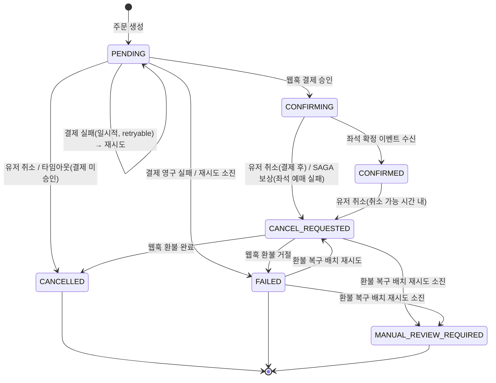

# Order/Payment Service — Architecture

## 1. 기술 스택

| 역할 | 기술 |
|------|------|
| DB | PostgreSQL |
| Cache | Redis (멱등성 키, 분산락) |
| 메시지 큐 | Kafka |
| PG 연동 | MockPaymentGateway (DIP 구조) |

---

## 2. ERD

### 테이블 관계

```
orders 1 ─── N payments
orders 1 ─── N order_status_histories
```

### orders

| 컬럼명 | 타입 | 제약 | 설명 |
|--------|------|------|------|
| order_id | UUID | PK | 주문 고유 식별자 |
| seat_id | UUID | NN | 구매 대상 좌석. 주문 생성 시점엔 티켓이 아직 존재하지 않아 `ticket_id`에서 명칭 변경. |
| user_id | UUID | NN | 주문한 사용자 |
| status | VARCHAR(30) | NN | 주문 상태 머신 상태값 |
| total_amount | BIGINT | NN | 주문 시점 확정 금액 |
| latest_payment_id | UUID | N | 현재 활성 결제 레코드 포인터. 재시도 시 새 Payment INSERT와 같은 트랜잭션에서 갱신. 주문 생성 시점엔 null. |
| created_at | TIMESTAMP | NN | |
| updated_at | TIMESTAMP | NN | |
| status_updated_at | TIMESTAMP | NN | 마지막 상태 변경 시각. SAGA 보상 디버깅 시 사용. |
| expired_at | TIMESTAMP | N | 주문 타임아웃 기준 시각 (타임아웃/좀비 결제 정리 스케줄러 기준값) |

### payments

| 컬럼명 | 타입 | 제약 | 설명 |
|--------|------|------|------|
| payment_id | UUID | PK | |
| order_id | UUID | FK | 연관 주문 |
| amount | BIGINT | NN | 결제 요청 금액 |
| payment_status | VARCHAR(30) | NN | PENDING / REQUESTED / APPROVED / FAILED / CANCELLED / REFUND_REQUESTED / REFUNDED / REFUND_FAILED |
| payment_method | VARCHAR(30) | NN | CARD / BANK_TRANSFER |
| pg_transaction_id | VARCHAR(100) | N | PG 발급 거래 ID. PG 결제 요청 접수 시점에 즉시 발급되어 저장된다. 웹훅 수신 시 이 값으로 결제 레코드를 조회한다. 결제 실패 시 null. |
| idempotency_key | VARCHAR(100) | NN, UNIQUE | 중복 결제 방지 키. 재시도마다 `retry-{orderId}-{UUID}` 형태로 새로 발급한다. |
| refund_amount | BIGINT | NN | 환불 금액 (기본값 0) |
| refund_retry_count | BIGINT | NN | 환불 자동 재시도 횟수 (기본값 0). 환불 복구 배치가 재환불 시도마다 증가시킨다. |
| retryable | BOOLEAN | NN | 결제 재시도 대상 여부. PG 일시적 오류로 실패하면 true, 영구 실패는 false. `PaymentRetryScheduler` 폴링 기준. APPROVED 전이 시 해당 주문의 모든 Payment에 대해 일괄 해제. |
| failure_reason | VARCHAR(255) | N | PG 응답 실패 사유 |
| created_at | TIMESTAMP | NN | |
| updated_at | TIMESTAMP | NN | |

### order_status_histories

| 컬럼명 | 타입 | 제약 | 설명 |
|--------|------|------|------|
| id | UUID | PK | |
| order_id | UUID | FK | |
| from_status | VARCHAR(30) | N | 전이 전 상태. 최초 생성(PENDING 진입) 시 null. |
| to_status | VARCHAR(30) | NN | 전이 후 상태 |
| changed_at | TIMESTAMP | NN | 상태 변경 시각 |
| reason | VARCHAR(255) | N | 취소/실패 사유. `[USER]`/`[SAGA]`/`[TIMEOUT]`/`[RETRY]` 프리픽스로 전이 경로를 구분한다. |

INSERT만 발생하는 append-only 테이블.

### 설계 포인트

**payments 1:N 구조**
결제 실패 시 각 시도의 실패 사유와 PG 승인번호를 추적하기 위해 실패할 때마다 새 레코드를 INSERT한다. 재시도 도입 이후에는 실제로 한 주문에 `FAILED, FAILED, ..., APPROVED` 순으로 여러 레코드가 쌓일 수 있으며, `orders.latest_payment_id`가 "현재 봐야 할 시도"를 O(1)로 가리킨다.

**멱등성 키 이중 방어**
Redis 1차 방어(속도) + DB UNIQUE 제약 2차 방어(안전). 중복 요청 차단 마커를 Redis에 먼저 등록하고, 처리 중 예외 발생 시 해당 마커를 삭제해 다음 요청이 정상 처리될 수 있도록 한다.

**CANCELLED 주문은 삭제하지 않는다**
주문 삭제(hard/soft 불문) 기능 자체가 없다. 취소는 `status`를 `CANCELLED`로 바꾸는 일반적인 상태 전이일 뿐이고, 취소된 주문도 다른 상태와 동일하게 정상 조회된다. CS 처리, 환불 분쟁 시 근거로 남아있어야 하기 때문이다.

### 인덱스 전략

| 테이블 | 컬럼 | 이유 |
|--------|------|------|
| orders | user_id | 주문 목록 조회 풀스캔 방지 |
| orders | status | 타임아웃 처리, SAGA 상태 조회 |
| payments | order_id | 주문별 결제 이력 조회 |
| payments | idempotency_key | 멱등성 키 UNIQUE 제약이 곧 인덱스 |
| payments | pg_transaction_id | 웹훅 수신 시 결제 레코드 빠른 조회 |
| order_status_histories | order_id | 주문별 전체 이력 조회 |

---

## 3. 주문 상태 머신

`orders.status`는 7개 상태로 구성되며, 결제/환불의 세부 진행 상태는 `payments.payment_status`가 별도로 책임진다(관심사 분리).

| 상태 | 설명 |
|------|------|
| PENDING | 주문 생성 완료 ~ 결제 시도 중(승인 전). 결제 요청 진행중 여부는 `payments.payment_status = REQUESTED` 존재로 판단(orders.status만으로는 알 수 없음) |
| CONFIRMING | 결제 승인 완료, 좌석 확정 대기 중 |
| CONFIRMED | 좌석 확정까지 완료, 구매 최종 확정 |
| CANCEL_REQUESTED | 취소 확정, 환불 처리 대기 중 (되돌릴 수 없는 지점). 유저 취소·SAGA 보상·환불 재시도 공통 진입점 |
| CANCELLED | 취소 완료 (결제 전 취소 또는 환불 완료 후) |
| FAILED | 결제 영구 실패 / 재시도 소진 / 환불 거절 |
| MANUAL_REVIEW_REQUIRED | 환불 복구 배치 재시도 소진, 운영자 개입 필요 |

**과거 10-state 설계에서 삭제된 상태**: `PAYMENT_REQUESTED`(→ `payments` 조회로 대체), `COMPENSATING`(→ 애초에 orders 테이블에 persist되지 않는 transient 상태였으므로 제거, history의 `[SAGA]` reason 프리픽스로만 구분), `REFUNDED`(→ `CANCELLED`로 흡수, 환불 완료 여부는 `payments.payment_status`로 조회).



**`Order` 엔티티의 `mark*()` 메서드가 상태 전이를 전담**하며 각 메서드 진입 시 현재 상태를 검증한다(허용되지 않은 전이는 `INTERNAL_SERVER_ERROR`). 전이 경로가 여러 개 겹치는 지점(`markCancelRequested`, `markCancelCompleted`, `markManualReviewRequired`)은 상태값이 아니라 `order_status_histories.reason`의 프리픽스(`[USER]`/`[SAGA]`/`[RETRY]`/`[TIMEOUT]`)로 구분한다.

**결제 재시도와 PENDING의 관계** — 결제 자동 재시도 도입 시 "재시도 중에는 어느 상태에 머물 것인가"가 쟁점이었다(`adr/009` 참고). 최종적으로 `orders.status`는 계속 `PENDING`에 머물고, "재시도 가능한 실패"는 별도 컬럼(retryable)으로 표현하는 방식을 택했다.

---

## 4. Kafka 이벤트

| 토픽 | Producer | Consumer | 용도 |
|------|----------|----------|------|
| order.payment.completed | order-service | ticketing-service | 결제 승인 → 좌석 BOOKED |
| order.payment.failed | order-service | ticketing-service | 결제 실패 → 좌석 해제 |
| order.payment.cancelled | order-service | ticketing-service | 결제 완료 후 취소/환불 → 좌석 해제 |
| order.hold.released | order-service | ticketing-service | 결제 전(PENDING) 좌석 선점 해제 — 유저 직접 취소 + 타임아웃 자동 취소 공통 |
| notification.send | order-service | notification-service | 알림 발송 (ORDER_COMPLETED / ORDER_CANCELED) |
| ticketing.seat.booked | ticketing-service | order-service | 좌석 확정 → 주문 CONFIRMED |
| ticketing.seat.book.failed | ticketing-service | order-service | 좌석 예매 실패 → SAGA 보상 시작 |

**Kafka 발행 원칙 — Transactional Outbox 패턴**

도메인 상태 변경과 이벤트 저장을 같은 트랜잭션으로 묶어 원자성을 보장한다.

```
도메인 상태 UPDATE + order_outbox INSERT → 같은 트랜잭션 (OutboxAppender)
→ OutboxPublisher(@Scheduled 폴링)가 PENDING 레코드를 읽어 Kafka 발행
→ 브로커 ack 확인 후 PUBLISHED로 UPDATE (OutboxRecordPublisher)
→ 발행 실패 시 PENDING 유지 → 다음 폴링이 자동 재시도
```

- **at-least-once 보장**: 발행 성공 전 서버 재시작 시 PENDING 레코드가 남아 재발행된다. 컨슈머는 멱등성을 보장해야 한다.
- **DELETE 대신 UPDATE**: 발행 완료 레코드를 PUBLISHED 상태로 보존한다. DLQ 연동 확장성 및 발행 이력 가시성 확보 목적.
- **한 건씩 독립 트랜잭션**: OutboxPublisher(폴링)와 OutboxRecordPublisher(단건 발행)를 빈 분리. 한 건 발행 실패가 다른 레코드에 전이되지 않는다.

**Kafka DLQ (구현 완료 — `adr/010` 참고)**
Consumer 측(`ticketing.seat.booked`, `ticketing.seat.book.failed` 리스너)은 재시도 소진 메시지를 `DeadLetterPublishingRecoverer`로 `{topic}.DLQ`에 이동시킨다. Outbox 측은 `OrderOutbox.retryCount` + `MAX_RETRY_COUNT`로 재시도 상한을 두고, 소진 시 `FAILED` 상태로 전환해 무한 폴링을 막는다.

**`order.payment.cancelled` vs `order.hold.released` 분리 결정**
PENDING 취소·타임아웃 취소는 `order.hold.released`로, PAID/CONFIRMED 이후 취소·환불은 `order.payment.cancelled`로 분리했다. 결제 완료 이력이 있는 취소 건과 결제 전 단순 선점 해제를 토픽 단계에서 구분해, 추후 환불/정산 배치에서 Payment 테이블 조인 없이 토픽만으로 1차 분류할 수 있게 하기 위함.

> ⚠️ **알려진 갭 — `order.payment.cancelled` 발행 시점**: 현재 `RefundResultWriter.applyRefundSuccess()`에서 **환불 완료(webhook REFUNDED) 시점에만** 발행한다. `CANCEL_REQUESTED` 진입은 이미 되돌릴 수 없는 지점인데, `REFUND_FAILED`나 `MANUAL_REVIEW_REQUIRED`로 빠지는 주문은 좌석이 영구히 해제되지 않는다. 발행 시점을 `CANCEL_REQUESTED` 전이 시점(환불 요청 시점)으로 앞당기는 설계까지는 끝났으나 아직 코드 반영 전 — TODO로 아래 6번 표에 등록.

---

## 5. 동시성 제어 전략

| 상황 | 전략                                                                                                                      |
|------|-------------------------------------------------------------------------------------------------------------------------|
| 주문 생성 중복 요청 (1차) | holdId 기반 Redis 멱등성 체크                                                                                                  |
| 주문 생성 중복 요청 (2차, Redis 장애 시) | seat_id + 진행중 상태(`OrderStatus.ACTIVE` = PENDING, CONFIRMING) 부분 UNIQUE 인덱스                                              |
| 중복 결제 요청 (동일 인스턴스) | Redis 멱등성 키                                                                                                             |
| 중복 결제 요청 (다중 인스턴스) | Redis 분산락                                                                                                               |
| 결제 진행중(REQUESTED) 상태에서 취소/타임아웃 요청 | `payments.existsByOrderIdAndPaymentStatus(REQUESTED)` 체크 후 보류(409/스킵) — 웹훅 결과를 먼저 기다림                                   |
| 주문 상태 동시 변경 | DB 비관적 락(`findByIdForUpdate`)                                                                                           |
| 중복 결제 DB 레벨 방어 | 멱등성 키 DB UNIQUE 제약                                                                                                      |
| 웹훅 중복 수신 | Redis SETNX 1차 차단(`pgTransactionId:status` 키) + 상태 전이 성공 여부를 반환해 Kafka 이벤트 중복 발행 방지                                     |
| 주문 취소 중복 요청 (이미 CANCELLED) | 200 + 현재 상태 반환 (멱등 응답)                                                                                                  |
| 주문 취소 (CANCEL_REQUESTED/FAILED/MANUAL_REVIEW_REQUIRED) | 409 INVALID_ORDER_STATUS                                                                                                |
| CONFIRMED 취소 (취소 가능 시간 초과) | 409 CANCELLATION_WINDOW_EXPIRED                                                                                         |
| 주문 타임아웃 자동 취소와 유저 직접 취소 경합 | 비관적 락 + 건당 트랜잭션. 락 획득 못한 쪽은 재검증 시 상태 불일치를 확인하고 스킵(스케줄러)/409(유저 요청) 처리                                                   |
| 좌석 예매 실패(SAGA)와 유저 직접 취소 경합 | 비관적 락 + 상태 검증. 먼저 락을 잡은 쪽만 `CANCEL_REQUESTED`로 전이, 나머지는 재검증에서 걸러짐(`OrderCompensationWriter`가 이미 처리된 상태는 예외 대신 멱등 결과 반환) |
| 결제 재시도 재진입 | `orders.latest_payment_id` 포인터 + `payments.retryable` 플래그 조합. 마지막 시도가 아직 `REQUESTED`(orphan)면 재시도 보류                    |
| 결제 요청 중 웹훅 유실("좀비" 결제) | 좀비 결제 정리 배치 — PG 거래조회로 실제 결과 동기화.                                                                                       |

### 주문 생성 부분 UNIQUE 인덱스

```sql
DROP INDEX IF EXISTS uq_orders_seat_active;
CREATE UNIQUE INDEX IF NOT EXISTS uq_orders_seat_active
    ON orders (seat_id)
    WHERE status IN ('PENDING', 'CONFIRMING');
```

"이 좌석에 대해 아직 결제까지 끝나지 않은, 살아있는 시도가 있는가"를 기준으로 상태를 선정했다. `OrderStatus.ACTIVE`(Java enum)와 이 조건은 반드시 동일해야 하며, 어긋나면 애플리케이션 레벨 멱등 체크와 DB 레벨 최종 방어선의 기준이 갈라진다.

- **포함** — PENDING, CONFIRMING: 해당 좌석을 점유 중인 진행 상태
- **제외 — CONFIRMED**: 구매 완전 종료. Ticketing이 더 이상 선점 요청을 받지 않음
- **제외 — CANCELLED/FAILED/MANUAL_REVIEW_REQUIRED**: 좌석이 재판매 가능한 상태(또는 별도 수동 처리 대상)로 종료됨. 인덱스 포함 시 취소 후 재구매 불가
- **제외 — CANCEL_REQUESTED**: Ticketing이 `ticketing.seat.book.failed` 발행 시점(SAGA) 또는 유저 취소 요청 시점에 좌석을 즉시 해제한다는 전제에 기반. 전제가 깨지면 이 상태도 포함해야 함

### 결제 요청 락 획득 순서

```
1. Redis 분산락 획득
2. 주문 비관적 락 조회
3. 상태 검증 (PENDING만 통과, 그리고 진행중 REQUESTED 없음을 재확인)
4. 결제 레코드 INSERT (REQUESTED)
5. 주문 latest_payment_id 갱신 (커밋)
6. 분산락 해제                          ← PG 호출 전에 해제
7. PG API 호출 (PG 트랜잭션 ID 수령)
8. PG 트랜잭션 ID DB 저장
```

5번 시점에 이미 `payments`에 `REQUESTED` 레코드가 존재하므로, 6번 이후 들어오는 동시 요청은 `existsByOrderIdAndPaymentStatus(REQUESTED)` 체크에서 자연히 거부된다. 락은 1차 방어(레코드 생성 구간의 동시성), DB 상태값은 2차 방어(PG 호출 구간 전체)로 역할이 분리된다.

---

## 6. 미확정 항목 / 알려진 갭

| 항목 | 현황                                                   | 내용 |
|------|------------------------------------------------------|------|
| 결제 요청 진행중(REQUESTED) 좀비 상태 정리 | ✅ 구현 완료, **PR 리뷰 대기** (`feature/306-zombie-payment`) | PG 거래조회 결과 기반으로 `APPROVED`→CONFIRMING 동기화 / 그 외→FAILED 동기화. 15초 폴링. `develop`엔 아직 merge 안 됨 |
| 결제 재시도 | ✅ 구현 완료                                              | `orders.latest_payment_id` 포인터 + `payments.retryable` 방식. 재시도 중에도 `PENDING` 유지(`adr/009` 갱신 참고) |
| Kafka DLQ | ✅ 구현 완료                                              | Consumer DLQ + Outbox `retryCount`/`MAX_RETRY_COUNT`. `adr/010` 참고 |
| `order.payment.cancelled` 발행 시점 이전 | 🔧 설계 완료, **코드 미반영**                                 | 환불 완료 시점 → `CANCEL_REQUESTED` 전이 시점(환불 요청 시점)으로 이동 예정. `REFUND_FAILED`/`MANUAL_REVIEW_REQUIRED` 경로에서 좌석이 영구 미해제되는 버그를 막기 위함. `OrderCancelWriter`(PAID/CONFIRMED 취소 분기)에 `appendPaymentCancelled` 추가, `RefundResultWriter.applyRefundSuccess`/`RefundRecoveryWriter.syncToRefunded`에서는 제거(알림만 유지), `OrderCompensationWriter`엔 `OutboxAppender` 의존성 자체가 없어 추가 필요 |
| holdId Redis TTL | 미반영                                                  | Ticketing 좌석 선점 TTL과 동일하게 맞추기로 원칙 확정. 구체 값은 Ticketing 팀 확인 필요 |
| 환불 미완료 주문 복구 배치 | ✅ 구현 완료                                              | PG 거래조회 결과 기반 분기 + 재시도 3회 + MANUAL_REVIEW_REQUIRED 전환. `adr/008` 참고 |
| `CONFIRMING` 상태 복구 로직 부재 | 🔧 설계 검토 중, 코드 미반영                                   | `ticketing.seat.booked`/`ticketing.seat.book.failed`가 아예 안 오는 경우(Ticketing 크래시, 발행 누락, Kafka 유실 등) 방어가 없음 |
| 결제 요청 시 Redis가 단일 장애점(SPOF) | 확인됨, 미해결                                             | `PaymentRequestService.requestPayment()`의 `lock.tryLock()`이 `InterruptedException`만 잡아서, Redis 연결 장애 시 DB 비관적 락(원래 의도한 최종 방어선)에 도달하기 전에 요청이 실패한다. `adr/003`, `redis-keys.md` 참고 |
| 비관적 락 타임아웃 미설정 | 확인 필요                                                | `findByIdForUpdate()`에 `jakarta.persistence.lock.timeout` 힌트 없음. DB 커넥션/statement 타임아웃도 이 레포에선 안 보임(Config Server에 있을 수 있어 확인 필요). `adr/007` 참고 |