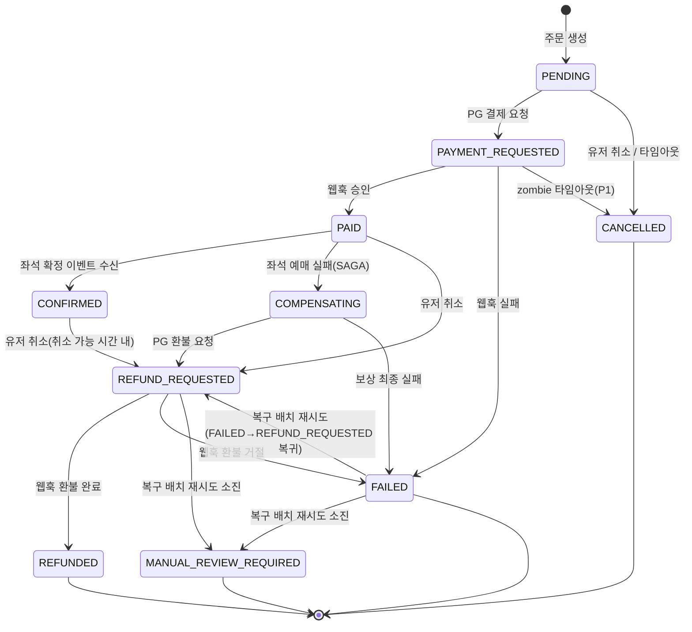

# Order/Payment Service — Architecture

## 1. 기술 스택

| 역할 | 기술 |
|------|------|
| DB | PostgreSQL |
| Cache | Redis (멱등성 키, 분산락) |
| 메시지 큐 | Kafka |
| PG 연동 | MockPaymentGateway (DIP 구조) |

---

## 2. ERD

### 테이블 관계

```
orders 1 ─── N payments
orders 1 ─── N order_status_histories
```

### orders

| 컬럼명 | 타입 | 제약 | 설명 |
|--------|------|------|------|
| order_id | UUID | PK | 주문 고유 식별자 |
| seat_id | UUID | NN | 구매 대상 좌석. 주문 생성 시점엔 티켓이 아직 존재하지 않아 `ticket_id`에서 명칭 변경. |
| user_id | UUID | NN | 주문한 사용자 |
| status | VARCHAR(30) | NN | 주문 상태 머신 상태값 |
| total_amount | BIGINT | NN | 주문 시점 확정 금액 |
| created_at | TIMESTAMP | NN | |
| updated_at | TIMESTAMP | NN | |
| status_updated_at | TIMESTAMP | NN | 마지막 상태 변경 시각. SAGA 보상 디버깅 시 사용. |
| expired_at | TIMESTAMP | N | 주문 타임아웃 기준 시각 (P1 스케줄러 기준값) |
| latest_payment_id | UUID | N | 현재 유효한 결제 시도를 가리키는 포인터. Payment 새로 생성될 때마다 같은 트랜잭션에서 갱신(Stripe `PaymentIntent.latest_charge` 패턴). 결제 재시도(#268) 도입으로 추가. |

### payments

| 컬럼명 | 타입 | 제약 | 설명 |
|--------|------|------|------|
| payment_id | UUID | PK | |
| order_id | UUID | FK | 연관 주문 |
| amount | BIGINT | NN | 결제 요청 금액 |
| payment_status | VARCHAR(30) | NN | REQUESTED / APPROVED / FAILED / REFUNDED |
| payment_method | VARCHAR(30) | NN | CARD / BANK_TRANSFER |
| pg_transaction_id | VARCHAR(100) | N | PG 발급 거래 ID. PG 결제 요청 접수 시점에 즉시 발급되어 저장된다. 웹훅 수신 시 이 값으로 결제 레코드를 조회한다. 결제 실패 시 null. |
| idempotency_key | VARCHAR(100) | NN, UNIQUE | 중복 결제 방지 키 |
| refund_amount | BIGINT | NN | 환불 금액 (기본값 0) |
| refund_retry_count | BIGINT | NN | 환불 자동 재시도 횟수 (기본값 0). 복구 배치(#96)가 재환불 시도마다 증가시킨다. |
| failure_reason | VARCHAR(255) | N | PG 응답 실패 사유 |
| retryable | BOOLEAN | NN | 결제 자동 재시도(#268) 대상 여부. Webhook `failureReason`이 `TRANSIENT:` 접두사면 true — `PaymentRetryScheduler`가 폴링 기준으로 사용. 기본값 false, 재시도 성공/횟수초과 시 클리어. |
| created_at | TIMESTAMP | NN | |
| updated_at | TIMESTAMP | NN | |

### order_status_histories

| 컬럼명 | 타입 | 제약 | 설명 |
|--------|------|------|------|
| id | UUID | PK | |
| order_id | UUID | FK | |
| from_status | VARCHAR(30) | N | 전이 전 상태. 최초 생성(PENDING 진입) 시 null. |
| to_status | VARCHAR(30) | NN | 전이 후 상태 |
| changed_at | TIMESTAMP | NN | 상태 변경 시각 |
| reason | VARCHAR(255) | N | 취소 사유, 실패 사유 등 |

INSERT만 발생하는 append-only 테이블.

### 설계 포인트

**payments 1:N 구조**
결제 실패 시 각 시도의 실패 사유와 PG 승인번호를 추적하기 위해 실패할 때마다 새 레코드를 INSERT한다.

**멱등성 키 이중 방어**
Redis 1차 방어(속도) + DB UNIQUE 제약 2차 방어(안전). 중복 요청 차단 마커를 Redis에 먼저 등록하고, 처리 중 예외 발생 시 해당 마커를 삭제해 다음 요청이 정상 처리될 수 있도록 한다.

**CANCELLED 주문 soft delete 미사용**
CANCELLED 주문은 정상 상태로 조회 가능해야 한다. CS 처리, 환불 분쟁 근거 보존 목적.

### 인덱스 전략

| 테이블 | 컬럼 | 이유 |
|--------|------|------|
| orders | user_id | 주문 목록 조회 풀스캔 방지 |
| orders | status | 타임아웃 처리, SAGA 상태 조회 |
| payments | order_id | 주문별 결제 이력 조회 |
| payments | idempotency_key | 멱등성 키 UNIQUE 제약이 곧 인덱스 |
| payments | pg_transaction_id | 웹훅 수신 시 결제 레코드 빠른 조회 |
| order_status_histories | order_id | 주문별 전체 이력 조회 |

---

## 3. 주문 상태 머신

### 상태 정의

| 상태 | 설명 |
|------|------|
| PENDING | 주문 생성 완료, 결제 요청 전 |
| PAYMENT_REQUESTED | PG 결제 API 호출 완료, 웹훅 승인 응답 대기 중 |
| PAID | 웹훅으로 결제 승인 완료, 좌석 예매 확정 전 |
| CONFIRMED | 좌석 예매 확정까지 완료, 구매 최종 확정 |
| COMPENSATING | 좌석 예매 실패로 보상 트랜잭션 진행 중 |
| REFUND_REQUESTED | PG 환불 API 호출 완료, 환불 처리 대기 중 |
| CANCELLED | 주문 취소 완료 |
| REFUNDED | 환불 완료 |
| FAILED | 결제 실패 또는 보상 트랜잭션 최종 실패 |
| MANUAL_REVIEW_REQUIRED | 환불 복구 배치(#96) 자동 재시도 소진. 더 이상 자동 처리 불가, 운영자 개입 필요. |

### 상태 전이 다이어그램



---

## 4. Kafka 이벤트

| 토픽 | Producer | Consumer | 용도 |
|------|----------|----------|------|
| order.payment.completed | order-service | ticketing-service | 결제 승인 → 좌석 BOOKED |
| order.payment.failed | order-service | ticketing-service | 결제 실패 → 좌석 해제 |
| order.payment.cancelled | order-service | ticketing-service | 결제 완료 후 취소/환불 → 좌석 해제 |
| order.hold.released | order-service | ticketing-service | 결제 전(PENDING) 좌석 선점 해제 — 유저 직접 취소 + 타임아웃 자동 취소 공통 |
| notification.send | order-service | notification-service | 알림 발송 (ORDER_COMPLETED / ORDER_CANCELED) |
| ticketing.seat.booked | ticketing-service | order-service | 좌석 확정 → 주문 CONFIRMED |
| ticketing.seat.book.failed | ticketing-service | order-service | 좌석 예매 실패 → SAGA 보상 시작 |

**Kafka 발행 원칙 — Transactional Outbox 패턴**

도메인 상태 변경과 이벤트 저장을 같은 트랜잭션으로 묶어 원자성을 보장한다.

```
도메인 상태 UPDATE + order_outbox INSERT → 같은 트랜잭션 (OutboxAppender)
→ OutboxPublisher(@Scheduled 폴링)가 PENDING 레코드를 읽어 Kafka 발행
→ 브로커 ack 확인 후 PUBLISHED로 UPDATE (OutboxRecordPublisher)
→ 발행 실패 시 PENDING 유지 → 다음 폴링이 자동 재시도
```

- **at-least-once 보장**: 발행 성공 전 서버 재시작 시 PENDING 레코드가 남아 재발행된다. 컨슈머는 멱등성을 보장해야 한다.
- **DELETE 대신 UPDATE**: 발행 완료 레코드를 PUBLISHED 상태로 보존한다. DLQ 연동 확장성 및 발행 이력 가시성 확보 목적.
- **한 건씩 독립 트랜잭션**: OutboxPublisher(폴링)와 OutboxRecordPublisher(단건 발행)를 빈 분리. 한 건 발행 실패가 다른 레코드에 전이되지 않는다.

**`order.payment.cancelled` vs `order.hold.released` 분리 결정**
PENDING 취소·타임아웃 취소는 `order.hold.released`로, PAID/CONFIRMED 이후 취소·환불은 `order.payment.cancelled`로 분리했다. 결제 완료 이력이 있는 취소 건과 결제 전 단순 선점 해제를 토픽 단계에서 구분해, 추후 환불/정산 배치에서 Payment 테이블 조인 없이 토픽만으로 1차 분류할 수 있게 하기 위함.

**Consumer/Outbox DLQ 정책**

Consumer 쪽(ticketing 이벤트 수신)과 Outbox 쪽(자체 발행) 실패는 서로 다른 방식으로 처리한다 — 실패 지점이 다르기 때문이다.

| 구분 | 대상 | 재시도 | 소진 시 처리 |
|------|------|--------|--------------|
| Consumer | `ticketing.seat.booked`, `ticketing.seat.book.failed` 수신 | `FixedBackOff(1000ms, 2회)` | `DeadLetterPublishingRecoverer`가 `{원본토픽}.DLQ`로 이동(토픽명 동적 조합) |
| Outbox | 자체 발행(`OutboxRecordPublisher`) | 스케줄러 폴링마다 재시도(횟수 제한 없이 PENDING 유지, `retryCount`만 증가) | `retryCount >= MAX_RETRY_COUNT(5)`에서 `OutboxStatus.FAILED`로 전이 — 별도 DLQ 토픽으로 보내지 않고 폴링 대상에서만 제외(수동 처리 대상) |

- **Consumer용 `dlqKafkaTemplate` 별도 분리**: `DeadLetterPublishingRecoverer`가 임의 토픽(`{topic}.DLQ`)에 쓸 때 `enable.idempotence` 제약 없이 동작해야 해서, 메인 `kafkaTemplate`(idempotence=true, `@Primary`)과 분리했다.
- **Outbox는 왜 `.DLQ` 토픽을 안 쓰는가**: Outbox 실패는 "우리 쪽 발행 자체"가 안 된 것이라 다른 컨슈머가 소비할 메시지가 없다. DLQ 토픽으로 보내봐야 소비할 주체가 없으므로, DB 상태(`FAILED`)로 남겨 운영자가 직접 확인하는 편이 더 명확하다.
- **알려진 정리 항목**: `KafkaTopics.SEAT_BOOKED_DLQ`/`SEAT_BOOK_FAILED_DLQ` 상수가 주석 처리된 채 미사용 상태로 남아있다(recoverer는 `record.topic() + ".DLQ"`로 직접 조합). 상수를 recoverer가 참조하도록 통일하거나 상수를 제거해야 함 — 급하지 않은 정리 대상.

---

## 5. 동시성 제어 전략

| 상황 | 전략 |
|------|------|
| 주문 생성 중복 요청 (1차) | holdId 기반 Redis 멱등성 체크 |
| 주문 생성 중복 요청 (2차, Redis 장애 시) | seat_id + 진행중 상태 부분 UNIQUE 인덱스 |
| 중복 결제 요청 (동일 인스턴스) | Redis 멱등성 키 |
| 중복 결제 요청 (다중 인스턴스) | Redis 분산락 |
| 주문 상태 동시 변경 | DB 비관적 락 |
| 중복 결제 DB 레벨 방어 | 멱등성 키 DB UNIQUE 제약 |
| 웹훅 중복 수신 | Redis SETNX 1차 차단 + 상태 전이 성공 여부를 반환해 Kafka 이벤트 중복 발행 방지 |
| 주문 취소 중복 요청 (이미 CANCELLED/REFUNDED) | 200 + 현재 상태 반환 (멱등 응답) |
| 주문 취소 (COMPENSATING/REFUND_REQUESTED/FAILED) | 409 INVALID_ORDER_STATUS |
| CONFIRMED 취소 (취소 가능 시간 초과) | 409 CANCELLATION_WINDOW_EXPIRED |
| 주문 타임아웃 자동 취소와 유저 직접 취소 경합 | 비관적 락 + 건당 트랜잭션. 락 획득 못한 쪽은 재검증 시 상태 불일치를 확인하고 스킵(스케줄러)/409(유저 요청) 처리 |
| 결제 자동 재시도 스케줄러 동시 실행(#268) | 비관적 락(`findByIdForUpdate`) + 건당 트랜잭션. `latest_payment_id` 포인터로 "현재 유효한 시도"를 O(1) 판별해 정렬 모호성 없이 처리 |

### 주문 생성 부분 UNIQUE 인덱스

```sql
CREATE UNIQUE INDEX uq_orders_seat_active
    ON orders (seat_id)
    WHERE status IN ('PENDING', 'PAYMENT_REQUESTED', 'PAID');
```

"이 좌석에 대해 아직 결제까지 끝나지 않은, 살아있는 시도가 있는가"를 기준으로 상태를 선정했다.

- **포함** — PENDING, PAYMENT_REQUESTED, PAID: 해당 좌석을 점유 중인 진행 상태
- **제외 — CONFIRMED**: 구매 완전 종료. Ticketing이 더 이상 선점 요청을 받지 않음
- **제외 — CANCELLED/REFUNDED/FAILED**: 좌석이 재판매 가능한 상태. 인덱스 포함 시 취소 후 재구매 불가
- **제외 — COMPENSATING/REFUND_REQUESTED**: Ticketing이 `ticketing.seat.book.failed` 발행 시점에 좌석을 즉시 해제한다는 전제에 기반. 전제가 깨지면 두 상태도 포함해야 함

### 결제 요청 락 획득 순서

```
1. Redis 분산락 획득
2. 주문 비관적 락 조회
3. 상태 검증 (PENDING만 통과)
4. 결제 레코드 INSERT
5. 주문 상태 → PAYMENT_REQUESTED (커밋)
6. 분산락 해제                          ← PG 호출 전에 해제
7. PG API 호출 (PG 트랜잭션 ID 수령)
8. PG 트랜잭션 ID DB 저장
```

5번에서 상태가 이미 PAYMENT_REQUESTED로 바뀌었으므로, 6번 이후 들어오는 동시 요청은 상태 검증에서 자연히 거부된다. 락 1차 방어, DB 상태값이 PG 호출 구간 전체를 덮는 2차 방어로 역할이 분리된다.

---

## 6. 미확정 항목

| 항목 | 현황 | 내용 |
|------|------|------|
| PAYMENT_REQUESTED zombie 처리 | 미구현 | 결제 타임아웃 스케줄러는 PENDING만 처리(#224). PAYMENT_REQUESTED 좀비 상태는 PG 거래 조회로 실제 승인 여부 확인이 필요해 별도 검토 대상. 결제 재시도(#268) 도입 후 재요청 실패 시 생기는 orphan Payment(REQUESTED)도 동일 갈래 — adr/009 "남은 갭" 참고 |
| holdId Redis TTL | 미확정 | Ticketing 좌석 선점 TTL과 동일하게 맞추기로 원칙 확정. 구체 값은 Ticketing 팀 확인 필요 |
| COMPENSATING/REFUND_REQUESTED 좌석 해제 시점 | 전제 | Ticketing이 book.failed 발행 시 좌석을 즉시 해제한다는 전제. 틀리면 두 상태를 인덱스에 추가해야 함 |
| CONFIRMED 취소 가능 시간 기준 | 미정 | 공연 시작 시각 기준 vs 확정 시각 기준. Ticketing 공연 일정 정보 참조 방식도 함께 결정 필요 |
| CONFIRMED 취소 시 Kafka 이벤트 | 미정 | order.payment.cancelled를 그대로 쓸지, 확정 취소 전용 처리가 필요한지 Ticketing 팀 확인 필요. PENDING/타임아웃 쪽은 order.hold.released로 이미 분리 확정 |
| 결제 전 취소 알림 발송 | 미정 | PENDING 취소 시 notification.send 발행 여부. 현재 미구현 |
| FAILED/REFUND_REQUESTED stuck 복구 배치 | ✅ 구현 완료 | PG 거래조회 결과 기반 분기 + 재시도 3회 + MANUAL_REVIEW_REQUIRED 전환. adr/008 참고 |
| 결제 재시도 (P1) | ✅ 구현 완료 | `latest_payment_id` 포인터 + `PAYMENT_REQUESTED` 유지 방식으로 구현(#268). adr/009 참고 |
| Kafka Consumer/Outbox DLQ (P1) | ✅ 구현 완료 | Consumer는 `{topic}.DLQ` 동적 토픽 이동, Outbox는 `FAILED` 상태 전이로 처리(#270). adr/010 참고 |