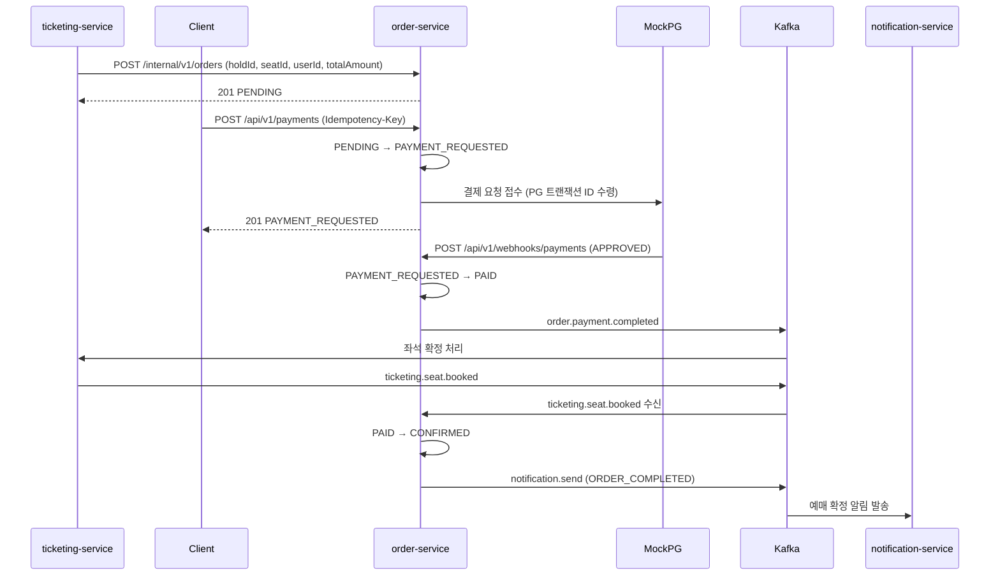
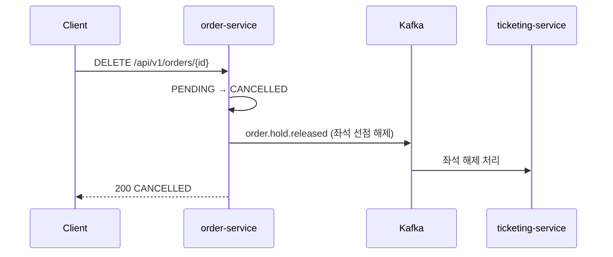
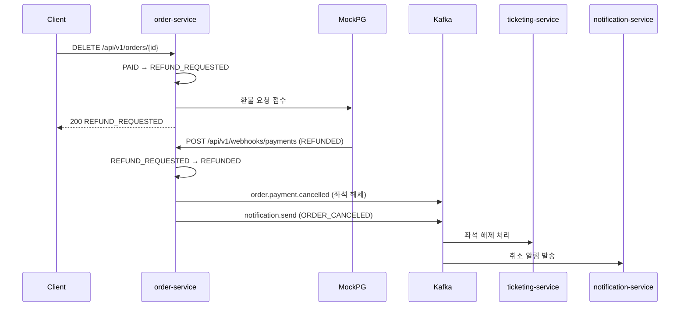
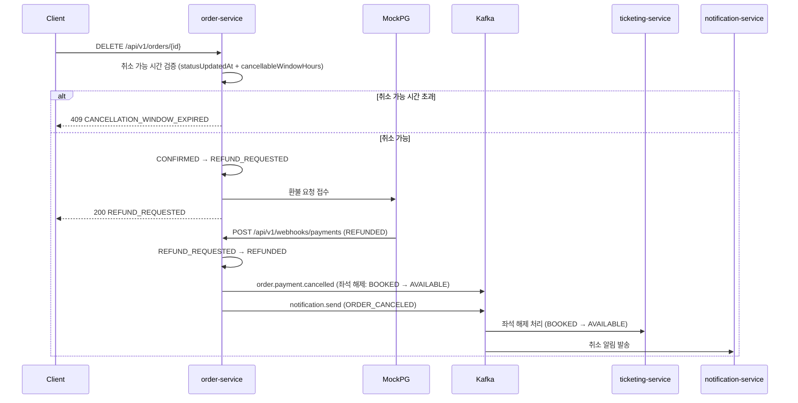
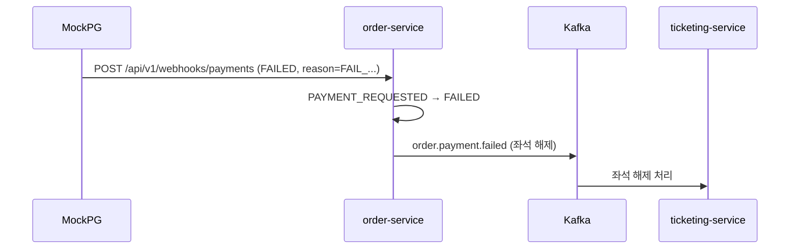
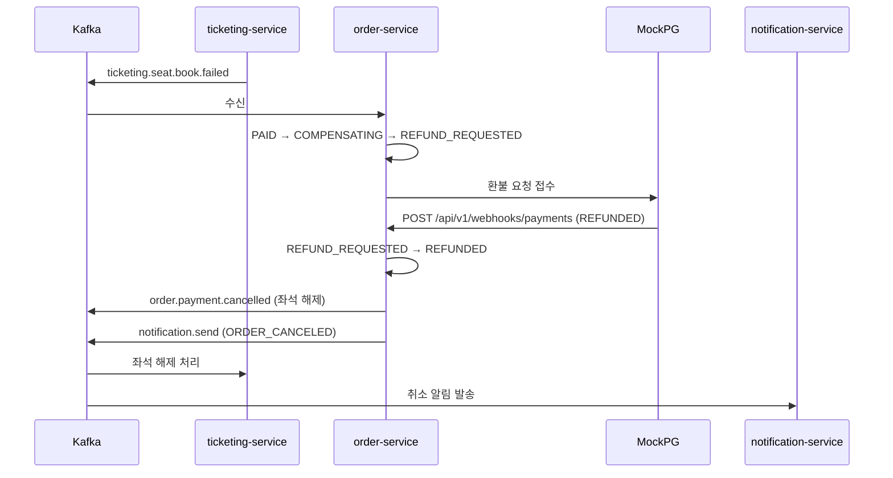
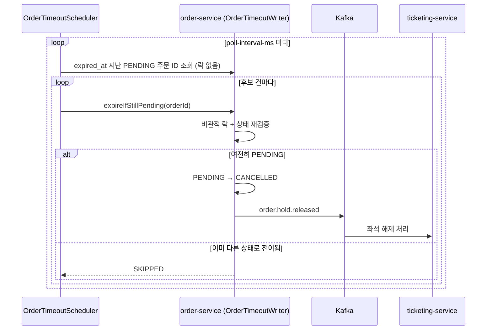
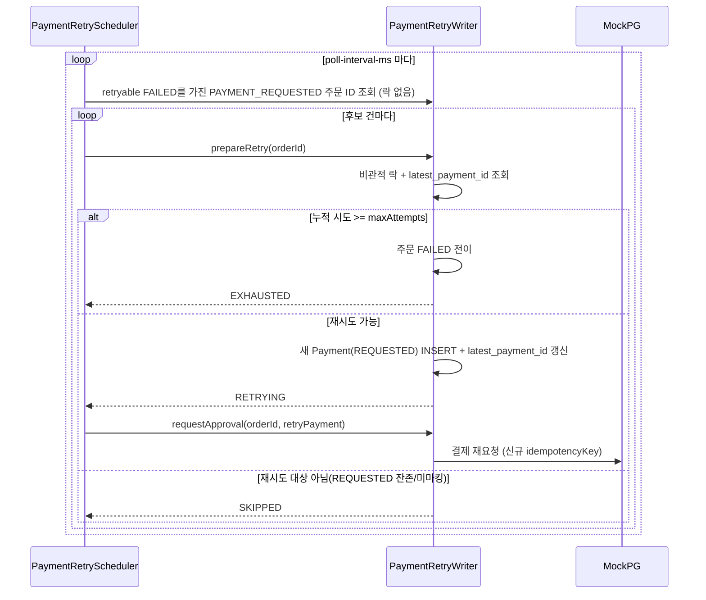

# Order/Payment Service — Flows

전체 시나리오별 흐름을 정리한다. 상태 전이 규칙은 [architecture.md](./architecture.md)를 참고.

---

## 시나리오 목록

1. [주문 완료 (해피패스)](#1-주문-완료-해피패스)
2. [결제 전 취소](#2-결제-전-취소)
3. [결제 후 취소 (PAID)](#3-결제-후-취소-paid)
4. [예매 확정 후 취소 (CONFIRMED)](#4-예매-확정-후-취소-confirmed)
5. [결제 실패](#5-결제-실패)
6. [SAGA 보상 트랜잭션](#6-saga-보상-트랜잭션)
7. [주문 타임아웃 자동 취소](#7-주문-타임아웃-자동-취소)
8. [결제 자동 재시도](#8-결제-자동-재시도)

---

## 1. 주문 완료 (해피패스)

```
주문 생성 (Ticketing Feign)
→ PG 결제 요청 (응답: PAYMENT_REQUESTED)
→ [비동기] 웹훅 승인 수신
→ order.payment.completed 발행
→ [Ticketing] 좌석 확정 처리
→ ticketing.seat.booked 수신
→ 주문 CONFIRMED
→ notification.send 발행 (ORDER_COMPLETED)
```



---

## 2. 결제 전 취소

취소 가능 상태: `PENDING`

```
주문 취소 요청
→ 주문 CANCELLED
→ order.hold.released 발행 (좌석 선점 해제)
→ 응답: 200 CANCELLED
```

> 결제 전 취소 시 알림 발송 여부는 미결정. 현재 미구현.



---

## 3. 결제 후 취소 (PAID)

취소 가능 상태: `PAID`

```
주문 취소 요청
→ 주문 REFUND_REQUESTED
→ PG 환불 요청 접수
→ 응답: 200 REFUND_REQUESTED
→ [비동기] 웹훅 환불 완료 수신
→ 주문 REFUNDED
→ order.payment.cancelled 발행 (좌석 해제)
→ notification.send 발행 (ORDER_CANCELED)
```



---

## 4. 예매 확정 후 취소 (CONFIRMED)

취소 가능 상태: `CONFIRMED` (취소 가능 시간 내)

흐름은 [결제 후 취소](#3-결제-후-취소-paid)와 동일. 취소 가능 시간 초과 시 409 `CANCELLATION_WINDOW_EXPIRED`.

> 취소 가능 시간 기준 (공연 시작 시각 vs 확정 시각) 미확정. Ticketing 팀 확인 필요.

```
주문 취소 요청
→ 취소 가능 시간 검증
→ 주문 REFUND_REQUESTED
→ PG 환불 요청 접수
→ 응답: 200 REFUND_REQUESTED
→ [비동기] 웹훅 환불 완료 수신
→ 주문 REFUNDED
→ order.payment.cancelled 발행 (좌석 해제: BOOKED → AVAILABLE)
→ notification.send 발행 (ORDER_CANCELED)
```



> CONFIRMED 취소 시 좌석 상태 전이는 BOOKED → AVAILABLE. 결제 전 취소(PENDING → CANCELLED) 및 타임아웃 자동 취소는 `order.hold.released` 토픽으로 분리되어 있어, 결제 이력이 있는 취소 건(PAID/CONFIRMED)과 토픽 레벨에서 명확히 구분된다.

---

## 5. 결제 실패

웹훅 `failureReason`이 `TRANSIENT:` 접두사인지에 따라 두 갈래로 나뉜다.

**영구 실패** (그 외 사유)

```
[비동기] 웹훅 실패 수신
→ 주문 FAILED
→ order.payment.failed 발행 (좌석 해제)
```



**일시적 실패** (`TRANSIENT:` 접두사) — 재시도 대상, [8. 결제 자동 재시도](#8-결제-자동-재시도) 참고

```
[비동기] 웹훅 실패 수신 (TRANSIENT:)
→ 주문 상태 유지 (PAYMENT_REQUESTED)
→ Payment FAILED + retryable=true 마킹
→ (스케줄러가 폴링해 재시도)
```

---

## 6. SAGA 보상 트랜잭션

좌석 예매 실패 시 결제를 자동 환불하는 보상 흐름.

```
ticketing.seat.book.failed 수신
→ 주문 COMPENSATING
→ PG 환불 요청 접수
→ 주문 REFUND_REQUESTED
→ [비동기] 웹훅 환불 완료 수신
→ 주문 REFUNDED
→ order.payment.cancelled 발행 (좌석 해제)
→ notification.send 발행 (ORDER_CANCELED)
```



**보상 실패 케이스**

PG 환불 요청 접수 자체가 실패(네트워크 오류 등)하면 로그만 남기고 REFUND_REQUESTED 상태에서 멈춘다. `RefundRecoveryScheduler`가 PG 거래조회 기반으로 이 상태를 복구한다 — 상세는 [adr/008](./adr/008-refund-recovery-batch.md) 참고.

환불 웹훅으로 `REFUND_FAILED`가 수신되면 FAILED로 전이하고, 이 역시 복구 배치의 재시도 대상이 된다(소진 시 `MANUAL_REVIEW_REQUIRED`).

---

## 7. 주문 타임아웃 자동 취소

`expired_at` 기준 폴링 스케줄러(`OrderTimeoutScheduler`)가 PENDING 주문을 자동 취소한다. 후보 조회는 락 없이 ID만 가져오고, 실제 전이는 건당 트랜잭션(`OrderTimeoutWriter`)에서 비관적 락 + 상태 재검증 후 수행한다. 유저 직접 취소와 동시에 경합하면, 락을 먼저 획득한 쪽만 처리되고 나머지는 재검증에서 상태 불일치를 확인해 스킵(스케줄러)되거나 409(유저 요청)로 거부된다.

```
스케줄러 폴링 (expired_at < now, status = PENDING)
→ 건당 비관적 락 획득 + 상태 재검증
→ 여전히 PENDING이면: CANCELLED 전이 + order.hold.released 발행
→ 이미 다른 상태로 바뀌었으면: 스킵 (정상 경합, 에러 아님)
```



**PAYMENT_REQUESTED zombie 상태는 이 스케줄러 범위 밖** — PG 웹훅 미수신으로 PAYMENT_REQUESTED에 멈춘 주문은 단순 타임아웃 취소가 위험하다(실제로는 PG가 승인했는데 취소 처리하면 정합성이 깨짐). PG 거래 조회로 실제 승인 여부를 확인하는 별도 복구 로직이 필요하며 현재 미구현이다.

---

## 8. 결제 자동 재시도

`PaymentRetryScheduler`가 `retryable=true`인 FAILED Payment를 가진 `PAYMENT_REQUESTED` 주문을 폴링해 자동 재시도한다. 주문 상태는 `PAYMENT_REQUESTED`를 벗어나지 않고, `payments`에 새 레코드가 추가되는 방식(기존 1:N 구조 그대로)이다. 설계 배경은 [adr/009](./adr/009-payment-retry-design.md) 참고.

```
스케줄러 폴링 (retryable=true FAILED Payment를 가진 PAYMENT_REQUESTED 주문)
→ 건당 비관적 락 획득
→ latest_payment_id가 가리키는 Payment 확인
  → REQUESTED(이전 PG 호출 미완료) 이면: 스킵 (webhook/타임아웃 정리 대기)
  → retryable 아니면: 스킵
  → 누적 시도 횟수 >= maxAttempts 이면: 주문 FAILED 전이 + order.payment.failed 발행
  → 그 외: 새 Payment(REQUESTED) 생성 + latest_payment_id 갱신 + 새 idempotencyKey 발급
→ (트랜잭션 커밋 후) PG 재요청
→ 이후 흐름은 [1. 해피패스](#1-주문-완료-해피패스)의 웹훅 분기와 동일
```



**새 `Idempotency-Key`를 매 시도마다 발급하는 이유**: 이전 키를 재사용하면 PG가 중복 요청으로 간주해 이전 결과(실패)를 그대로 반환할 수 있다. `payments.idempotency_key` UNIQUE 제약과도 맞물려, 새 키를 쓰면 자연스럽게 새 레코드가 생성된다.

**PG 재요청 실패 시**: 새로 만든 Payment가 `REQUESTED`에서 멈춘다(orphan). `OrderTimeoutScheduler`는 `PENDING` 주문만 처리 대상이라 `PAYMENT_REQUESTED` 상태인 이 주문을 정리해주지 않는다 — 기존에 문서화된 "PAYMENT_REQUESTED zombie" 문제와 같은 갈래이며 별도 복구 로직 없이 현재 미해결 상태.