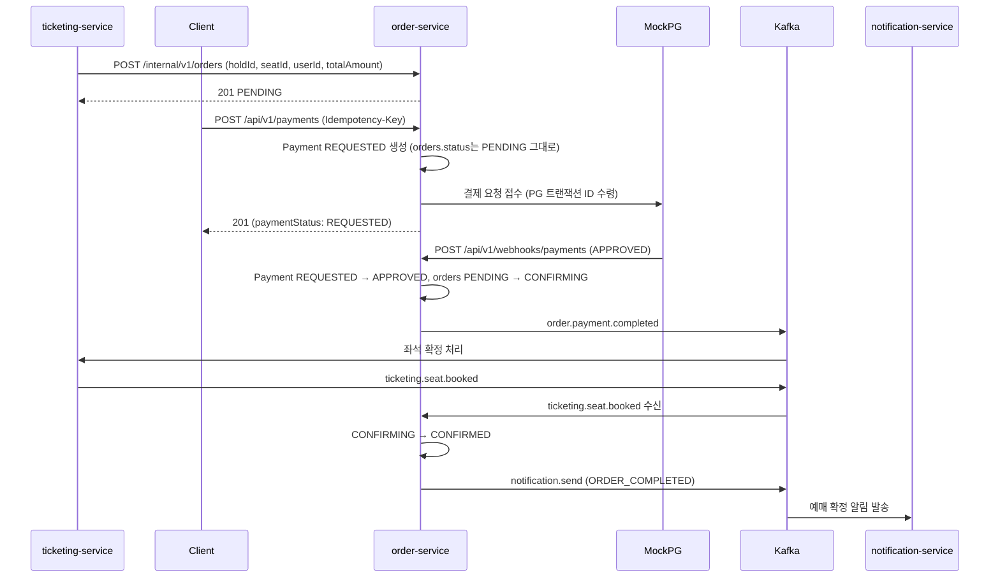
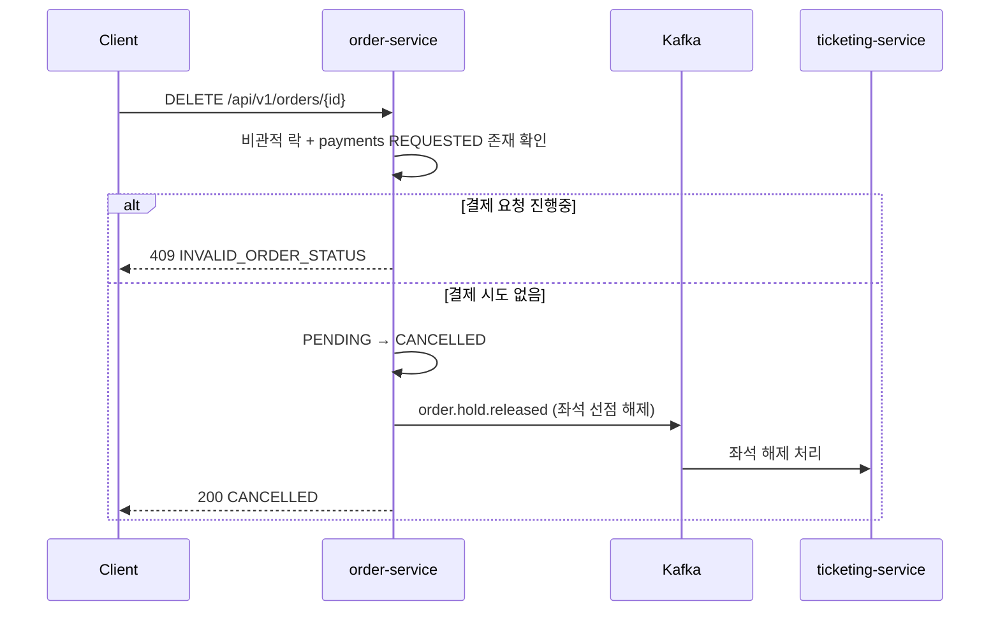
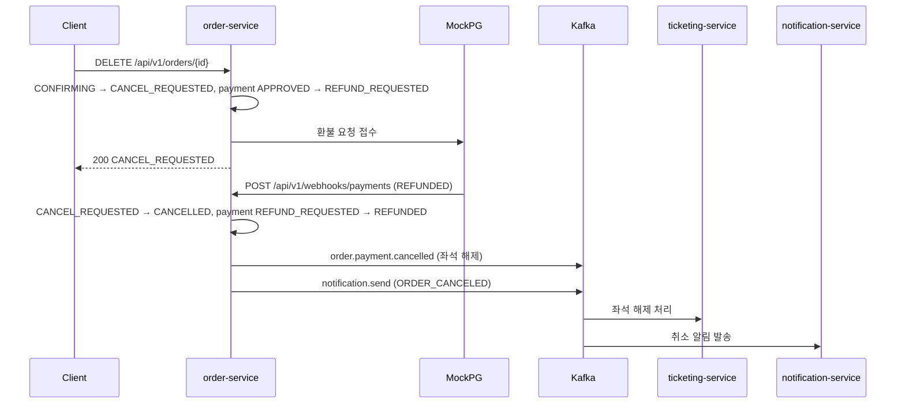
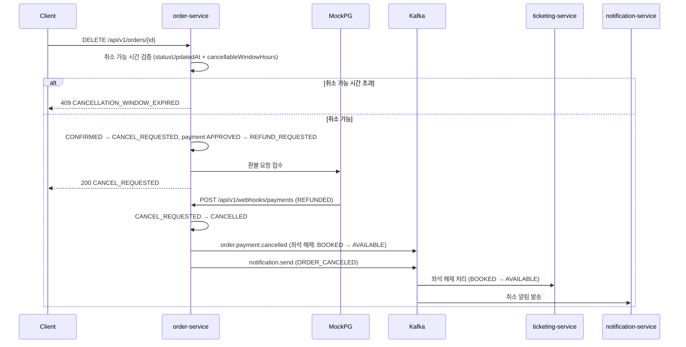
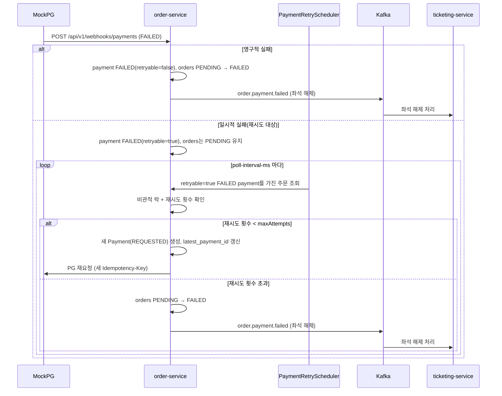
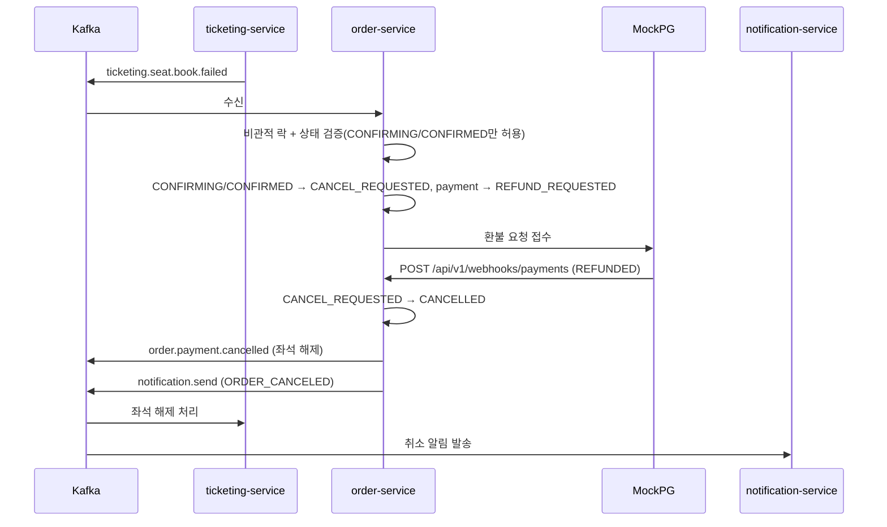
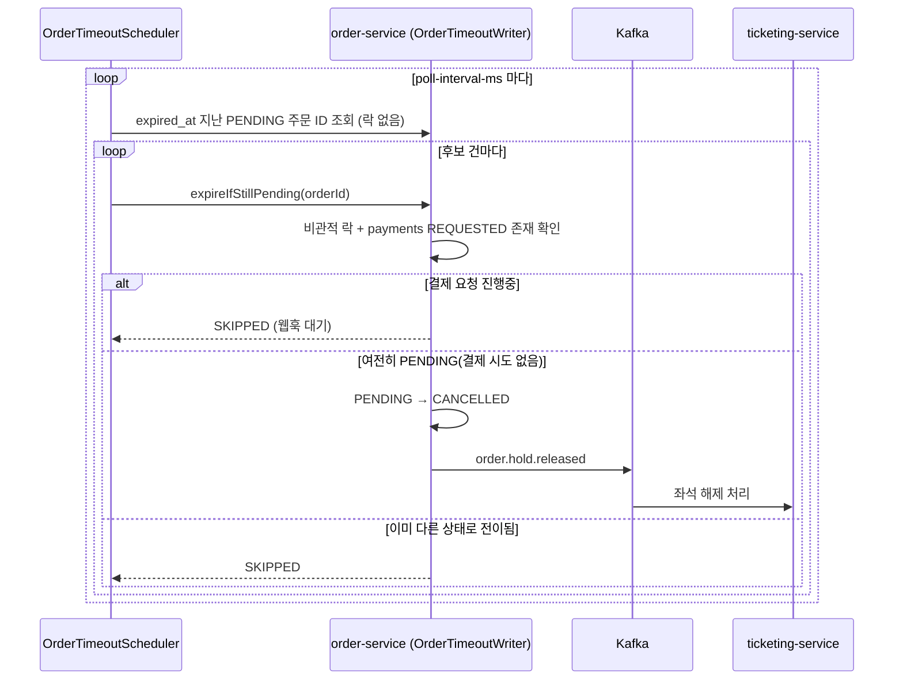
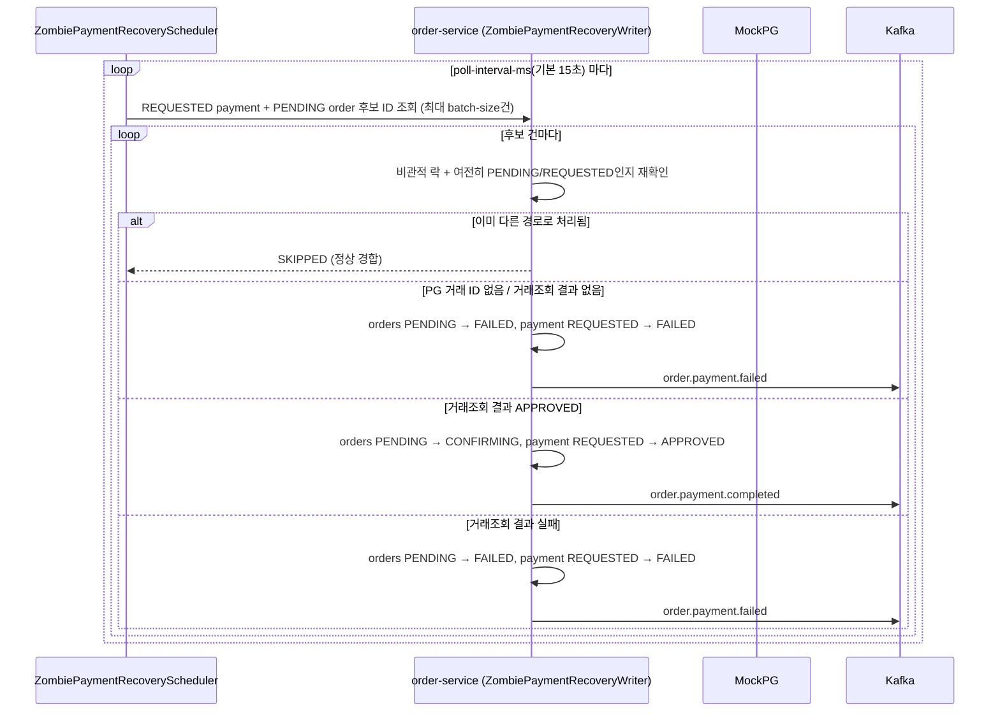

# Order/Payment Service — Flows

전체 시나리오별 흐름을 정리한다. 상태 전이 규칙은 [architecture.md](./architecture.md)를 참고.

---

## 시나리오 목록

1. [주문 완료 (해피패스)](-주문-완료-해피패스)
2. [결제 전 취소](-결제-전-취소)
3. [결제 후 취소 (CONFIRMING)](-결제-후-취소-confirming)
4. [예매 확정 후 취소 (CONFIRMED)](-예매-확정-후-취소-confirmed)
5. [결제 실패 및 재시도](-결제-실패-및-재시도)
6. [SAGA 보상 트랜잭션](-saga-보상-트랜잭션)
7. [주문 타임아웃 자동 취소](-주문-타임아웃-자동-취소)
8. [좀비 결제 정리 배치](-좀비-결제-정리-배치)

---

## 1. 주문 완료 (해피패스)

```
주문 생성 (Ticketing Feign)
→ PG 결제 요청 (payments: REQUESTED, orders: PENDING 유지)
→ [비동기] 웹훅 승인 수신
→ 주문 CONFIRMING, order.payment.completed 발행
→ [Ticketing] 좌석 확정 처리
→ ticketing.seat.booked 수신
→ 주문 CONFIRMED
→ notification.send 발행 (ORDER_COMPLETED)
```



> "결제 진행중인가"는 `orders.status`가 아니라 `payments.payment_status = REQUESTED` 존재 여부로 판단한다.

> ⚠️ **알려진 갭 — `CONFIRMING` 고착**: "[Ticketing] 좌석 확정 처리 → `ticketing.seat.booked` 수신" 구간이 아예 일어나지 않으면(Ticketing 크래시, 발행 누락, Kafka 유실 등) 주문이 `CONFIRMING`에 영구히 멈춘다. 이를 감지·복구하는 스케줄러가 없음. 코드 미반영, 설계 검토 중 — `architecture.md` 6번 표 참고.

---

## 2. 결제 전 취소

취소 가능 상태: `PENDING` (단, 진행중인 결제 요청이 없을 때만)

```
주문 취소 요청
→ payments에 REQUESTED 존재? → 있으면 409 (웹훅 결과 대기 유도)
→ 없으면: 주문 CANCELLED
→ order.hold.released 발행 (좌석 선점 해제)
→ 응답: 200 CANCELLED
```



---

## 3. 결제 후 취소 (CONFIRMING)

취소 가능 상태: `CONFIRMING` (결제 승인 완료, 좌석 확정 대기 중)

```
주문 취소 요청
→ 주문 CANCEL_REQUESTED, payment REFUND_REQUESTED
→ PG 환불 요청 접수
→ 응답: 200 CANCEL_REQUESTED
→ [비동기] 웹훅 환불 완료 수신
→ 주문 CANCELLED, payment REFUNDED
→ order.payment.cancelled 발행 (좌석 해제)
→ notification.send 발행 (ORDER_CANCELED)
```



> ⚠️ **알려진 갭**: `order.payment.cancelled`는 환불 완료(webhook REFUNDED) 시점에만 발행된다. 환불이 거절(`REFUND_FAILED`)되거나 복구 배치 재시도가 소진(`MANUAL_REVIEW_REQUIRED`)되면 좌석이 영구히 해제되지 않는다. 코드 미반영, 설계 검토 중 — `architecture.md` 6번 표 참고.

**환불 거절 시**: `FAILED`로 전이. 이후 환불 복구 배치가 재시도하거나 `MANUAL_REVIEW_REQUIRED`로 넘긴다.

---

## 4. 예매 확정 후 취소 (CONFIRMED)

취소 가능 상태: `CONFIRMED` (취소 가능 시간 내)

흐름은 [결제 후 취소](-결제-후-취소-confirming)와 동일. 취소 가능 시간 초과 시 409 `CANCELLATION_WINDOW_EXPIRED`.

> 취소 가능 시간 기준(공연 시작 시각 vs 확정 시각) 미확정. 현재 코드는 `statusUpdatedAt` + `cancellableWindowHours`(임시값 24h) 기준.



---

## 5. 결제 실패 및 재시도

```
[비동기] 웹훅 실패 수신
→ 일시적 오류(retryable) → payment FAILED(retryable=true), 주문 PENDING 유지
   → PaymentRetryScheduler 폴링 → 새 Payment(REQUESTED) 생성 + latest_payment_id 갱신 → PG 재요청
   → 재시도 횟수(maxAttempts) 초과 시 주문 FAILED, order.payment.failed 발행
→ 영구적 오류 → payment FAILED(retryable=false), 주문 FAILED
→ order.payment.failed 발행 (좌석 해제)
```



---

## 6. SAGA 보상 트랜잭션

좌석 예매 실패 시 결제를 자동 환불하는 보상 흐름.

```
ticketing.seat.book.failed 수신
→ 주문 CANCEL_REQUESTED, payment REFUND_REQUESTED
→ PG 환불 요청 접수
→ [비동기] 웹훅 환불 완료 수신
→ 주문 CANCELLED, payment REFUNDED
→ order.payment.cancelled 발행 (좌석 해제)
→ notification.send 발행 (ORDER_CANCELED)
```



**동시성**: 유저 직접 취소(`OrderCancelWriter`)와 SAGA 보상(`OrderCompensationWriter`)이 거의 동시에 같은 주문을 건드릴 수 있다. 비관적 락 + 상태 검증으로 이중 처리를 막는다.

PG 환불 요청 접수 자체가 실패하면 `CANCEL_REQUESTED`에서 멈추고, 별도 배치(환불 복구 배치, `adr/008` 참고)가 복구한다. 환불 웹훅으로 `REFUND_FAILED`가 수신되면 `FAILED`로 전이한다.

> ⚠️ **알려진 갭**: SAGA 보상 최종 실패(`FAILED`)와 일반 결제 실패로 인한 `FAILED`가 상태값만으로는 구분되지 않는다.

---

## 7. 주문 타임아웃 자동 취소

`expired_at` 기준 폴링 스케줄러(`OrderTimeoutScheduler`)가 PENDING 주문을 자동 취소한다. 후보 조회는 락 없이 ID만 가져오고, 실제 전이는 건당 트랜잭션(`OrderTimeoutWriter`)에서 비관적 락 + 상태 재검증 후 수행한다. 유저 직접 취소와 동시에 경합하면, 락을 먼저 획득한 쪽만 처리되고 나머지는 재검증에서 상태 불일치를 확인해 스킵(스케줄러)되거나 409(유저 요청)로 거부된다.

```
스케줄러 폴링 (expired_at < now, status = PENDING)
→ 건당 비관적 락 획득 + 상태 재검증
→ payments에 REQUESTED 존재? → 있으면 스킵 (웹훅 결과 대기)
→ 여전히 PENDING이고 진행중 결제 없으면: CANCELLED 전이 + order.hold.released 발행
→ 이미 다른 상태로 바뀌었으면: 스킵 (정상 경합, 에러 아님)
```



**PG 웹훅 미수신으로 REQUESTED에 멈춘 결제("좀비 결제")는 이 스케줄러 범위 밖** — 단순 타임아웃 취소는 위험하다(실제로는 PG가 승인했는데 취소 처리하면 정합성이 깨짐). PG 거래 조회로 실제 승인 여부를 확인하는 8번 좀비 결제 정리 배치가 이 케이스를 담당한다.

---

## 8. 좀비 결제 정리 배치

주문 상태 머신 재설계로 결제 진행중 판단 기준이 `payments.payment_status = REQUESTED` 존재 여부로 바뀌면서 생긴 부작용: PG 웹훅이 유실되거나 서버가 크래시하면 이 `REQUESTED` 상태가 영구히 남는다. 7번 타임아웃 스케줄러와 5번 결제 재시도 스케줄러 모두 `REQUESTED` 결제가 있는 주문을 의도적으로 건너뛰기 때문에(웹훅 결과를 기다리는 정상 동작), 웹훅이 영영 안 오면 해당 주문은 어느 배치의 손도 안 닿는 좀비 상태로 영구히 고착된다.

```
스케줄러 폴링 (payments.REQUESTED + orders.PENDING + expired_at < now)
→ 건당 비관적 락 + PG 거래조회(inquireTransaction)
→ PG 거래 ID 없음(PG 호출 자체 실패) → FAILED 동기화
→ 거래조회 결과 없음 → FAILED 동기화
→ 거래조회 결과 APPROVED → CONFIRMING 동기화 (order.payment.completed 발행)
→ 거래조회 결과 그 외 → FAILED 동기화 (order.payment.failed 발행)
```



**건별 독립 처리**: 스케줄러 레벨에서 건당 `try-catch`로 감싸 한 건의 예외가 배치 전체를 막지 않는다.