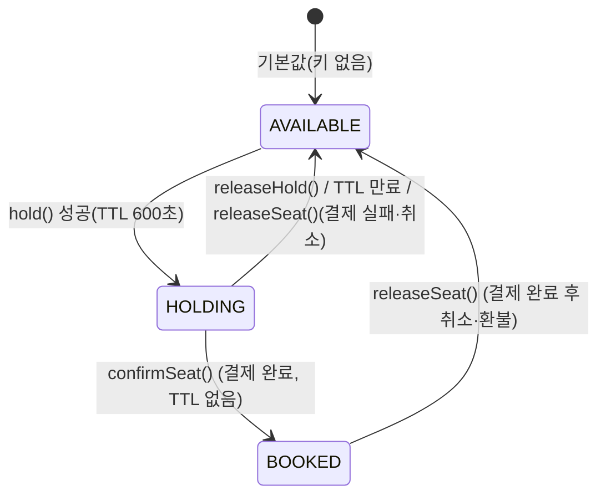
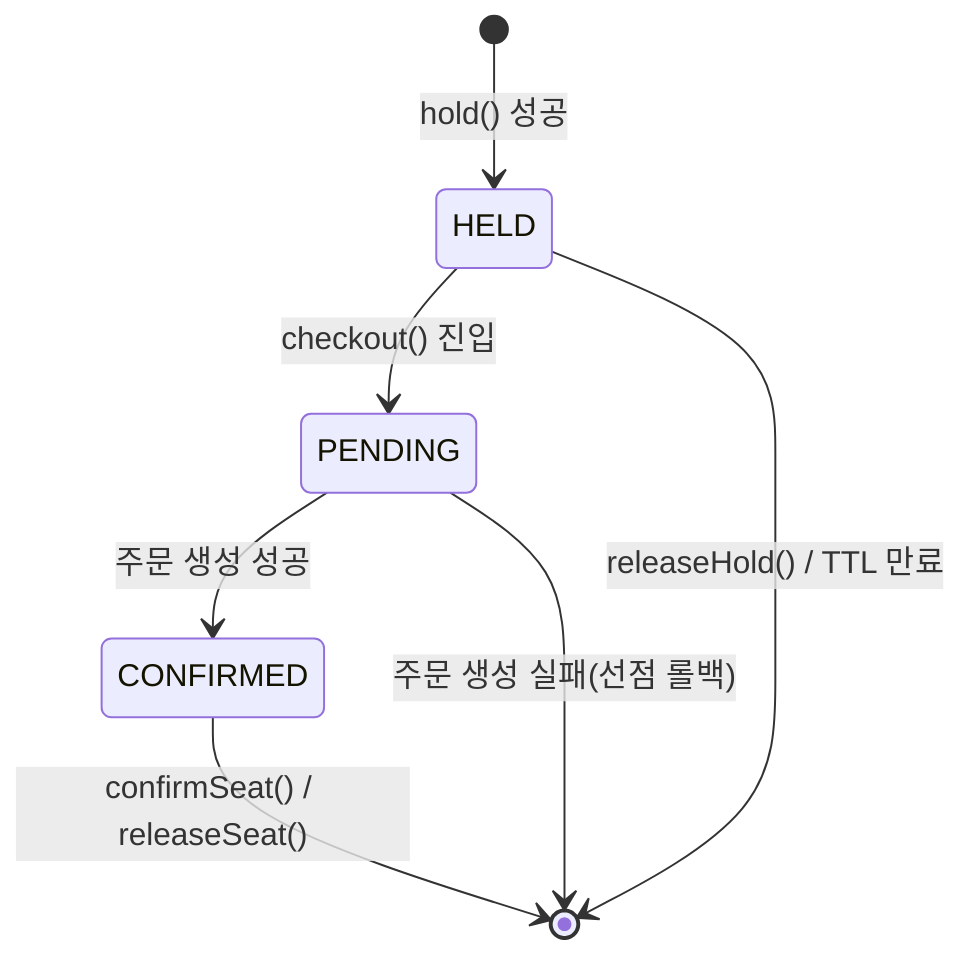
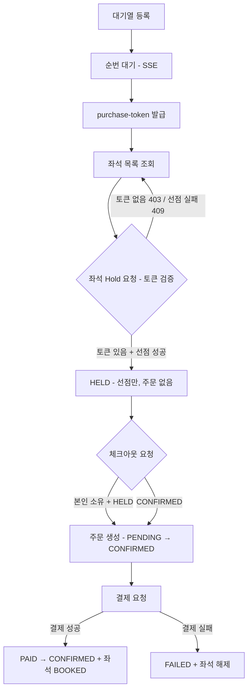
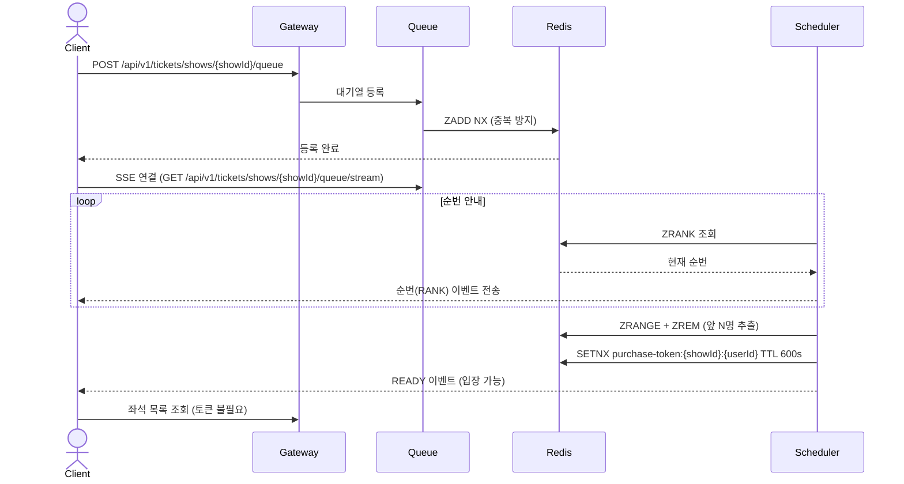

# 티켓팅 시스템 설계 문서

> **[주의]** 이 문서의 Order Service 관련 설계는 임의로 작성해둔 것이며 확정된 사항이 아닙니다.
> 자세한 내용은 [Order/Payment 서비스 설계 문서](docs/)를 참고해주세요.

## 0. 요약 및 문서 읽는 법

**한 줄 요약:**
> PostgreSQL + Redis + Kafka 기반의 선착순 티켓팅 시스템. 대기열 → 좌석 선점 → 결제 확정의 3구간으로 동작한다.

| 목적 | 이동 |
|---|---|
| 전체 흐름을 빠르게 파악하고 싶다 | → [5. 해피패스 플로우](#5-해피패스-플로우) |
| Redis 키 구조가 궁금하다 | → [3. Redis 키 설계](#3-redis-키-설계) |
| Kafka 토픽 목록이 필요하다 | → [4. Kafka 토픽](#4-kafka-토픽) |
| 미확정 항목을 확인하고 싶다 | → [9. 미확정 항목](#9-미확정-항목) |

**문서 목록 (order-service 문서 구조와 동일하게 분리, 2026-07-03)**

| 문서 | 내용 |
|------|------|
| [architecture.md](./architecture.md) | ERD, 좌석 상태 모델(HELD/PENDING/CONFIRMED), Kafka 이벤트, 동시성 제어 전략, 미확정 항목 |
| [flows.md](./flows.md) | 전체 시나리오별 흐름 (대기열, hold, checkout, 확정/해제, SAGA 보상) |
| [adr/001-entity-builder-pattern.md](./adr/001-entity-builder-pattern.md) | 엔티티 생성 패턴: 빌더 채택 |
| [adr/002-kafka-topic-renaming.md](./adr/002-kafka-topic-renaming.md) | Kafka 토픽 구성 정리 (개명/신규/제거) |
| [adr/003-notification-consumer-migration.md](./adr/003-notification-consumer-migration.md) | notification Consumer를 order.confirmed 구독으로 이관 |
| [adr/004-order-status-alignment.md](./adr/004-order-status-alignment.md) | Orders 상태 머신을 order-service와 정렬 |
| [adr/005-hold-rollback-on-order-failure.md](./adr/005-hold-rollback-on-order-failure.md) | 주문 생성 실패 시 Redis 선점 즉시 롤백 |
| [adr/006-queue-api-path-showid.md](./adr/006-queue-api-path-showid.md) | 대기열 API 경로에 showId 포함 |
| [adr/007-redis-backup-strategy.md](./adr/007-redis-backup-strategy.md) | Redis 백업 전략: RDB + PostgreSQL 재적재 |
| [adr/008-postgresql-17.md](./adr/008-postgresql-17.md) | PostgreSQL 17 채택 |
| [adr/009-order-cancel-integration.md](./adr/009-order-cancel-integration.md) | 주문 취소 연동 (#155) |
| [redis-keys.md](./redis-keys.md) | ticketing-service Redis 키 설계 (Lua 스크립트, TTL, 알려진 버그) |

이 README는 요약/네비게이션 용도로 유지하고, 상세 설계는 위 문서들을 최신 상태로 관리한다.

---

## 1. 기술 스택

| 역할 | 기술 |
|---|---|
| DB | PostgreSQL 17 |
| Cache / 상태 관리 | Redis (RDB 영속성) |
| 메시지 큐 | Kafka |
| 대기열 실시간 안내 | SSE (Server-Sent Events) |

---

## 2. ERD 핵심 구조

```
Venues
  └─ VenueSeats       (물리 좌석 마스터)

Performances
  └─ Shows            (회차)
       └─ ShowSeats   (회차별 좌석, status 컬럼 없음 — 상태는 Redis 관리)

Orders               (주문 = 예약 + 확정 통합 단일 애그리게이트)
```

> **설계 포인트:** `ShowSeats`에 `status` 컬럼을 두지 않는다. 좌석 상태는 Redis에서만 관리하여 DB 경합을 제거한다.

**패키지 구조 (#222):** 위 ERD 바운더리에 맞춰 `venue`(Venue/VenueSeat), `show`(Performance/Show)를 분리하고, `seat`(ShowSeat + hold/confirm 전체 흐름), `queue`, `order`(infrastructure)는 각각 `presentation/application/domain/infrastructure` 4계층으로 재정리했다.

---

## 3. Redis 키 설계

| 키 | 자료구조 | TTL | 설명 |
|---|---|---|---|
| `waiting_queue:{show_id}` | Sorted Set | - | 대기열. score = 입장 요청 timestamp |
| `purchase-token:{showId}:{userId}` | String | 600초 | 좌석 구매 자격 토큰 (showId별 격리) |
| `show:{show_id}:seat:{show_seat_id}` | String | 600초 | 좌석 상태: `AVAILABLE` / `HOLDING` / `BOOKED` |
| `show:{show_id}:seat:{show_seat_id}:owner` | String | 600초 (seatKey와 동일) | 선점한 `{userId}:{status}`. status는 `PENDING`(주문 생성 중) / `CONFIRMED`(주문 생성 완료) |
| `inventory:{show_id}` | String (Counter) | - | 남은 좌석 수 |
| `purchase-count:{userId}:{showId}` | String (Counter) | - | 사용자별 구매 한도 체크. 한도(`MAX_PER_USER`)는 4(`SeatService.java:36`, 2→4로 상향된 값) |

### 상태 전이

이 시스템엔 상태가 3군데 있다 — seatKey(좌석)·ownerKey(소유권)·`Order.status`(주문). 상세 비교는 [architecture.md §3](./architecture.md#3-좌석-상태-모델) 참고.

**seatKey** (`show:{showId}:seat:{seatId}`, 클라이언트 노출):



**ownerKey** (`show:{showId}:seat:{seatId}:owner`, 내부 동시성 제어용):



**`Order.status`** (order-service 소유, PostgreSQL): `PENDING`/`PAYMENT_REQUESTED`/`PAID`/`CONFIRMED`/`COMPENSATING`/`REFUND_REQUESTED`/`CANCELLED`/`REFUNDED`/`FAILED`/`MANUAL_REVIEW_REQUIRED`. 전이 다이어그램·재설계안(#292)은 [order-service/architecture.md §3](../order-service/architecture.md#3-주문-상태-머신) 참고.

---

## 4. Kafka 토픽

| 토픽 | Producer | Consumer | 용도 |
|---|---|---|---|
| `order.payment.completed` | order-service | ticketing-service | 결제 승인 → 좌석 BOOKED |
| `order.payment.failed` | order-service | ticketing-service | 결제 실패 → 좌석 해제 |
| `order.payment.cancelled` | order-service | ticketing-service | 결제 취소 → 좌석 해제 |
| `order.hold.released` | order-service | ticketing-service | 타임아웃 자동취소(#231) → 좌석 해제(`releaseSeat`, 멱등) |
| `ticketing.seat.booked` | ticketing-service | order-service | 좌석 확정 → 주문 CONFIRMED |
| `ticketing.seat.book.failed` | ticketing-service | order-service | 좌석 예매 실패 → SAGA 보상 시작 |

---

## 5. 해피패스 플로우

### 전체 흐름 요약



> **변경 (2026-06-23):** 토큰 검증 주체를 Gateway → `SeatService.hold()`로 변경. 좌석 목록 조회는 토큰 없이도 가능하며, 검증은 Hold 시점에 이루어진다. 자세한 배경은 [260623 대기열 토큰.md](./archive/260623%20대기열%20토큰.md), 변경 이력은 [ticketing-system-change-log.md](./archive/ticketing-system-change-log.md) 참고.
>
> **변경 (2026-07-03):** 주문 생성을 `hold()`에서 분리해 별도 체크아웃 API(`POST .../seats/{seatId}/checkout`)로 이전. 가장 트래픽이 몰리는 hold 구간에 동기 cross-service 호출(order-service Feign)이 들어있던 걸 가벼운 Redis 전용 연산으로 줄이기 위함. 자세한 배경은 [SA-260703.md 11번](../SA-260703.md) 참고.

---

### 구간 1 — 대기열 → 좌석 선택 화면



> **변경 (2026-06-23):** 이전 버전은 Gateway가 좌석 선택 화면 진입 시점에 토큰을 검증한다고 되어 있었으나, 실제로는 좌석 목록 조회까지는 토큰 없이 가능하고 **좌석 Hold 요청 시점**에 `SeatService`가 직접 검증한다 (구간 2 참고).

---

### 구간 2 — 좌석 선점(hold) + 체크아웃(주문 생성)

**좌석 Hold 시 구매 토큰 검증 (2026-06-23 추가):**
`SeatService.hold()` 진입 시 `purchase-token:{showId}:{userId}` 존재 여부를 가장 먼저 확인한다. 없으면 `PURCHASE_TOKEN_NOT_FOUND`(403)로 즉시 거부하고, 있으면 좌석 선점 Lua 스크립트(`HOLD_SCRIPT`)만 실행하고 끝난다(**2026-07-03부터 주문 생성 없음**). 토큰은 Hold 성공 여부와 무관하게 TTL(600초)로만 만료되며 별도 삭제 로직은 없다.

**체크아웃(주문 생성, 2026-07-03 신설):** `POST .../seats/{seatId}/checkout`이 별도 API로 분리됐다. `SeatService.checkout()`이 owner 상태가 `HELD`인지 확인 후 `CHECKOUT_CLAIM_SCRIPT`로 `PENDING` 전이 → `orderClient.create()` 호출(기존 hold()가 하던 것과 동일) → 성공 시 `CONFIRMED` 전이 + `HoldResponse(orderId)` 반환. 이미 `CONFIRMED`(재요청)면 주문 생성 없이 기존 orderId로 멱등 응답. 주문 생성 실패 시 이 좌석의 선점만 롤백(seatKey/ownerKey 삭제, 재고/구매카운트 복구).

(이하 결제/확정은 order-service에서)

### 구간 3 — 결제 및 예매 확정 (order-service에서)

---

### 좌석 선점 해제 (hold release)

선점은 세 가지 경로로 풀린다.

| 경로 | 트리거 | 처리 |
|---|---|---|
| 결제 실패/취소 | Kafka `order.payment.failed`, `order.payment.cancelled` | `SeatConfirmService.releaseSeat()` — DB `orderId` 해제, Redis seat/owner 키 삭제, 재고 복구 |
| TTL 자연 만료 | Redis keyspace notification (`__keyevent@__:expired`) | `SeatHoldExpirationListener` → `SeatService.releaseExpiredHold()` — DB `orderId` 해제, 재고 복구 (사용자가 직접 해제/결제하지 않고 600초 동안 방치한 경우). **owner가 `PENDING`(체크아웃 진행 중)이면 해제를 스킵**하고 경고 로그만 남김 (#326, 2026-07-07) |
| 사용자 직접 취소 | `DELETE /api/v1/tickets/shows/{showId}/seats/{seatId}/hold` | `SeatService.releaseHold()` — owner 본인 확인 후 Redis seat/owner 키 삭제, 재고 복구, DB `orderId` 해제 |

**hold ↔ release ↔ checkout 동시 호출 레이스 방지 (2026-07-03 갱신, 2026-07-07 확장):** owner 키 상태가 `HELD`(선점만, 주문 없음) → `PENDING`(체크아웃 진행 중, `orderClient.create` 외부 네트워크 호출) → `CONFIRMED`(주문 생성 완료) 3단계로 전이한다. `releaseHold()`는 `PENDING`인 동안(체크아웃이 주문 생성을 기다리는 중)만 `SEAT_HOLD_PROCESSING`(409)으로 거부하고, `HELD`나 `CONFIRMED` 상태에서는 해제를 허용한다. 이게 없으면 "Redis는 풀렸는데 DB에는 뒤늦게 orderId가 박히는" 더블부킹 레이스가 생길 수 있다. 이 가드는 `releaseHold()`뿐 아니라 `releaseExpiredHold()`(TTL 만료 경로)에도 동일하게 적용된다(#326).

> **주문 취소 연동 (🔴 설계 미확정, [9. 미확정 항목](#9-미확정-항목) 참고):** `releaseHold()`에 `OrderClient.cancel(orderId, requesterId)` 호출 코드가 있으나 현재 주석 처리되어 있다. order-service의 `DELETE /internal/v1/orders/{orderId}` 엔드포인트가 develop에 아직 없어 항상 404가 나기 때문. order-service 쪽 타임아웃 자동취소(#231)는 `order.hold.released` 이벤트를 발행하고, ticketing `PaymentEventConsumer.onHoldReleased()`가 이를 구독해 `SeatConfirmService.releaseSeat()`로 좌석을 해제한다(멱등 처리).

---

## 6. API 명세

### ticketing-service

| 메서드 | 경로 | 설명 |
|---|---|---|
| POST | `/api/v1/tickets/shows/{showId}/queue` | 대기열 등록 |
| GET | `/api/v1/tickets/shows/{showId}/queue/status` | 현재 순번 조회 |
| GET | `/api/v1/tickets/shows/{showId}/queue/stream` | SSE 연결 — 순번 실시간 수신 |
| GET | `/api/v1/tickets/shows/{showId}/seats` | 회차별 좌석 목록 + 상태 조회 |
| POST | `/api/v1/tickets/shows/{showId}/seats/{seatId}/hold` | 좌석 선점만(주문 없음, HELD 상태). 응답 바디 없음 |
| POST | `/api/v1/tickets/shows/{showId}/seats/{seatId}/checkout` | 체크아웃 — 주문 생성(2026-07-03 신설). HELD 상태에서만 가능, 이미 CONFIRMED면 멱등 응답 |
| DELETE | `/api/v1/tickets/shows/{showId}/seats/{seatId}/hold` | 좌석 선점 해제 (본인 선점만 가능) |
| GET | `/api/v1/tickets/shows/{showId}/purchase-limit` | 사용자별 구매 한도/남은 수량 조회 |

---

## 7. Rate Limit 기준 (15,000석 공연 기준)

| 항목 | 수치 |
|---|---|
| 좌석 hold API | 초당 50~60건 |
| 대기열 입장 배치 | 분당 3,000~3,600명 |
| purchase-token TTL | 600초 |
| 결제 성공률 (외부 PG 기준) | 40~50% |

---

## 8. 구현 일정

[github projects - 6pm 일정 관리](https://github.com/orgs/6pm-sparta/projects/2) 

---

## 9. 미확정 항목

| 항목 | 현황 | 결정 필요 사항 |
|---|---|---|
| SSE `ENTERED` 이벤트 (문서/코드 불일치) | 미구현 | "260623 대기열 토큰.md"는 토큰 발급 시 SSE로 `ENTERED` 이벤트를 전송한다고 적혀 있으나, 실제 `QueueSseService.java:58,61`에서는 `READY`/`RANK` 이벤트만 전송하고 `ENTERED`는 코드 어디에도 없음 |
| `SeatService.hold()` switch default 케이스 | 미확정 | 알 수 없는 결과값(-3 이하 등) 처리를 현재 `SEAT_ALREADY_HELD`로 하고 있는데, `INTERNAL_SERVER_ERROR`가 더 적절한지 결정 필요 (구 TODO.md 코드 품질 항목) |
| `checkout()` 트랜잭션 커밋 지연 레이스 | 알려진 제약(낮은 우선순위) | `assignOrder` DB 저장과 owner 키 `CONFIRMED` Redis 갱신 사이, `@Transactional` 커밋 전 시점에 `releaseHold`가 끼어들면 이론상 레이스 재현 가능. 윈도우가 매우 작아(로컬 DB 커밋 지연 수준) 우선순위 낮으나 해결 여부 결정 필요 |
| `QueueScheduler.findActiveShowIds()`의 `KEYS` 사용 | 알려진 제약(낮은 우선순위) | O(N) 전체 스캔이라 키 스페이스가 커지면 다른 Redis 명령(좌석 Hold 등)을 블로킹할 수 있음. 현재 동시 활성 공연 수가 적어 우선순위 낮으나 `SCAN` 커서 기반 전환 여부/시점 결정 필요 |
| `releaseHold()` → order-service 주문 취소 연동 끊김 | 🔴 설계 미확정 | `DELETE /internal/v1/orders/{orderId}` 엔드포인트가 develop `InternalOrderController`에 아직 없음 — 설계 미확정으로 임시 주석 처리함. `SeatService.releaseHold()`의 `orderClientRetryWrapper.cancel()` 호출을 아예 주석 처리해둠(항상 404 나는 호출을 굳이 시도 안 하게). order-service 쪽 주문 취소는 당분간 타임아웃 자동취소(#231)에만 의존. 설계 확정되고 엔드포인트 추가되면 주석 해제 |
