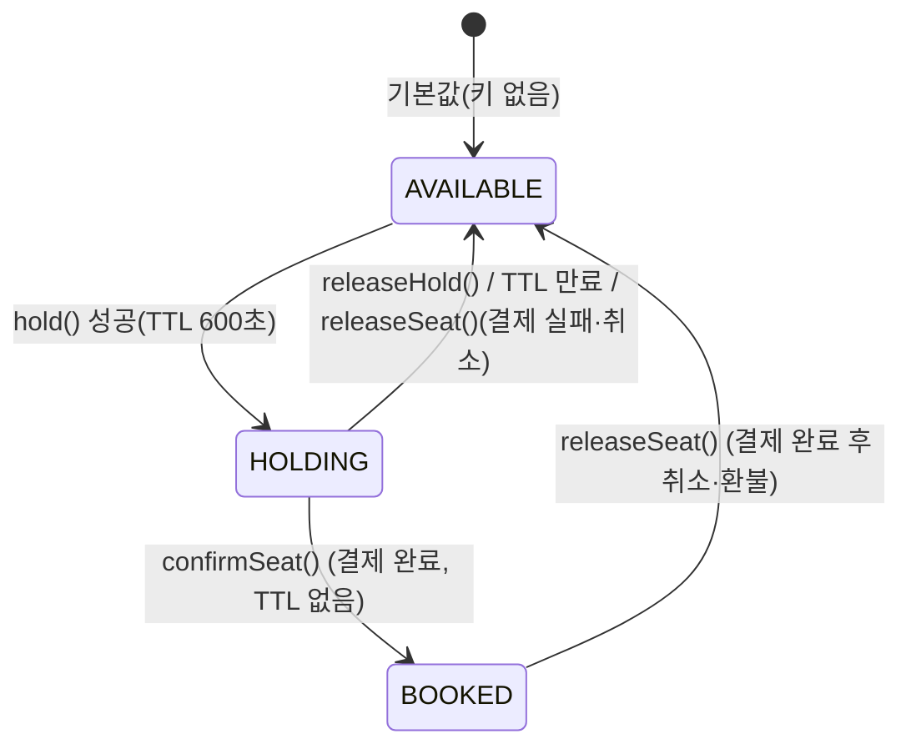
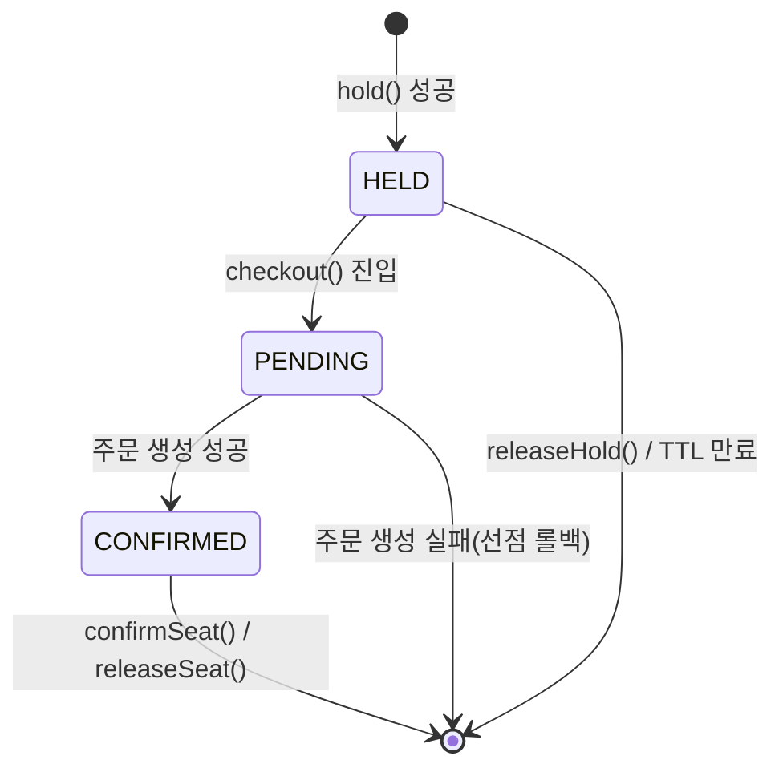
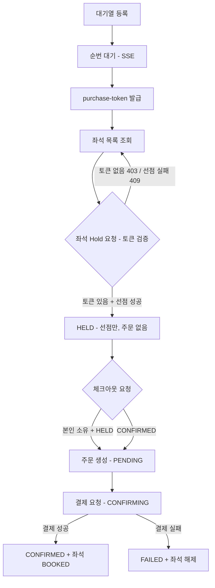
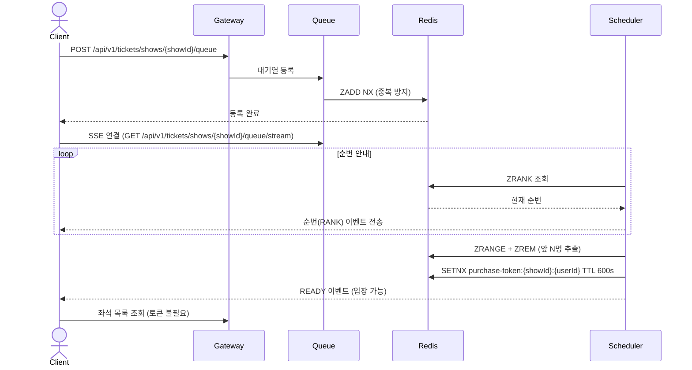

# 티켓팅 시스템 설계 문서

> **[주의]** 이 문서의 Order Service 관련 설명은 최신화가 되지 않을 수 있습니다.
> 자세한 내용은 [Order/Payment 서비스 문서](../order-service/README.md)를 참고해주세요.

## 0. 요약 및 문서 읽는 법

**한 줄 요약:**
> PostgreSQL + Redis + Kafka 기반의 선착순 티켓팅 시스템. 대기열 → 좌석 선점 → 결제 확정의 3구간으로 동작한다.

| 목적 | 이동 |
|---|---|
| 전체 흐름을 빠르게 파악하고 싶다 | → [5. 해피패스 플로우](#5-해피패스-플로우) |
| Redis 키 구조가 궁금하다 | → [3. Redis 키 설계](#3-redis-키-설계) |
| Kafka 토픽 목록이 필요하다 | → [4. Kafka 토픽](#4-kafka-토픽) |
| 알려진 이슈/개선 방향을 확인하고 싶다 | → [improvement-roadmap.md](./improvement-roadmap.md) |

| 문서 | 내용 |
|------|------|
| [architecture.md](./architecture.md) | ERD, 좌석 상태 모델(HELD/PENDING/CONFIRMED), Kafka 이벤트, 동시성 제어 전략, 미확정 항목 |
| [flows.md](./flows.md) | 전체 시나리오별 흐름 (대기열, hold, checkout, 확정/해제, SAGA 보상) |
| [adr/001-entity-builder-pattern.md](./adr/001-entity-builder-pattern.md) | 엔티티 생성 패턴: 빌더 채택 |
| [adr/002-kafka-topic-renaming.md](./adr/002-kafka-topic-renaming.md) | Kafka 토픽 구성 정리 (개명/신규/제거) |
| [adr/003-notification-consumer-migration.md](./adr/003-notification-consumer-migration.md) | notification Consumer를 order.confirmed 구독으로 이관 |
| [adr/004-order-status-alignment.md](./adr/004-order-status-alignment.md) | Orders 상태 머신을 order-service와 정렬 |
| [adr/005-hold-rollback-on-order-failure.md](./adr/005-hold-rollback-on-order-failure.md) | 주문 생성 실패 시 Redis 선점 즉시 롤백 |
| [adr/006-queue-api-path-showid.md](./adr/006-queue-api-path-showid.md) | 대기열 API 경로에 showId 포함 |
| [adr/007-redis-backup-strategy.md](./adr/007-redis-backup-strategy.md) | Redis 백업 전략: RDB + PostgreSQL 재적재 |
| [adr/008-postgresql-17.md](./adr/008-postgresql-17.md) | PostgreSQL 17 채택 |
| [adr/009-order-cancel-integration.md](./adr/009-order-cancel-integration.md) | 주문 취소 연동 (#155) |
| [adr/010-hold-id-ephemeral-uuid.md](./adr/010-hold-id-ephemeral-uuid.md) | holdId를 별도 테이블 없이 휘발성 UUID로 유지 |
| [adr/011-hold-release-no-order-cancel-call.md](./adr/011-hold-release-no-order-cancel-call.md) | releaseHold()는 order-service에 취소를 요청하지 않음(self-heal) |
| [adr/012-outbox-pattern-draft.md](./adr/012-outbox-pattern-draft.md) | Kafka 발행 Outbox 패턴 도입 |
| [adr/013-cancellation-window-performance-start-based.md](./adr/013-cancellation-window-performance-start-based.md) | 취소 가능 시간 기준: 공연 시작 시각 기준으로 변경 |
| [adr/014-purchase-token-verify-at-hold.md](./adr/014-purchase-token-verify-at-hold.md) | 구매 토큰 검증은 Gateway가 아니라 hold() 시점에 수행 |
| [adr/015-split-checkout-from-hold.md](./adr/015-split-checkout-from-hold.md) | 주문 생성을 hold()에서 분리해 체크아웃 API로 이전 |
| [adr/016-release-path-consistency.md](./adr/016-release-path-consistency.md) | 선점 해제 3경로의 레이스 방지·멱등성 (#326, #365) |
| [adr/017-inventory-lazy-init-lock.md](./adr/017-inventory-lazy-init-lock.md) | inventory 최초 초기화 Redisson 분산락 (#362) |
| [redis-keys.md](./redis-keys.md) | ticketing-service Redis 키 설계 (Lua 스크립트, TTL, 알려진 버그) |
| [improvement-roadmap.md](./improvement-roadmap.md) | 실측 검증 전 설계 목표치, 알려진 이슈 및 우선순위 |

이 README는 요약/네비게이션 용도로 유지하고, 상세 설계는 위 문서들을 최신 상태로 관리한다.

---

## 1. 기술 스택

| 역할 | 기술 |
|---|---|
| DB | PostgreSQL 17 |
| Cache / 상태 관리 | Redis (RDB 영속성) |
| 메시지 큐 | Kafka |
| 대기열 실시간 안내 | SSE (Server-Sent Events) |

---

## 2. ERD 핵심 구조

```
Venues
  └─ VenueSeats       (물리 좌석 마스터)

Performances
  └─ Shows            (회차)
       └─ ShowSeats   (회차별 좌석, status 컬럼 없음 — 상태는 Redis 관리)

Orders               (주문 = 예약 + 확정 통합 단일 애그리게이트)
```

> **설계 포인트:** `ShowSeats`에 `status` 컬럼을 두지 않는다. 좌석 상태는 Redis에서만 관리하여 DB 경합을 제거한다.

---

## 3. Redis 키 설계

| 키 | 자료구조 | TTL | 설명 |
|---|---|---|---|
| `waiting_queue:{show_id}` | Sorted Set | - | 대기열. score = 입장 요청 timestamp |
| `purchase-token:{showId}:{userId}` | String | 600초 | 좌석 구매 자격 토큰 (showId별 격리) |
| `show:{show_id}:seat:{show_seat_id}` | String | 600초 | 좌석 상태: `AVAILABLE` / `HOLDING` / `BOOKED` |
| `show:{show_id}:seat:{show_seat_id}:owner` | String | 600초 (seatKey와 동일) | 선점한 `{userId}:{status}`. status는 `PENDING`(주문 생성 중) / `CONFIRMED`(주문 생성 완료) |
| `inventory:{show_id}` | String (Counter) | - | 남은 좌석 수 |
| `purchase-count:{userId}:{showId}` | String (Counter) | - | 사용자별 구매 한도 체크. 한도는 `SeatService`의 `MAX_PER_USER` 상수(현재 4, 2→4로 상향) |

### 상태 전이

이 시스템엔 상태가 3군데 있다 — seatKey(좌석)·ownerKey(소유권)·`Order.status`(주문). 상세 비교는 [architecture.md §3](./architecture.md#3-좌석-상태-모델) 참고.

**seatKey** (`show:{showId}:seat:{seatId}`, 클라이언트 노출):



**ownerKey** (`show:{showId}:seat:{seatId}:owner`, 내부 동시성 제어용):



**`Order.status`** (order-service 소유, PostgreSQL): `PENDING`/`CONFIRMING`/`CONFIRMED`/`CANCEL_REQUESTED`/`CANCELLED`/`FAILED`/`MANUAL_REVIEW_REQUIRED`. 전이 다이어그램은 [order-service/architecture.md §3](../order-service/architecture.md#3-주문-상태-머신) 참고.

---

## 4. Kafka 토픽

현재 토픽 목록·메시지는 Kafka UI에서 실시간 확인. 각 토픽의 발행 트리거·소비 처리(Producer/Consumer 매핑, DLQ 등)는 [architecture.md §4](./architecture.md#4-kafka-이벤트) 참고.

---

## 5. 해피패스 플로우

### 전체 흐름 요약



> 토큰 검증 시점(Gateway → hold()): [ADR 014](./adr/014-purchase-token-verify-at-hold.md) · hold/checkout 분리: [ADR 015](./adr/015-split-checkout-from-hold.md)

---

### 구간 1 — 대기열 → 좌석 선택 화면



---

### 구간 2 — 좌석 선점(hold) + 체크아웃(주문 생성)

**좌석 Hold:** `hold()`는 구매 토큰 검증 후 좌석 선점만 한다(Redis 전용, 주문 없음) — 검증 시점/규칙은 [ADR 014](./adr/014-purchase-token-verify-at-hold.md).

**체크아웃(주문 생성):** `POST .../seats/{seatId}/checkout`이 owner `HELD` 확인 → `PENDING` 전이 → `orderClient.create()` → `CONFIRMED` 전이 + `HoldResponse(orderId)` 반환. 재요청 멱등 응답·실패 롤백 포함 상세는 [ADR 015](./adr/015-split-checkout-from-hold.md).

(이하 결제/확정은 order-service에서)

### 구간 3 — 결제 및 예매 확정 (order-service에서)

---

### 좌석 선점 해제 (hold release)

선점은 결제 실패/취소·TTL 자연 만료·사용자 직접 취소 세 경로로 풀린다. 경로별 처리, 레이스 방지·멱등성, 주문 취소 미연동 배경은 [flows.md §6](./flows.md#6-좌석-선점-해제사용자-직접-취소) 참고.

---

## 6. API 명세

Swagger 문서 참고 (각 서비스 `/swagger-ui.html`).

---

## 7. 구현 일정

[github projects - 6pm 일정 관리](https://github.com/orgs/6pm-sparta/projects/2)
