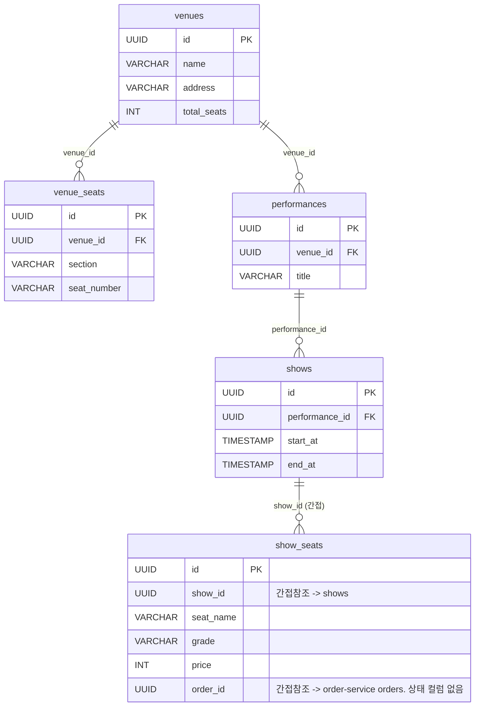

# Ticketing Service — Architecture

## 1. 기술 스택

| 역할 | 기술 |
|------|------|
| DB | PostgreSQL 17 |
| Cache / 상태 관리 | Redis (RDB 영속성) |
| 메시지 큐 | Kafka |
| 대기열 실시간 안내 | SSE (Server-Sent Events) |
| 서비스 간 통신 | FeignClient(`OrderClient`, 동기) — order-service 주문 생성/취소 |

---

## 2. ERD

### 테이블 관계

```
Venues 1 ─── N VenueSeats
Venues 1 ─── N Performances 1 ─── N Shows 1 ─── N ShowSeats (간접 참조)
```



### venues

| 컬럼명 | 타입 | 제약 | 설명 |
|--------|------|------|------|
| name | VARCHAR | NN | 공연장명 |
| address | VARCHAR | NN | |
| total_seats | INT | NN | |

### venue_seats

물리 좌석 마스터(회차와 무관하게 고정된 좌석 배치).

| 컬럼명 | 타입 | 제약 | 설명 |
|--------|------|------|------|
| venue_id | UUID | FK | `venues.id` |
| section | VARCHAR | NN | 구역 |
| seat_number | VARCHAR | NN | 좌석 번호 |

### performances / shows

| 테이블 | 컬럼 | 제약 | 설명 |
|--------|------|------|------|
| performances | venue_id | FK | `venues.id` |
| performances | title | NN | 공연명 |
| shows | performance_id | FK | `performances.id` |
| shows | start_at / end_at | NN | `endAt > startAt` 애플리케이션 레벨 검증(`Show` 엔티티 빌더) |

### show_seats

회차별 판매 단위 좌석. **상태 컬럼이 없다** — 좌석 상태(`AVAILABLE`/`HOLDING`/`BOOKED`)는 전부 Redis가 단일 진실 공급원(SoT)이다.

| 컬럼명 | 타입 | 제약 | 설명 |
|--------|------|------|------|
| show_id | UUID | NN | 간접 참조 → `shows.id` |
| seat_name | VARCHAR(20) | NN | 예: `A-12` |
| grade | VARCHAR(20) | NN | 등급(가격 구간) |
| price | INT | NN | |
| order_id | UUID | N | 선점/확정한 주문 ID. 간접 참조 → order-service `orders.id` |

**설계 포인트**
- `show_seats`에 상태 컬럼을 두지 않는 이유: 좌석 상태는 초당 수십 건씩 바뀌는 고빈도 쓰기 데이터라 DB 컬럼으로 관리하면 락 경합이 심해진다. Redis만으로 상태를 관리하고 DB `order_id`는 "누가 최종적으로 이 좌석을 가져갔는가"의 보조 참조로만 쓴다.
- 좌석은 재사용 자원이라 취소 시 row를 soft delete하지 않고 `order_id`만 비운다(`ShowSeat.releaseOrder()`).

**패키지 구조 (#222)**: ERD 바운더리에 맞춰 `venue`(Venue/VenueSeat), `show`(Performance/Show)를 분리하고, `seat`(ShowSeat + hold/checkout/confirm 전체 흐름), `queue`, `order`(infrastructure only, order-service 호출 클라이언트)는 각각 `presentation/application/domain/infrastructure` 4계층으로 정리했다.

---

## 3. 좌석 상태 모델

좌석 상태는 Redis의 독립된 두 키로 관리된다 — 클라이언트에 노출되는 상태(`seatKey`)와 동시성 제어용 내부 소유권 상태(`ownerKey`). 키 상세 설계는 [redis-keys.md](./redis-keys.md) 참고.

### seatKey — 클라이언트 노출 상태 (`show:{showId}:seat:{seatId}`)

`GET .../seats` 응답의 `status` 필드가 참조한다.

| 값 | 의미 | TTL |
|---|---|---|
| (키 없음) | `AVAILABLE`(기본값) | - |
| `HOLDING` | 누군가 선점 중 | 600초 |
| `BOOKED` | 확정 | 없음(영구) |

### ownerKey — 소유권 상태 (`{userId}:{status}`)

`hold()`(선점)와 `checkout()`(주문 생성)이 분리된 2026-07-03 리팩토링 이후 3단계로 구성된다. 상태 전이 다이어그램은 [README §5 상태 전이](../ticketing-service/README.md#상태-전이) 참고.

| 상태 | 의미 |
|---|---|
| `HELD` | 선점만 완료, 주문 없음 |
| `PENDING` | 체크아웃 진행 중(`orderClient.create()` 호출 대기) — `releaseHold()`가 끼어들어 "Redis는 풀렸는데 DB엔 orderId가 뒤늦게 박히는" 더블부킹 레이스를 막기 위한 상태. 이 상태에서는 해제 요청을 `SEAT_HOLD_PROCESSING`(409)으로 거부한다 |
| `CONFIRMED` | 주문 생성 완료. 재요청은 기존 `orderId`로 멱등 응답 |

> **변경 이력 (2026-07-03)**: 이전에는 `hold()`가 선점(Redis)과 주문 생성(order-service Feign 동기 호출)을 한 번에 처리했고, owner 상태도 `PENDING`/`CONFIRMED` 2단계였다. 가장 트래픽이 몰리는 hold 구간에 동기 cross-service 호출이 들어있는 게 역효과라고 판단해 `checkout()` API로 주문 생성을 분리했고, 그 사이 상태로 `HELD`가 추가됐다. 배경은 [SA-260703.md §11](../SA-260703.md) 참고.

### 헷갈리기 쉬운 지점 — 이 시스템엔 "상태"가 3군데 있다

이름이 비슷하거나 값이 겹쳐서 회의/리뷰에서 혼동이 잦은 지점. "확정 상태"라고만 말하면 아래 셋 중 뭘 가리키는지 불명확하므로, 아래 표 기준으로 명시해서 부른다.

| | seatKey (좌석 상태) | ownerKey (소유권 상태) | `Order.status` (주문 상태) |
|---|---|---|---|
| 소유 서비스 | ticketing-service | ticketing-service | order-service |
| 저장 위치 | Redis `show:{showId}:seat:{seatId}` | Redis `show:{showId}:seat:{seatId}:owner` | PostgreSQL `orders.status` |
| 값 | `AVAILABLE`/`HOLDING`/`BOOKED` | `HELD`/`PENDING`/`CONFIRMED` | `PENDING`/`CONFIRMING`/`CONFIRMED`/`CANCEL_REQUESTED`/`CANCELLED`/`FAILED`/`MANUAL_REVIEW_REQUIRED` |
| 무엇을 나타내나 | "남이 이 좌석을 잡을 수 있나" — 좌석 자체의 겉모습, 클라이언트에 노출 | "이 hold를 지금 풀어줘도 되나" — 동시성 제어용 내부 상태, 클라이언트 비노출 | 결제·환불까지 포함한 주문 전체 생명주기 |
| 바꾸는 주체 | `SeatService`, `SeatConfirmService` | `SeatService`, `SeatConfirmService` | order-service의 각 Writer(`OrderCreationWriter`, `PaymentRequestWriter`, `OrderConfirmationWriter`, `OrderCompensationWriter` 등) |

**"확정(Confirm)" 용어 충돌 — 이름은 같은데 시점이 다른 세 지점**

- `SeatConfirmService.confirmSeat()` → seatKey `BOOKED` 전이: **결제 완료 이벤트를 받아서 좌석을 내주는 것**
- ownerKey `CONFIRMED`: **체크아웃(주문 생성)이 끝났다는 것** — 아직 결제 전일 수 있다(checkout 직후 시점)
- `Order.status = CONFIRMED`: **좌석 확정 이벤트(`ticketing.seat.booked`)까지 수신해서 주문이 최종 종료됐다는 것**

특히 ownerKey `CONFIRMED`와 `Order.status CONFIRMED`는 **이름이 완전히 같은데 의미가 다르다** — 전자는 "주문이 막 생성됨"(결제 전일 수도 있음), 후자는 "결제+좌석확정까지 다 끝남"(주문 생명주기의 끝). "CONFIRMED 상태"라고만 말하면 이 둘 중 뭘 가리키는지 반드시 명시해야 한다.

---

## 4. Kafka 이벤트

| 토픽 | Producer | Consumer | 용도 |
|------|----------|----------|------|
| `ticketing.seat.booked` | ticketing-service | order-service | 좌석 확정 → 주문 CONFIRMED |
| `ticketing.seat.book.failed` | ticketing-service | order-service | 좌석 예매 실패 → SAGA 보상 시작(`CONFIRMING`/`CONFIRMED` → `CANCEL_REQUESTED` 단일 전이, 환불은 `Order`가 아닌 `Payment.paymentStatus`에서 별도 추적) |
| `order.payment.completed` | order-service | ticketing-service | 결제 승인 → 좌석 BOOKED |
| `order.payment.failed` | order-service | ticketing-service | 결제 실패 → 좌석 해제 |
| `order.payment.cancelled` | order-service | ticketing-service | 결제 완료 후 취소/환불 → 좌석 해제 |
| `order.hold.released` | order-service | ticketing-service | 결제 전(PENDING) 취소 — 유저 직접 취소 + 타임아웃 자동 취소 공통 |

**발행 방식 — 단순 KafkaTemplate.send (Outbox 미적용)**

order-service는 도메인 상태 변경과 이벤트 저장을 같은 트랜잭션으로 묶는 Transactional Outbox 패턴을 쓰지만, ticketing-service의 `SeatEventProducer`는 `KafkaTemplate.send()`를 직접 호출한다. 발행 실패는 로그만 남기고 흡수한다(호출부에 예외를 던지지 않음) — 좌석 Hold/확정이 이미 DB/Redis에 반영된 뒤이므로 Kafka 장애가 그 응답 자체를 실패시키면 안 된다는 판단.

> **[TODO] 위험 인지**: DB 커밋 후 `kafkaTemplate.send()`가 실패하면(브로커 다운 등) 이벤트가 유실될 수 있다. `ticketing.seat.booked` 유실 시 order-service 주문이 영원히 `PAID`에 머물고, `ticketing.seat.book.failed` 유실 시 SAGA 보상이 트리거되지 않아 결제된 주문이 고아 상태로 남는다. order-service의 Outbox 패턴과 동일한 방식 도입이 필요한지 검토 대상 — 현재 별도 이슈로 관리되고 있지 않음.

**수신측 멱등성**: `PaymentEventConsumer`의 4개 리스너(`onPaymentCompleted`/`onPaymentFailed`/`onPaymentCancelled`/`onHoldReleased`) 전부 `SeatConfirmService.releaseSeat()` 또는 `confirmSeat()`를 호출하는데, 두 메서드 다 "해당 `orderId`로 좌석을 못 찾으면 조용히 스킵/로그"하는 방식으로 재수신에 안전하다(멱등). 별도 이벤트 소비 이력 테이블은 없다.

---

## 5. 동시성 제어 전략

| 상황 | 전략 |
|------|------|
| 좌석 Hold 원자성(재고 확인 + 선점 + 카운트 증가) | Redis Lua 스크립트(`HOLD_SCRIPT`) — 단일 원자적 실행 |
| hold ↔ checkout ↔ release 3자 레이스 | owner 키 `HELD`/`PENDING`/`CONFIRMED` 3단계 전이(§3). `PENDING` 구간엔 `releaseHold()` 거부 |
| 체크아웃 중복 요청(동일 유저 재시도) | `CHECKOUT_CLAIM_SCRIPT`가 이미 `CONFIRMED`면 기존 orderId로 멱등 응답, 이미 `PENDING`이면 409 |
| 대기열 중복 등록 | `ZADD NX` (`QueueService.enter()`) |
| purchase-token 중복 발급 | `SETNX` (`PurchaseTokenService.issue()`) — `QueueScheduler`가 배치(50명 단위)로 순번 밀어냄 |
| 좌석 hold 방치(TTL) 자동 해제 | Redis Keyspace Notification(`__keyevent@__:expired`) 구독(`SeatHoldExpirationListener`) → `releaseExpiredHold()` |
| 주문 생성 중복(order-service 측 2차 방어) | `holdId` 기반 Redis 멱등성 + `seat_id` 진행중 상태 부분 UNIQUE 인덱스. 상세는 [order-service/redis-keys.md](../order-service/redis-keys.md) 참고 |
| 좌석 목록 조회 N+1 | `RedisTemplate.multiGet()`으로 좌석별 상태를 한 번에 조회(`getSeats()`) |
| 대기열 스케줄러 다중 인스턴스 중복 처리 | Redisson `RLock`(`processQueue()` 전체 감싸는 방식)으로 인스턴스당 한 번만 실행되도록 처리 |

### hold/checkout 실패 시 롤백

`checkout()`에서 `orderClient.create()` 호출이 실패하면 이 좌석의 선점만 롤백한다(`seatKey`/`ownerKey` DELETE, `inventory` +1, `purchase-count` -1). 롤백하지 않으면 주문 없이 선점만 600초 동안 묶여버리는 상태가 되기 때문(2026-06-18 CHANGELOG 결정 사항).

### inventory lazy 초기화

`inventory:{showId}` 카운터는 쇼/좌석 생성 시점에 초기화되는 곳이 없어서, 첫 `hold()` 요청이 들어왔을 때 DB의 `order_id IS NULL` 좌석 수를 세어 lazy 초기화한다(`SETNX`라 동시 요청이 몰려도 한 번만 세팅됨).

---

## 6. 미확정 항목

| 항목 | 현황 | 내용 |
|------|------|------|
| `holdId` 전용 테이블 분리 여부 | 미확정 | 별도 `SeatHolds` 테이블로 분리할지, `Orders.id`를 그대로 holdId로 쓸지 |
| 대기열 스케줄러 분산 락 | 완료(2026-07-05) | Redisson `RLock`으로 `processQueue()`를 감싸 인스턴스당 한 번만 실행되도록 수정 |
| Kafka 발행 신뢰성(Outbox 미적용) | 미검토 | §4 참고. DB 커밋 후 Kafka 발행 실패 시 이벤트 유실 가능 |
| `GET /purchase-limit` 엔드포인트 설계 | 미확정 | 코드(`SeatController.java:64`)엔 `// TODO: api 엔드포인트 설계 괜찮은지 검토 필요` 주석 있음 |
| Venue/Performance/Show 관리 API | 미구현 | 엔티티만 존재, 컨트롤러 없음. 시드 데이터로만 채워짐 |
| CONFIRMED 취소(공연 확정 후 환불) 시 좌석 처리 | order-service 미확정 항목과 연동 | 취소 가능 시간 기준(공연 시작 vs 확정 시각)이 order-service 쪽에서도 미정 — [order-service/architecture.md §6](../order-service/architecture.md#6-미확정-항목) 참고 |
| 다중예매(N좌석 묶음) | 결정 대기 | A(1좌석=1주문 유지) / A'(batchId만 부여) / B(N좌석=주문 1개) 트레이드오프 검토 중 — [SA-260703.md §11](../SA-260703.md#다중예매-옵션-결정-대기--담당자-확인-중) 참고 |
