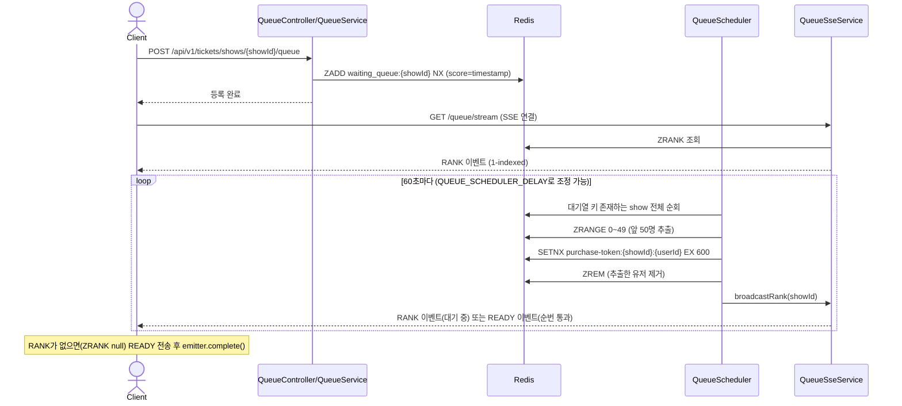
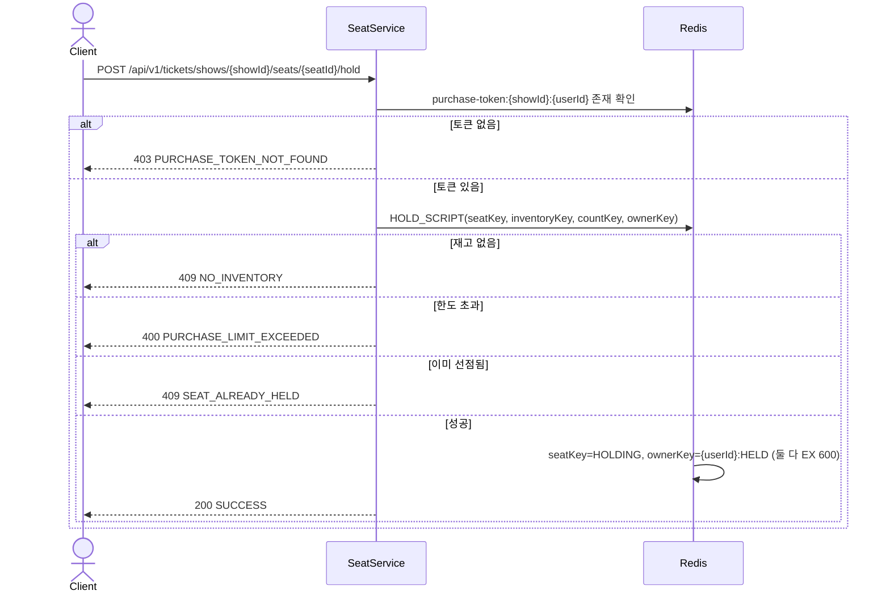
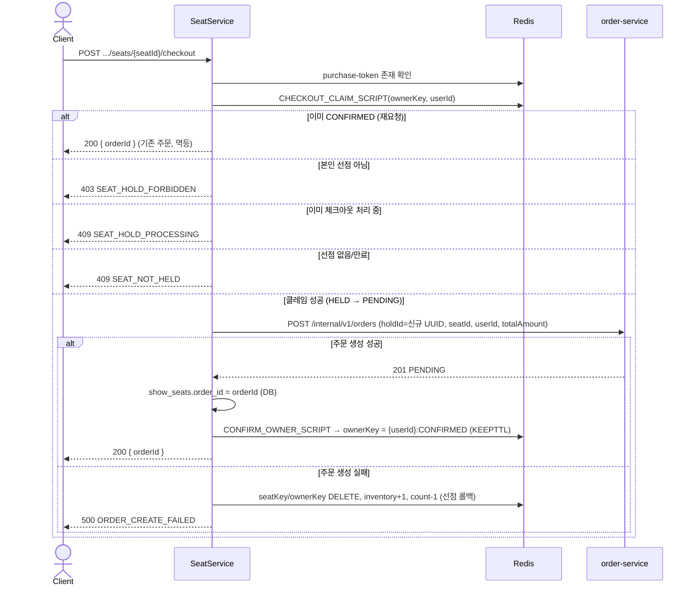
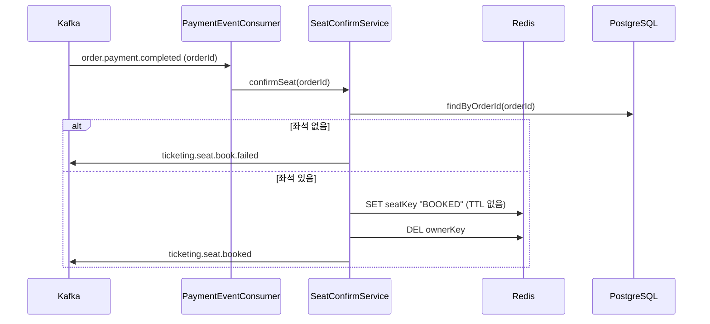
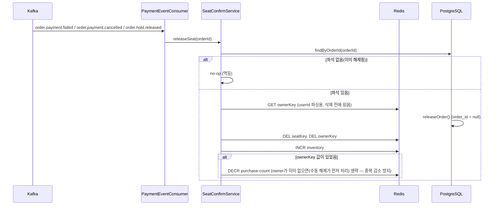
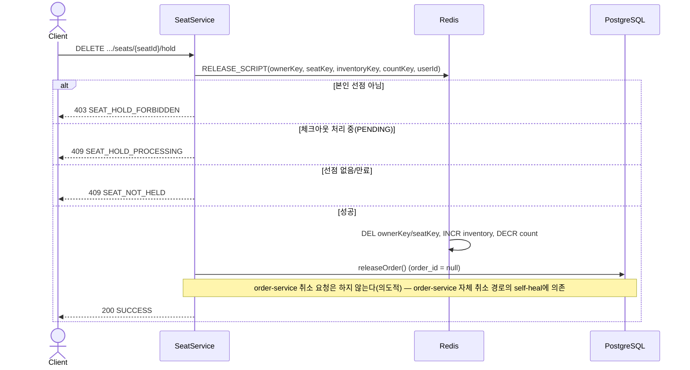
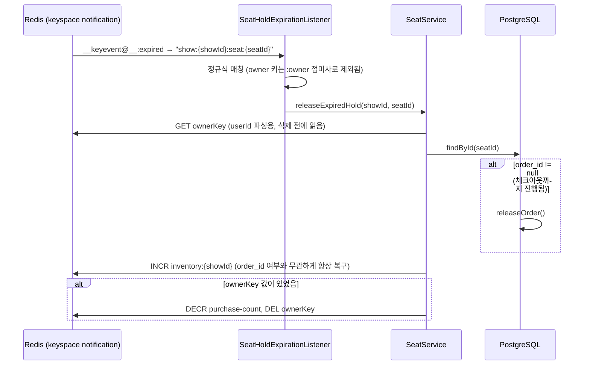
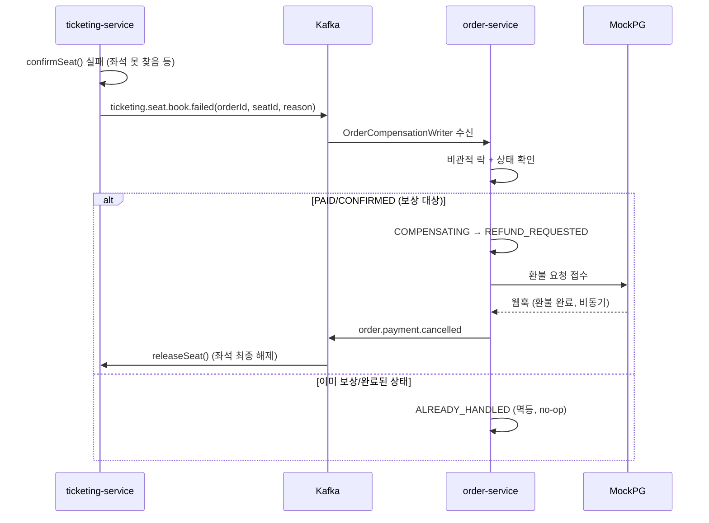

# Ticketing Service — Flows

전체 시나리오별 흐름을 정리한다. 상태 전이 규칙은 [architecture.md](./architecture.md)를 참고.

---

## 시나리오 목록

1. [대기열 등록 → 입장](#1-대기열-등록--입장)
2. [좌석 선점(hold)](#2-좌석-선점hold)
3. [체크아웃(주문 생성)](#3-체크아웃주문-생성)
4. [결제 완료 → 좌석 확정](#4-결제-완료--좌석-확정)
5. [결제 실패/취소 → 좌석 해제](#5-결제-실패취소--좌석-해제)
6. [좌석 선점 해제(사용자 직접 취소)](#6-좌석-선점-해제사용자-직접-취소)
7. [TTL 자연 만료](#7-ttl-자연-만료)
8. [SAGA 보상(좌석 예매 실패)](#8-saga-보상좌석-예매-실패)

---

## 1. 대기열 등록 → 입장

```
대기열 등록 (ZADD NX)
→ SSE 연결, RANK 이벤트로 순번 수신
→ [QueueScheduler, 60초 주기] 앞 50명 추출 → purchase-token 발급 (SETNX)
→ READY 이벤트 수신, SSE 연결 종료
→ 좌석 목록 조회 (토큰 불필요)
```



> 대기열 키(`waiting_queue:{showId}`)는 최초 `enter()` 시점에 생성되고, 비워지면 자연히 사라진다. `QueueScheduler`는 매 주기마다 `waiting_queue:*` 패턴으로 활성 show를 찾아 처리하므로 별도 show 목록 관리가 필요 없다.

---

## 2. 좌석 선점(hold)

`hold()`는 **선점만** 한다 — 2026-07-03부터 주문 생성을 포함하지 않는다.

```
purchase-token 존재 확인 (없으면 403 PURCHASE_TOKEN_NOT_FOUND)
→ HOLD_SCRIPT 실행 (재고 확인 + 선점 + 카운트 증가, 원자적)
→ seatKey: (없음) → HOLDING (TTL 600s)
→ ownerKey: (없음) → {userId}:HELD (TTL 600s)
→ 응답: 200 (바디 없음)
```



---

## 3. 체크아웃(주문 생성)

`POST .../seats/{seatId}/checkout` — 2026-07-03 신설. `HELD` 상태에서만 진행되며, 이미 `CONFIRMED`면 멱등 응답.

```
CHECKOUT_CLAIM_SCRIPT: ownerKey HELD → PENDING 전이(클레임)
→ orderClient.create() 호출 (Feign, holdId 멱등)
→ 성공: ownerKey PENDING → CONFIRMED, DB show_seats.order_id 저장
→ 실패: 선점 롤백 (seatKey/ownerKey DELETE, inventory+1, count-1)
```



> `holdId`는 order-service 1차 멱등성 방어(Redis 클레임) 키다. `CHECKOUT_CLAIM_SCRIPT`가 동시 중복 호출 자체를 막으므로 같은 좌석에 `holdId`가 두 번 쓰일 일이 없고, 매 `checkout()` 시도마다 새로 발급해도 안전하다.

(이후 결제/확정은 order-service 담당 — [order-service/flows.md](../order-service/flows.md) 참고)

---

## 4. 결제 완료 → 좌석 확정

order-service가 `order.payment.completed`를 발행하면 `PaymentEventConsumer.onPaymentCompleted()`가 수신해 `SeatConfirmService.confirmSeat()`를 호출한다.

```
orderId로 좌석 조회 (show_seats.order_id = orderId)
→ seatKey: HOLDING → BOOKED (TTL 없이 영구)
→ ownerKey DELETE
→ ticketing.seat.booked 발행
```



> `BOOKED`는 DELETE가 아니라 SET으로 영구 유지한다. DELETE하면 `getSeats()`가 기본값 `AVAILABLE`로 반환해 이미 팔린 좌석이 다시 선점 가능한 것처럼 보이고, `hold()`가 `SETNX`만으로 선점을 허용해버리기 때문이다.

---

## 5. 결제 실패/취소 → 좌석 해제

`order.payment.failed`(결제 실패) / `order.payment.cancelled`(결제 완료 후 취소·환불) / `order.hold.released`(결제 전 취소·타임아웃) 세 토픽 모두 `SeatConfirmService.releaseSeat()`로 수렴한다.

```
orderId로 좌석 조회
→ show_seats.order_id = null (DB)
→ seatKey/ownerKey DELETE (Redis)
→ inventory +1
```



> **해결됨 (#286, 2026-07-06)**: 과거엔 이 경로가 `purchase-count`를 감소시키지 않아 결제 실패/취소를 반복하면 구매 한도 카운트가 계속 쌓이는 버그가 있었다. `ownerKey`를 삭제하기 전에 값을 읽어 userId를 파싱하고 감소시키도록 수정함.

---

## 6. 좌석 선점 해제(사용자 직접 취소)

```
DELETE .../seats/{seatId}/hold
→ RELEASE_SCRIPT: 본인 확인 + PENDING 아님 확인 → seatKey/ownerKey DELETE, inventory+1, count-1
→ order-service에는 알리지 않음 — order-service 자체 취소 경로가 order.hold.released를
  발행하면 PaymentEventConsumer.onHoldReleased() → releaseSeat()가 멱등하게 뒤따라 정리한다(self-heal)
```



**레이스 방지·멱등성:** owner 키 3단계 상태(`HELD`→`PENDING`→`CONFIRMED`) 가드로 hold↔release↔checkout 동시 호출 레이스를 막는다. 결제 실패/취소·TTL 만료 경로의 멱등 처리 방식 포함 — [ADR 016](./adr/016-release-path-consistency.md).

**inventory 최초 초기화:** 첫 hold 요청 시 lazy 초기화되며, 동시 DB 조회 경합은 Redisson 분산락으로 방지 — [ADR 017](./adr/017-inventory-lazy-init-lock.md).

> **주문 취소 연동:** `releaseHold()`는 order-service에 취소를 요청하지 않는다는 결정이 코드 리뷰로 발견된 교차 유저 케이스 때문에 재검토 대상이 됐다 — [ADR 011](./adr/011-hold-release-no-order-cancel-call.md) 참고.

---

## 7. TTL 자연 만료

사용자가 결제도, 직접 해제도 하지 않고 600초를 방치한 경우. Redis Keyspace Notification으로 감지한다.

```
seatKey TTL 만료(EXPIRED 이벤트)
→ SeatHoldExpirationListener가 show:{showId}:seat:{seatId} 패턴 매칭
→ SeatService.releaseExpiredHold(): (order_id != null이면) show_seats.order_id = null,
  inventory +1, (ownerKey 값 있으면) purchase-count -1
```



> **해결됨 (#286, 2026-07-06)**: 과거엔 `order_id == null`(체크아웃 없이 hold만 하다 방치된 경우)이면 조기 return해서 inventory/purchase-count 둘 다 복구가 안 되는 버그가 있었다. 이제는 order_id 여부와 무관하게 항상 inventory를 복구하고, ownerKey에 남아있던 userId를 파싱해 purchase-count도 감소시킨다.

> 이 경로는 order-service가 자체 `expired_at` 기준 타임아웃 스케줄러로 `PENDING` 주문을 별도로 취소하고 `order.hold.released`를 발행하며, ticketing은 그 이벤트를 `onHoldReleased()`(§5)로 다시 수신해 멱등 처리한다. 즉 좌석 hold TTL(600초)과 order-service 주문 만료(`expirationMinutes`)가 각자 독립적으로 동작하고, 두 이벤트가 겹쳐도 `releaseSeat()`의 멱등성으로 안전하다.

---

## 8. SAGA 보상(좌석 예매 실패)

좌석 확정(`confirmSeat`) 자체가 실패한 경우(좌석을 못 찾음 등) — 결제는 끝났는데 좌석을 못 준 상황이므로 order-service가 자동 환불로 보상한다.

```
confirmSeat() 실패 → ticketing.seat.book.failed 발행
→ [order-service] 비관적 락 + 상태 검증(PAID/CONFIRMED만 보상 대상)
→ COMPENSATING → REFUND_REQUESTED 전이 + PG 환불 요청
→ [비동기] 환불 완료 웹훅 → REFUNDED
→ order.payment.cancelled 발행
→ [ticketing] releaseSeat() (§5)
```



상세 흐름(주문 상태 전이, 환불 실패 케이스 등)은 [order-service/flows.md §6](../order-service/flows.md#6-saga-보상-트랜잭션) 참고.
