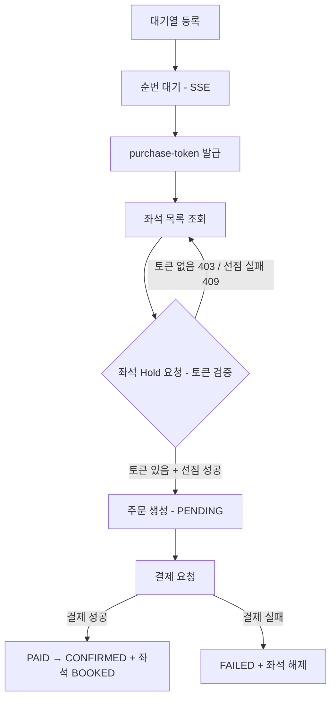
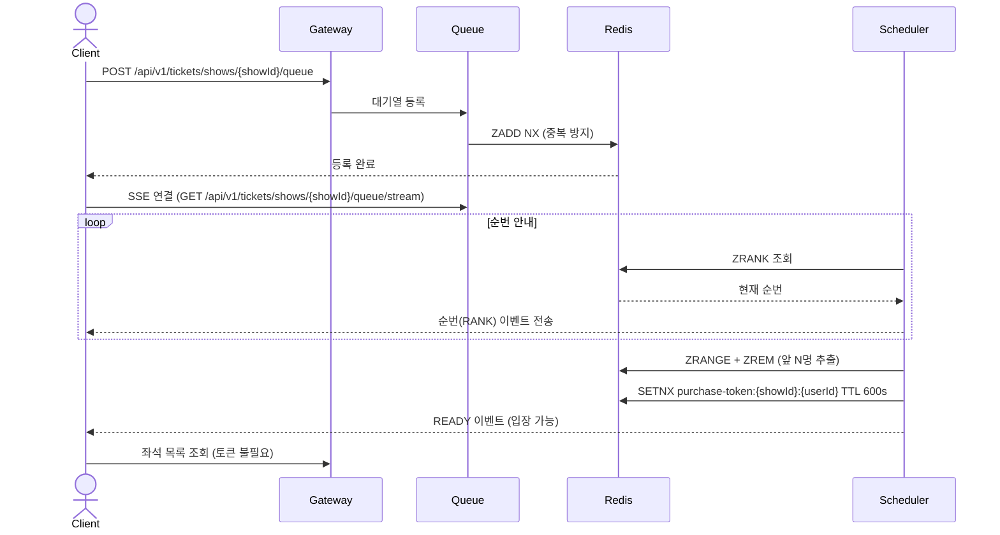

# 티켓팅 시스템 설계 문서

> **[주의]** 이 문서의 Order Service 관련 설계는 임의로 작성해둔 것이며 확정된 사항이 아닙니다.
> 자세한 내용은 [Order/Payment 서비스 설계 문서](https://app.notion.com/p/teamsparta/order-payment-3822dc3ef51480608fd7cb333ea3ba34)를 참고해주세요.

## 0. 요약 및 문서 읽는 법

**한 줄 요약:**
> PostgreSQL + Redis + Kafka 기반의 선착순 티켓팅 시스템. 대기열 → 좌석 선점 → 결제 확정의 3구간으로 동작한다.

| 목적 | 이동 |
|---|---|
| 전체 흐름을 빠르게 파악하고 싶다 | → [5. 해피패스 플로우](#5-해피패스-플로우) |
| Redis 키 구조가 궁금하다 | → [3. Redis 키 설계](#3-redis-키-설계) |
| Kafka 토픽 목록이 필요하다 | → [4. Kafka 토픽](#4-kafka-토픽) |
| 미확정 항목을 확인하고 싶다 | → [9. 미확정 항목](#9-미확정-항목) |

---

## 1. 기술 스택

| 역할 | 기술 |
|---|---|
| DB | PostgreSQL 17 |
| Cache / 상태 관리 | Redis (RDB 영속성) |
| 메시지 큐 | Kafka |
| 대기열 실시간 안내 | SSE (Server-Sent Events) |

---

## 2. ERD 핵심 구조

```
Venues
  └─ VenueSeats       (물리 좌석 마스터)

Performances
  └─ Shows            (회차)
       └─ ShowSeats   (회차별 좌석, status 컬럼 없음 — 상태는 Redis 관리)

Orders               (주문 = 예약 + 확정 통합 단일 애그리게이트)
```

> **설계 포인트:** `ShowSeats`에 `status` 컬럼을 두지 않는다. 좌석 상태는 Redis에서만 관리하여 DB 경합을 제거한다.

---

## 3. Redis 키 설계

| 키 | 자료구조 | TTL | 설명 |
|---|---|---|---|
| `waiting_queue:{show_id}` | Sorted Set | - | 대기열. score = 입장 요청 timestamp |
| `purchase-token:{showId}:{userId}` | String | 600초 | 좌석 구매 자격 토큰 (showId별 격리) |
| `show:{show_id}:seat:{show_seat_id}` | String | 600초 | 좌석 상태: `AVAILABLE` / `HOLDING` / `BOOKED` |
| `show:{show_id}:seat:{show_seat_id}:owner` | String | 600초 (seatKey와 동일) | 선점한 `{userId}:{status}`. status는 `PENDING`(주문 생성 중) / `CONFIRMED`(주문 생성 완료) |
| `inventory:{show_id}` | String (Counter) | - | 남은 좌석 수 |
| `purchase-count:{userId}:{showId}` | String (Counter) | - | 사용자별 구매 한도 체크 |

---

## 4. Kafka 토픽

| 토픽 | Producer | Consumer | 용도 |
|---|---|---|---|
| `order.payment.completed` | order-service | ticketing-service | 결제 승인 → 좌석 BOOKED |
| `order.payment.failed` | order-service | ticketing-service | 결제 실패 → 좌석 해제 |
| `order.payment.cancelled` | order-service | ticketing-service | 결제 취소 → 좌석 해제 |
| `ticketing.seat.booked` | ticketing-service | order-service | 좌석 확정 → 주문 CONFIRMED |
| `ticketing.seat.book.failed` | ticketing-service | order-service | 좌석 예매 실패 → SAGA 보상 시작 |

---

## 5. 해피패스 플로우

### 전체 흐름 요약



> **변경 (2026-06-23):** 토큰 검증 주체를 Gateway → `SeatService.hold()`로 변경. 좌석 목록 조회는 토큰 없이도 가능하며, 검증은 Hold 시점에 이루어진다. 자세한 배경은 [260623 대기열 토큰.md](./260623%20대기열%20토큰.md), 변경 이력은 [ticketing-system-change-log.md](./ticketing-system-change-log.md) 참고.

---

### 구간 1 — 대기열 → 좌석 선택 화면



> **변경 (2026-06-23):** 이전 버전은 Gateway가 좌석 선택 화면 진입 시점에 토큰을 검증한다고 되어 있었으나, 실제로는 좌석 목록 조회까지는 토큰 없이 가능하고 **좌석 Hold 요청 시점**에 `SeatService`가 직접 검증한다 (구간 2 참고).

---

### 구간 2 — 좌석 선점 + 주문 생성

**좌석 Hold 시 구매 토큰 검증 (2026-06-23 추가):**
`SeatService.hold()` 진입 시 `purchase-token:{showId}:{userId}` 존재 여부를 가장 먼저 확인한다. 없으면 `PURCHASE_TOKEN_NOT_FOUND`(403)로 즉시 거부하고, 있으면 기존 좌석 선점 Lua 스크립트(`HOLD_SCRIPT`) → 주문 생성 흐름으로 진행한다. 토큰은 Hold 성공 여부와 무관하게 TTL(600초)로만 만료되며 별도 삭제 로직은 없다.

(이하 주문 생성은 order-service에서)

### 구간 3 — 결제 및 예매 확정 (order-service에서)

---

### 좌석 선점 해제 (hold release)

선점은 세 가지 경로로 풀린다.

| 경로 | 트리거 | 처리 |
|---|---|---|
| 결제 실패/취소 | Kafka `order.payment.failed`, `order.payment.cancelled` | `SeatConfirmService.releaseSeat()` — DB `orderId` 해제, Redis seat/owner 키 삭제, 재고 복구 |
| TTL 자연 만료 | Redis keyspace notification (`__keyevent@__:expired`) | `SeatHoldExpirationListener` → `SeatService.releaseExpiredHold()` — DB `orderId` 해제, 재고 복구 (사용자가 직접 해제/결제하지 않고 600초 동안 방치한 경우) |
| 사용자 직접 취소 | `DELETE /api/v1/tickets/shows/{showId}/seats/{seatId}/hold` | `SeatService.releaseHold()` — owner 본인 확인 후 Redis seat/owner 키 삭제, 재고 복구, DB `orderId` 해제 |

**hold ↔ release 동시 호출 레이스 방지:** `hold()`가 주문 생성(`orderClient.create`, 외부 네트워크 호출)을 하는 동안 owner 키 상태를 `PENDING`으로 두고, 주문 생성이 끝나야 `CONFIRMED`로 바꾼다. `releaseHold()`는 `PENDING`인 동안은 무조건 `SEAT_HOLD_PROCESSING`(409)으로 거부한다. 이게 없으면 "Redis는 풀렸는데 DB에는 뒤늦게 orderId가 박히는" 더블부킹 레이스가 생길 수 있다.

> **알려진 제약:** order-service에 생성된 주문을 취소하는 API가 아직 없어서, `releaseHold()`/`releaseExpiredHold()`는 ticketing-service 쪽 상태만 정리한다. order-service의 주문은 별도로 만료/취소 처리가 필요하다 (TODO).

---

## 6. API 명세

### ticketing-service

| 메서드 | 경로 | 설명 |
|---|---|---|
| POST | `/api/v1/tickets/shows/{showId}/queue` | 대기열 등록 |
| GET | `/api/v1/tickets/shows/{showId}/queue/status` | 현재 순번 조회 |
| GET | `/api/v1/tickets/shows/{showId}/queue/stream` | SSE 연결 — 순번 실시간 수신 |
| GET | `/api/v1/tickets/shows/{showId}/seats` | 회차별 좌석 목록 + 상태 조회 |
| POST | `/api/v1/tickets/shows/{showId}/seats/{seatId}/hold` | 좌석 선점 + 주문 생성 트리거 |
| DELETE | `/api/v1/tickets/shows/{showId}/seats/{seatId}/hold` | 좌석 선점 해제 (본인 선점만 가능) |

---

## 7. Rate Limit 기준 (15,000석 공연 기준)

| 항목 | 수치 |
|---|---|
| 좌석 hold API | 초당 50~60건 |
| 대기열 입장 배치 | 분당 3,000~3,600명 |
| purchase-token TTL | 600초 |
| 결제 성공률 (외부 PG 기준) | 40~50% |

---

## 8. 구현 일정

| 날짜 | 작업 |
|---|---|
| 6/16 (월) | 설계 확정 + 명세 작성 |
| 6/17 (화) | 대기열 + 토큰 + SSE |
| 6/18 (수) | 좌석 선점 + 주문 생성 |
| 6/19 (목) | 예매 확정 |
| 주말 | TTL 만료 처리, 결제 실패 SAGA, 취소/환불 |

---

## 9. 미확정 항목

| 항목 | 현황 | 결정 필요 사항 |
|---|---|---|
| `holdId` | 미확정 | 별도 `SeatHolds` 테이블로 분리할지, `Orders.id`를 그대로 holdId로 사용할지 |
| 주문 취소 연동 | 미구현 | `releaseHold`/`releaseExpiredHold` 시 order-service의 주문도 취소하는 API 연동 필요 (`OrderClient`에 취소 메서드 없음) |
| 스케줄러 분산 락 | 미구현 | `QueueScheduler`가 멀티 인스턴스로 떠 있을 때 같은 배치를 중복 처리할 수 있음. ShedLock 등 분산 락 적용 필요 |
